# 🚀 GitHub Actions CI/CD Summary

## 📋 Overview

This document provides a comprehensive overview of the GitHub Actions workflows implemented for the Brown Bear ALM project.

## 🔄 **Workflow Files Created**

### 1. **🧪 CI Pipeline** (`ci.yml`)
**Trigger**: Push to any branch, Pull requests
**Purpose**: Continuous Integration for code quality and testing

**Jobs:**
- **Setup & Validation**: Environment setup and dependency installation
- **Code Quality**: Linting, formatting, and type checking
- **Testing**: Unit tests, integration tests with coverage reporting
- **Security**: Dependency auditing and security scanning
- **Build**: Production build verification

### 2. **🚀 Release & Deploy** (`release.yml`)
**Trigger**: Push to main, version tags, manual dispatch
**Purpose**: Automated release management and deployment

**Jobs:**
- **Semantic Release**: Automated versioning and changelog generation
- **Container Build**: Multi-service Docker image building and pushing
- **Security Scan**: Container vulnerability scanning with Trivy
- **Staging Deployment**: Automated staging environment deployment
- **Production Deployment**: Production deployment with safety checks
- **Rollback**: Automatic rollback on deployment failures

### 3. **🛡️ Security Audit** (`security.yml`)
**Trigger**: Schedule (daily), manual dispatch, security events
**Purpose**: Comprehensive security monitoring and compliance

**Jobs:**
- **Dependency Audit**: Automated dependency vulnerability scanning
- **Code Scanning**: Static application security testing (SAST)
- **Container Security**: Docker image security analysis
- **License Compliance**: Open source license validation
- **Security Report**: Automated security reporting

### 4. **🧪 Nightly Tests** (`nightly.yml`)
**Trigger**: Schedule (2 AM UTC daily), manual dispatch
**Purpose**: Comprehensive system testing and integration validation

**Jobs:**
- **Full Integration**: Complete multi-service integration testing
- **Performance Testing**: Load testing with k6
- **Security Testing**: OWASP ZAP security scanning
- **Dependency Audit**: Comprehensive dependency analysis
- **Database Migration**: Database schema validation

### 5. **📦 Dependencies** (`dependencies.yml`)
**Trigger**: Schedule (weekly), manual dispatch
**Purpose**: Automated dependency management and updates

**Jobs:**
- **Dependency Updates**: Automated dependency updates with Dependabot
- **Security Patches**: Critical security update automation
- **Compatibility Testing**: Automated testing of dependency updates
- **Update Reports**: Comprehensive dependency update reporting

## 🔧 **Configuration Files**

### **Semantic Release** (`.releaserc.json`)
- Conventional commit analysis
- Automatic changelog generation
- Version management
- GitHub release creation

### **Dependabot** (`.github/dependabot.yml`)
- Automated dependency updates
- Security patch management
- Multi-ecosystem support (npm, Composer, Docker)

### **CodeQL** (`.github/codeql/codeql-config.yml`)
- Static application security testing
- Custom query configuration
- Multi-language analysis

## 🚦 **Workflow Features**

### **🔒 Security & Compliance**
- ✅ Dependency vulnerability scanning
- ✅ Container security analysis
- ✅ Static code analysis
- ✅ License compliance checking
- ✅ Security reporting and alerting

### **🧪 Testing & Quality**
- ✅ Unit testing with coverage
- ✅ Integration testing
- ✅ End-to-end testing
- ✅ Performance testing
- ✅ Code quality enforcement

### **🚀 Deployment & Release**
- ✅ Automated semantic versioning
- ✅ Multi-environment deployment
- ✅ Container registry integration
- ✅ Rollback capabilities
- ✅ Deployment notifications

### **📊 Monitoring & Reporting**
- ✅ Test coverage reporting
- ✅ Performance metrics
- ✅ Security scan results
- ✅ Deployment status
- ✅ Workflow summaries

## 🎯 **Environment Setup**

### **Required Secrets**
Add these to your GitHub repository secrets:

```bash
# GitHub Token (automatically provided)
GITHUB_TOKEN

# Container Registry (if using private registry)
REGISTRY_USERNAME
REGISTRY_PASSWORD

# Deployment (if deploying to external services)
STAGING_DEPLOY_KEY
PRODUCTION_DEPLOY_KEY

# Monitoring (if using external monitoring)
MONITORING_API_KEY
```

### **Environment Variables**
The workflows use these environment variables:

```yaml
REGISTRY: ghcr.io                    # Container registry
IMAGE_NAME: ${{ github.repository }} # Container image name
NODE_VERSION: '18'                   # Node.js version
PNPM_VERSION: '8.15.0'              # pnpm version
PHP_VERSION: '8.0'                   # PHP version
```

## 📈 **Workflow Triggers**

| Workflow | Manual | Push | PR | Schedule | Tags |
|----------|--------|------|----|---------|----- |
| CI | ✅ | ✅ | ✅ | ❌ | ❌ |
| Release | ✅ | main only | ❌ | ❌ | v* |
| Security | ✅ | ❌ | ❌ | Daily | ❌ |
| Nightly | ✅ | ❌ | ❌ | 2 AM UTC | ❌ |
| Dependencies | ✅ | ❌ | ❌ | Weekly | ❌ |

## 🎨 **Workflow Visualization**

```mermaid
graph TD
    A[Code Push] --> B[CI Pipeline]
    B --> C{Tests Pass?}
    C -->|Yes| D[Security Scan]
    C -->|No| E[❌ Fail]
    D --> F[Build Containers]
    F --> G[Push to main?]
    G -->|Yes| H[Release Pipeline]
    G -->|No| I[✅ Complete]
    H --> J[Semantic Release]
    J --> K[Deploy Staging]
    K --> L[Deploy Production]
    L --> M[✅ Released]
    
    N[Schedule] --> O[Nightly Tests]
    N --> P[Security Audit]
    N --> Q[Dependency Updates]
```



## 🔄 **Development Workflow**

1. **Feature Development**
   ```bash
   git checkout -b feature/new-feature
   git push origin feature/new-feature
   # Creates PR → Triggers CI Pipeline
   ```

2. **Pull Request Review**
   - CI pipeline runs automatically
   - Security checks performed
   - Code quality validated
   - Tests executed with coverage

3. **Merge to Main**
   ```bash
   git checkout main
   git merge feature/new-feature
   # Triggers Release Pipeline
   ```

4. **Automated Release**
   - Semantic versioning applied
   - Changelog generated
   - Containers built and pushed
   - Staging deployment executed
   - Production deployment (on tags)

## 🚨 **Troubleshooting**

### **Common Issues**

1. **Workflow Fails on Dependencies**
   ```bash
   # Clear cache and retry
   gh workflow run ci.yml
   ```

2. **Container Build Failures**
   ```bash
   # Check Dockerfile syntax
   docker build -t test .
   ```

3. **Test Failures**
   ```bash
   # Run tests locally
   pnpm test
   pnpm lint
   ```

4. **Deployment Issues**
   ```bash
   # Check environment configuration
   # Verify secrets are configured
   # Review deployment logs
   ```

### **Debugging Commands**

```bash
# View workflow status
gh run list

# View specific workflow run
gh run view [run-id]

# Download logs
gh run download [run-id]

# Trigger manual workflow
gh workflow run [workflow-name]
```

## 📚 **Best Practices**

### **Commit Messages**
Use conventional commits for automated releases:
```bash
feat: add user authentication
fix: resolve login bug
docs: update API documentation
chore: update dependencies
```

### **Branch Protection**
Configure branch protection rules:
- Require status checks
- Require pull request reviews
- Restrict force pushes
- Require up-to-date branches

### **Security**
- Regularly update dependencies
- Monitor security alerts
- Review workflow permissions
- Use secrets for sensitive data

## 🔮 **Future Enhancements**

- [ ] Infrastructure as Code (IaC) validation
- [ ] Multi-cloud deployment support
- [ ] Advanced monitoring integration
- [ ] Automated performance regression testing
- [ ] Enhanced security compliance reporting
- [ ] Integration with external quality gates

---

## 🎉 **Conclusion**

The Brown Bear project now has a comprehensive CI/CD pipeline that ensures:

- **Quality**: Automated testing and code quality checks
- **Security**: Comprehensive security scanning and compliance
- **Reliability**: Automated deployments with rollback capabilities
- **Efficiency**: Streamlined development and release processes
- **Monitoring**: Comprehensive observability and reporting

This setup provides a solid foundation for enterprise-grade software development and deployment! 🚀
