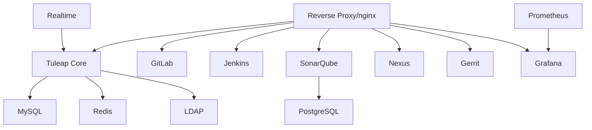
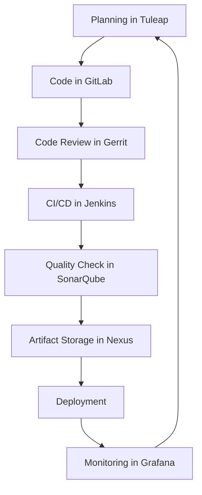

# 🐻 The Brown Bear Project | مشروع براون بير

<div align="center">

[](LICENSE)
[](VERSION)
[](https://www.docker.com/)
[](https://nodejs.org/)
[](https://www.php.net/)

**Comprehensive Application Lifecycle Management Platform**  
*All-in-One ALM Solution for Agile Software Development*


[🚀 Quick Start](#-quick-start) • [📋 Features](#-features) • [🏗️ Architecture](#️-architecture) • [📚 Documentation](#-documentation) • [🤝 Community](#-community)

</div>

---

## 🎯 **Overview**

**Brown Bear** is a comprehensive, open-source Application Lifecycle Management (ALM) platform designed specifically for small to medium-sized agile software teams. Built on the robust foundation of Tuleap Community Edition, it integrates the entire DevOps toolchain into a single, seamless platform.

### 🌍 **Multilingual Support**
> Brown Bear هو منصة إدارة دورة حياة التطبيقات الشاملة ومفتوحة المصدر المصممة خصيصًا للفرق البرمجية الرشيقة الصغيرة والمتوسطة الحجم

### ✨ **Why Brown Bear?**

- **🔧 All-in-One Solution**: Complete ALM platform in a single deployment
- **💰 Cost-Effective**: Open-source alternative to expensive commercial tools
- **🔄 Fully Integrated**: Seamless workflow from planning to deployment
- **🐳 Cloud-Native**: Container-based, scalable architecture
- **🛡️ Enterprise-Ready**: Security, monitoring, and compliance built-in
- **👥 Team-Focused**: Designed for collaborative development

---

## 🚀 **Quick Start**

Get your complete ALM platform running in minutes!

### **Prerequisites**
- Docker & Docker Compose (20.10+)
- Node.js (18+) with pnpm
- Git (2.30+)
- 8GB+ RAM, 20GB+ disk space

### **Automated Setup**

**Linux/macOS:**
```bash
git clone https://github.com/yasir2000/brown-bear.git
cd brown-bear
./setup.sh
```

**Windows:**
```batch
git clone https://github.com/yasir2000/brown-bear.git
cd brown-bear
setup.bat
```

### **Manual Setup**
```bash
# 1. Setup environment
make setup-env

# 2. Complete development setup
make dev-setup

# 3. Start the platform
make dev-up
```

### **Access Your Platform**
After startup (2-3 minutes), access your services:

- 🏠 **Main Platform**: https://brownbear.local
- 🦊 **GitLab**: https://gitlab.brownbear.local
- 🔧 **Jenkins**: https://jenkins.brownbear.local
- 📊 **SonarQube**: https://sonar.brownbear.local
- 📦 **Nexus**: https://nexus.brownbear.local

---

## 📋 **Features**

### 🎯 **Core ALM Capabilities**

| Feature | Component | Description |
|---------|-----------|-------------|
| **📝 Project Management** | Tuleap | Agile planning, backlogs, sprints, Kanban |
| **🔄 Source Control** | GitLab | Git repositories, merge requests, CI/CD |
| **👁️ Code Review** | Gerrit | Advanced code review workflow |
| **🏗️ Build Automation** | Jenkins | Continuous integration and deployment |
| **📊 Quality Analysis** | SonarQube | Code quality, security, coverage |
| **📦 Artifact Management** | Nexus | Package registry, Docker registry |
| **🧪 Test Management** | Tuleap | Test plans, execution, reporting |
| **📈 Monitoring** | Prometheus + Grafana | Metrics, dashboards, alerting |

### 🔧 **Technical Features**

- **🏗️ Microservices Architecture**: Containerized, scalable services
- **🔐 Single Sign-On**: LDAP-based authentication across all tools
- **🌐 HTTPS Everywhere**: SSL/TLS encryption for all services
- **📊 Real-time Monitoring**: Comprehensive metrics and alerting
- **🔄 Automated Workflows**: End-to-end automation from code to deployment
- **📱 Responsive UI**: Modern, mobile-friendly interfaces
- **🌍 Multi-language**: English/Arabic support

### 🛠️ **Developer Experience**

- **⚡ Hot Reloading**: Real-time development feedback
- **🧪 Multi-level Testing**: Unit, integration, E2E, performance
- **📝 Code Quality**: Automated linting, formatting, analysis
- **🔍 Debugging Tools**: Comprehensive logging and debugging
- **📚 Documentation**: Auto-generated API docs
- **🎛️ CLI Tools**: Rich command-line interface

---

## 🏗️ **Architecture**

<div align="center">


*Brown Bear Integrated Architecture*

</div>

### 🧩 **Service Architecture**



### 🔄 **Workflow Integration**

1. **Planning** → Tuleap (Backlog, Sprint Planning)
2. **Development** → GitLab (Git, Issue Tracking)
3. **Code Review** → Gerrit (Peer Review)
4. **Build & Test** → Jenkins (CI/CD Pipeline)
5. **Quality Gate** → SonarQube (Quality Analysis)
6. **Artifact Storage** → Nexus (Package Registry)
7. **Deployment** → Automated (Environment Promotion)
8. **Monitoring** → Prometheus + Grafana (Observability)

### 🌐 **Network Architecture**

- **Custom Bridge Network**: `brownbear` (172.20.0.0/16)
- **Service Discovery**: Docker DNS resolution
- **Load Balancing**: Nginx reverse proxy
- **SSL Termination**: Centralized SSL/TLS
- **Health Checks**: Automated service monitoring

---

## 🚀 **Deployment**

### 🐳 **Container Stack**

| Service | Image | Purpose | Health Check |
|---------|-------|---------|--------------|
| **Web** | tuleap-aio-dev | Main ALM platform | ✅ HTTP |
| **GitLab** | gitlab/gitlab-ce | Git SCM | ✅ GitLab API |
| **Jenkins** | jenkins/jenkins | CI/CD | ✅ Jenkins API |
| **SonarQube** | sonarqube:community | Code quality | ✅ SonarQube API |
| **Nexus** | sonatype/nexus3 | Artifact registry | ✅ Nexus API |
| **Gerrit** | gerrit/gerrit | Code review | ✅ Gerrit API |
| **MySQL** | mysql:5.7 | Primary database | ✅ MySQL ping |
| **Redis** | redis:6.2 | Cache layer | ✅ Redis ping |
| **LDAP** | openldap | Authentication | ✅ LDAP search |

### 📊 **Resource Requirements**

| Environment | CPU | RAM | Storage | Services |
|-------------|-----|-----|---------|----------|
| **Development** | 4 cores | 8GB | 50GB | Basic stack |
| **Testing** | 6 cores | 16GB | 100GB | Full stack + testing |
| **Production** | 8+ cores | 32GB+ | 500GB+ | HA configuration |

### 🔧 **Configuration Management**

- **Environment Variables**: Centralized `.env` configuration
- **Docker Compose**: Multi-service orchestration
- **SSL Certificates**: Automated certificate generation
- **Volume Management**: Persistent data storage
- **Network Isolation**: Secure service communication

---

## 🧪 **Testing & Quality**

### 🎯 **Testing Strategy**

```bash
# Run all tests
make test-all

# Specific test types
make test-unit           # Unit tests (PHPUnit, Jest)
make test-integration    # Integration tests
make test-api           # REST/SOAP API tests
make test-e2e           # End-to-end tests (Cypress)
make performance-test   # Performance testing
```

### 📊 **Quality Metrics**

- **Code Coverage**: 80%+ requirement
- **Technical Debt**: < 1 day per 1000 LOC
- **Security Rating**: A grade minimum
- **Performance**: < 2s page load times
- **Availability**: 99.9% uptime target

### 🔍 **Code Quality Tools**

| Tool | Purpose | Language | Integration |
|------|---------|----------|-------------|
| **ESLint** | JavaScript linting | JS/TS | Pre-commit hooks |
| **Stylelint** | CSS linting | CSS/SCSS | Build pipeline |
| **PHPStan** | PHP static analysis | PHP | CI pipeline |
| **SonarQube** | Multi-language analysis | All | Quality gates |
| **Psalm** | PHP type checking | PHP | IDE integration |

---

## 🔧 **Development**

### 🛠️ **Available Commands**

<details>
<summary><strong>🔧 Environment & Setup</strong></summary>

```bash
make setup-env          # Setup environment configuration
make check-env          # Check prerequisites
make dev-setup          # Complete development setup
make dev-up             # Start development environment
make dev-down           # Stop development environment
make dev-reset          # Reset development environment
```
</details>

<details>
<summary><strong>🐳 Docker Management</strong></summary>

```bash
make docker-build       # Build all Docker images
make docker-pull        # Pull latest images
make docker-clean       # Clean Docker resources
make stack-up           # Start the complete stack
make stack-down         # Stop the complete stack
make stack-restart      # Restart the complete stack
make stack-logs         # Show logs from all services
make stack-status       # Show status of all services
```
</details>

<details>
<summary><strong>🏗️ Build & Development</strong></summary>

```bash
make build-all          # Build all components
make js-deps            # Install JavaScript dependencies
make js-build           # Build JavaScript components
make js-watch           # Watch and rebuild JavaScript
make js-test            # Run JavaScript tests
make composer           # Install PHP dependencies
```
</details>

<details>
<summary><strong>🔍 Code Quality</strong></summary>

```bash
make lint               # Run all linting tools
make typecheck          # Run TypeScript type checking
make security-check     # Run security checks
make test-all           # Run all tests
make test-unit          # Run unit tests
make test-integration   # Run integration tests
make test-api           # Run API tests
make test-e2e           # Run end-to-end tests
```
</details>

### 💡 **Development Workflow**

1. **Start Development Environment**
   ```bash
   make dev-up
   ```

2. **Make Changes and Test**
   ```bash
   make js-watch    # Watch for changes
   make test-unit   # Run tests
   ```

3. **Quality Checks**
   ```bash
   make lint        # Code linting
   make typecheck   # Type checking
   make security-check  # Security scan
   ```

4. **Commit and Push**
   ```bash
   git add .
   git commit -m "feat: your feature"
   git push origin feature-branch
   ```

---

## 📊 **Monitoring & Observability**

### 📈 **Monitoring Stack**

- **Prometheus**: Metrics collection and alerting
- **Grafana**: Visualization and dashboards
- **Application Logs**: Centralized logging
- **Health Checks**: Automated service monitoring
- **Performance Metrics**: Real-time performance tracking

### 🎯 **Key Metrics**

| Metric Type | Examples | Tools |
|-------------|----------|-------|
| **Application** | Response time, throughput, errors | Prometheus |
| **Infrastructure** | CPU, memory, disk, network | Node Exporter |
| **Business** | User activity, feature usage | Custom metrics |
| **Security** | Authentication, authorization | Audit logs |

### 🚨 **Alerting**

- **Service Down**: Immediate notification
- **High Resource Usage**: 80%+ threshold
- **Error Rate**: > 1% error rate
- **Performance**: > 5s response time
- **Security**: Failed login attempts

---

## 🔐 **Security**

### 🛡️ **Security Features**

- **🔐 HTTPS Everywhere**: SSL/TLS for all communications
- **👥 LDAP Authentication**: Centralized user management
- **🔑 Role-Based Access**: Granular permission system
- **🔒 Secret Management**: Secure credential storage
- **🛡️ Network Isolation**: Container network segmentation
- **🔍 Security Scanning**: Automated vulnerability detection

### 🔧 **Security Best Practices**

- Regular security updates
- Automated vulnerability scanning
- Strong password policies
- Multi-factor authentication support
- Audit logging
- Data encryption at rest and in transit

---

## 📚 **Documentation**

### 📖 **Available Guides**

- **[Setup Guide](SETUP.md)**: Comprehensive installation and configuration
- **[Integration Improvements](INTEGRATION-IMPROVEMENTS.md)**: Latest enhancements
- **[API Documentation](docs/api/)**: Auto-generated API docs
- **[Architecture Decisions](adr/)**: ADR records for key decisions
- **[Contributing Guide](CONTRIBUTING.md)**: How to contribute

### 🎓 **Learning Resources**

- **Video Tutorials**: [Tuleap.org Resources](https://www.tuleap.org/resources/videos-tutorials)
- **Documentation**: [Official Tuleap Docs](https://docs.tuleap.org/)
- **Community Forums**: [Tuleap Community](https://tuleap.net/)
- **Training Materials**: Available in English and Arabic

---

## 🤝 **Community & Support**

### 🌟 **Getting Help**

1. **📚 Documentation**: Check our comprehensive guides
2. **🐛 Issues**: Report bugs on [GitHub Issues](https://github.com/yasir2000/brown-bear/issues)
3. **💬 Discussions**: Join [GitHub Discussions](https://github.com/yasir2000/brown-bear/discussions)
4. **📧 Email**: Contact the maintainers

### 🤝 **Contributing**

We welcome contributions! Please see our [Contributing Guide](CONTRIBUTING.md) for details.

1. Fork the repository
2. Create a feature branch
3. Make your changes
4. Add tests
5. Submit a pull request

### 📜 **Code of Conduct**

This project follows the [Contributor Covenant Code of Conduct](CODE_OF_CONDUCT.md).

---

## 🗂️ **Project Structure**

```
brown-bear/
├── 📁 src/                    # Tuleap core source code
│   ├── common/               # Shared libraries
│   ├── themes/               # UI themes
│   └── www/                  # Web assets
├── 📁 plugins/               # 50+ feature plugins
│   ├── git/                  # Git integration
│   ├── gitlab/               # GitLab integration
│   ├── tracker/              # Issue tracking
│   └── ...                   # Many more plugins
├── 📁 tools/                 # Development tools
│   ├── docker/               # Docker configurations
│   └── utils/                # Utility scripts
├── 📁 tests/                 # Test suites
├── 📁 adr/                   # Architecture decisions
├── 🐳 docker-compose*.yml    # Container orchestration
├── 📋 Makefile               # Build automation
├── 🔧 package.json           # Node.js configuration
├── 🐘 composer.json          # PHP dependencies
└── 📚 README.md              # This file
```

---

## 📈 **Roadmap**

### 🎯 **Current Release (v13.6)**
- ✅ Complete ALM integration
- ✅ Container orchestration
- ✅ CI/CD pipeline
- ✅ Monitoring & observability

### 🚀 **Next Release (v14.0)**
- 🔄 Kubernetes support
- 🔄 Advanced analytics
- 🔄 Mobile applications
- 🔄 Cloud deployment options

### 🌟 **Future Releases**
- AI-powered insights
- Advanced security features
- Multi-tenant support
- Marketplace ecosystem

---

## 📊 **Statistics**

<div align="center">

| Metric | Value |
|--------|-------|
| **Total Services** | 15+ integrated |
| **Supported Languages** | PHP, JavaScript, TypeScript |
| **Test Coverage** | 80%+ |
| **Container Images** | 10+ optimized |
| **API Endpoints** | 200+ REST/SOAP |
| **Plugins** | 50+ available |

</div>

---

## ⭐ **Star History**

[](https://star-history.com/#yasir2000/brown-bear&Date)

---

## 📄 **License**

This project is licensed under the **Apache License 2.0** - see the [LICENSE](LICENSE) file for details.

### 🔗 **Third-Party Licenses**
- Tuleap: GPL v2+
- GitLab: MIT License
- Jenkins: MIT License
- SonarQube: LGPL v3
- Nexus: Eclipse Public License

---

## 🙏 **Acknowledgments**

- **Tuleap Team**: For the excellent ALM foundation
- **Open Source Community**: For the amazing tools and libraries
- **Contributors**: For their valuable contributions
- **Users**: For feedback and support

---

<div align="center">

**Made with ❤️ by the Brown Bear Team**

[](https://github.com/yasir2000)
[](LICENSE)

**[⬆ Back to Top](#-the-brown-bear-project--مشروع-براون-بير)**

</div>

## 🔧 **Detailed Component Overview**

### 🎯 **Core ALM - Tuleap**
[Tuleap](https://www.tuleap.org/) is the foundation of Brown Bear, providing comprehensive Application Lifecycle Management capabilities.

**Key Features:**
- 📋 Agile project management (Scrum, Kanban)
- 🎯 Backlog and sprint planning
- 📊 Reporting and analytics
- 🔗 Traceability and compliance
- 👥 Team collaboration tools

### 🦊 **Source Control - GitLab**
[GitLab Community Edition](https://gitlab.com/gitlab-org/gitlab-foss) provides world-class Git management with integrated CI/CD.

**Integration Features:**
- 🔄 Git repository management
- 🔀 Merge request workflows
- 🚀 Built-in CI/CD pipelines
- 📦 Container registry
- 🔐 LDAP authentication integration

### 👁️ **Code Review - Gerrit**
[Gerrit](https://www.gerritcodereview.com) enables advanced code review workflows with GitLab integration.

**Configuration Example:**
```bash
docker run -d --name gerrit \
  -p 8080:8080 -p 29418:29418 \
  -e AUTH_TYPE=LDAP \
  -e WEBURL=https://gerrit.brownbear.local \
  -e LDAP_SERVER=ldap://ldap:389 \
  -v gerrit-data:/var/gerrit/review_site \
  brownbear/gerrit
```

**Jenkins Integration:**
- [Gerrit Trigger Plugin](https://plugins.jenkins.io/gerrit-trigger/)
- [SonarQube Gerrit Plugin](https://github.com/jenkinsci/sonar-gerrit-plugin)

### 🏗️ **CI/CD - Jenkins**
[Jenkins](https://github.com/jenkinsci/jenkins) provides comprehensive automation with extensive plugin ecosystem.

**Brown Bear Jenkins Features:**
- 🔧 Configuration as Code (JCasC)
- 🐳 Docker-based build agents
- 🔗 Multi-service integration
- 📊 Pipeline visualization
- 🚨 Automated notifications

**Key Plugins Included:**
- Pipeline and Blue Ocean
- GitLab and Gerrit integration
- SonarQube and Nexus plugins
- Docker and Kubernetes support
- Security and monitoring plugins

### 📊 **Code Quality - SonarQube**
[SonarQube](https://github.com/SonarSource/sonarqube) provides continuous code quality inspection with "Clean as You Code" methodology.

**Quality Features:**
- 🔍 Static code analysis
- 🛡️ Security vulnerability detection
- 📈 Technical debt tracking
- 📋 Quality gates
- 📊 Detailed reporting

**Jenkins Integration:**
- [SonarQube Plugin](https://github.com/jenkinsci/sonarqube-plugin)
- Quality gate integration
- Automated failure on quality issues

### 📦 **Repository Manager - Nexus**
[Sonatype Nexus](https://github.com/sonatype/nexus-public) serves as the central artifact repository supporting multiple package formats.

**Supported Repositories:**
- 📦 npm (JavaScript packages)
- 🐘 Composer (PHP packages)
- 🐳 Docker (Container images)
- ☕ Maven (Java artifacts)
- 🐍 PyPI (Python packages)
- 💎 Ruby Gems
- 🏗️ Raw artifacts

**Jenkins Integration:**
- [Nexus Jenkins Plugin](https://plugins.jenkins.io/nexus-jenkins-plugin/)
- Automated artifact publishing
- Version management

### 📧 **Development Email - MailHog**
[MailHog](https://github.com/mailhog/MailHog) provides email testing for development environments.

**Features:**
- 📧 SMTP server for testing
- 🌐 Web UI for email viewing
- 🔗 JSON API for automation
- 🚀 Go-based, no installation required

### 📈 **Monitoring - Prometheus**
[Prometheus](https://github.com/prometheus/prometheus) provides comprehensive monitoring and alerting.

**Monitoring Capabilities:**
- 📊 Multi-dimensional metrics
- 🔍 Powerful PromQL queries
- 🚨 Flexible alerting rules
- 🌐 Service discovery
- 📈 Grafana integration

**Brown Bear Metrics:**
- Application performance
- Service health
- Resource utilization
- Build metrics
- User activity

---

## 🔄 **Workflow Integration**

### 📋 **Development Workflow**



### 🎯 **Integration Points**

1. **Tuleap ↔ GitLab**: Project synchronization and issue linking
2. **GitLab ↔ Gerrit**: Code review workflow integration
3. **Gerrit ↔ Jenkins**: Automated build triggers
4. **Jenkins ↔ SonarQube**: Quality gate integration
5. **Jenkins ↔ Nexus**: Artifact publishing
6. **All Services ↔ LDAP**: Unified authentication
7. **All Services ↔ Prometheus**: Metrics collection

---

## 🐳 **Docker Architecture**

### 📊 **Service Dependencies**

```yaml
# Simplified dependency structure
services:
  reverse-proxy:
    depends_on: [web, gitlab, jenkins, sonarqube, nexus, gerrit]
  
  web:
    depends_on: [db, redis, ldap, realtime]
  
  gitlab:
    depends_on: [db, redis, ldap]
  
  jenkins:
    depends_on: [gitlab, sonarqube, nexus, ldap]
  
  sonarqube:
    depends_on: [sonarpgdb, ldap]
  
  gerrit:
    depends_on: [ldap, gitlab]
```

### 🌐 **Network Configuration**

The Brown Bear platform uses a custom Docker network with fixed IP addresses for reliable service discovery:

- **Network**: `brownbear` (172.20.0.0/16)
- **DNS**: Automatic service name resolution
- **SSL**: Terminated at reverse proxy
- **Health Checks**: Automated service monitoring

---

## ⚙️ **Configuration Files**

### 📁 **Key Configuration Files**

| File | Purpose | Format |
|------|---------|--------|
| `.env` | Environment variables | Key-value pairs |
| `docker-compose-enhanced.yml` | Service orchestration | YAML |
| `Makefile` | Build automation | Make |
| `package.json` | JavaScript dependencies | JSON |
| `composer.json` | PHP dependencies | JSON |
| `turbo.json` | Monorepo build config | JSON |
| `Jenkinsfile` | CI/CD pipeline | Groovy |

### 🔧 **Environment Setup**

The `.env` file contains all configuration for the platform. Key sections include:

- **Database Configuration**: MySQL settings
- **LDAP Settings**: Authentication configuration
- **Service Passwords**: Secure service credentials
- **Network Configuration**: Hostnames and ports
- **Volume Mappings**: Persistent storage paths

---

## 🚀 **Production Deployment**

### 🏗️ **Production Considerations**

1. **🔐 Security Hardening**
   - Change default passwords
   - Enable firewall rules
   - Configure SSL certificates
   - Set up backup procedures

2. **📈 Scaling**
   - Increase resource allocations
   - Configure load balancing
   - Set up high availability
   - Monitor performance metrics

3. **🔄 Backup Strategy**
   - Database backups
   - Volume snapshots
   - Configuration backups
   - Disaster recovery plan

### 🛡️ **Security Checklist**

- [ ] Change all default passwords
- [ ] Configure production SSL certificates
- [ ] Set up firewall rules
- [ ] Enable audit logging
- [ ] Configure backup procedures
- [ ] Set up monitoring alerts
- [ ] Review user permissions
- [ ] Enable security scanning

---

## 🔗 **External Resources**

### 📚 **Official Documentation**
- [Tuleap Documentation](https://docs.tuleap.org/)
- [GitLab Documentation](https://docs.gitlab.com/)
- [Jenkins Documentation](https://www.jenkins.io/doc/)
- [SonarQube Documentation](https://docs.sonarqube.org/)
- [Nexus Documentation](https://help.sonatype.com/repomanager3)

### 🎓 **Learning Resources**
- [Tuleap Tutorials](https://www.tuleap.org/resources/videos-tutorials)
- [GitLab Learn](https://about.gitlab.com/learn/)
- [Jenkins User Handbook](https://www.jenkins.io/user-handbook/)
- [DevOps Best Practices](https://docs.microsoft.com/en-us/azure/devops/learn/)

### 🤝 **Community**
- [Tuleap Community](https://tuleap.net/)
- [GitLab Community](https://about.gitlab.com/community/)
- [Jenkins Community](https://www.jenkins.io/participate/)

---

## ⚖️ **Legal & Compliance**

### 📄 **Licensing**

**Brown Bear Project**: Apache License 2.0
- ✅ Commercial use allowed
- ✅ Modification allowed
- ✅ Distribution allowed
- ⚠️ Must include license notice

**Component Licenses:**
- **Tuleap**: GPL v2+ (Open source)
- **GitLab CE**: MIT License
- **Jenkins**: MIT License
- **SonarQube**: LGPL v3
- **Nexus**: Eclipse Public License

### 🌍 **Export Compliance**

*Brought to you courtesy of our legal counsel. For more context, please see the [NOTICE](NOTICE) document in this repo.*

Use and transfer of Brown Bear may be subject to certain restrictions by the United States and other governments. It is your responsibility to ensure that your use and/or transfer does not violate applicable laws.

For more information, please see https://www.bis.doc.gov

### 🔒 **Data Protection**

- GDPR compliance ready
- Data encryption at rest and in transit
- Audit logging capabilities
- User consent management
- Data retention policies

---

