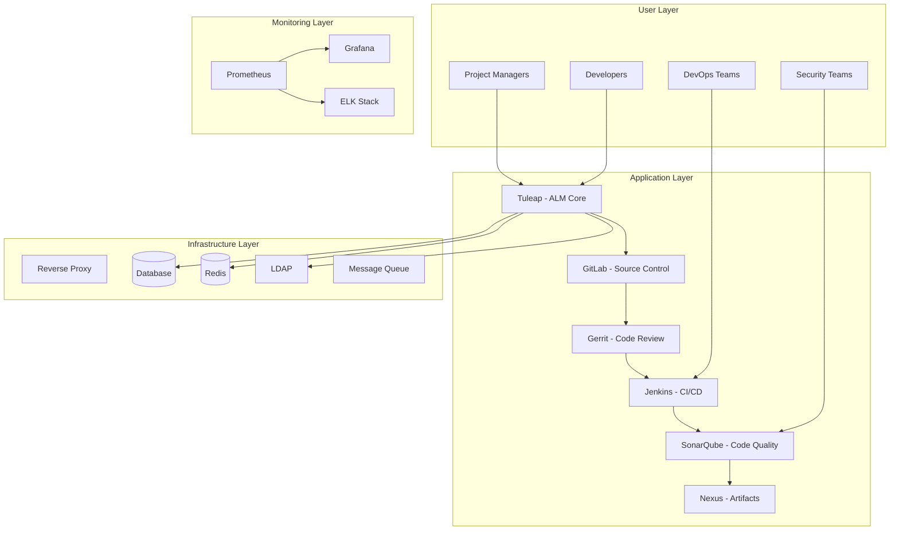

# 📚 Brown Bear ALM Platform Documentation

Welcome to the comprehensive documentation for the Brown Bear Application Lifecycle Management (ALM) platform. This documentation provides detailed technical information for developers, architects, operators, and stakeholders.

## 📖 **Documentation Structure**

### 🏗️ **[Architecture](./architecture/)**
Comprehensive system architecture documentation with detailed diagrams and design decisions.

- **[System Overview](./architecture/system-overview.md)** - High-level platform architecture
- **[Component Architecture](./architecture/component-architecture.md)** - Detailed component design
- **[Data Architecture](./architecture/data-architecture.md)** - Database and data flow design
- **[Security Architecture](./architecture/security-architecture.md)** - Security design and patterns
- **[Integration Architecture](./architecture/integration-architecture.md)** - Inter-service communication
- **[Deployment Architecture](./architecture/deployment-architecture.md)** - Infrastructure and deployment design

### 📝 **[Architecture Decision Records (ADR)](./adr/)**
Documented architectural decisions with context, options, and rationale.

- **[ADR Index](./adr/README.md)** - Complete list of architectural decisions
- **[ADR Template](./adr/template.md)** - Template for new ADRs

### 🚀 **[Deployment](./deployment/)**
Comprehensive deployment documentation for all environments.

- **[Deployment Guide](./deployment/deployment-guide.md)** - Complete deployment instructions
- **[Environment Configuration](./deployment/environment-config.md)** - Environment-specific settings
- **[Container Orchestration](./deployment/container-orchestration.md)** - Docker and Kubernetes deployment
- **[CI/CD Pipeline](./deployment/cicd-pipeline.md)** - Automated deployment processes
- **[Monitoring & Observability](./deployment/monitoring.md)** - Monitoring and alerting setup

### 🛡️ **[Security](./security/)**
Security documentation covering all aspects of platform security.

- **[Security Overview](./security/security-overview.md)** - Comprehensive security framework
- **[Authentication & Authorization](./security/auth.md)** - Identity and access management
- **[Data Security](./security/data-security.md)** - Data protection and encryption
- **[Network Security](./security/network-security.md)** - Network protection and segmentation
- **[Security Policies](./security/policies.md)** - Security policies and procedures
- **[Compliance](./security/compliance.md)** - Regulatory compliance documentation

### 🔗 **[Integration](./integration/)**
Integration patterns and API documentation.

- **[Integration Overview](./integration/integration-overview.md)** - Platform integration strategy
- **[API Documentation](./integration/api-docs.md)** - REST and GraphQL APIs
- **[Service Integration](./integration/service-integration.md)** - Inter-service communication
- **[Third-party Integrations](./integration/third-party.md)** - External system integrations
- **[Event-driven Architecture](./integration/event-architecture.md)** - Event streaming and messaging

### 🏗️ **[Infrastructure](./infrastructure/)**
Infrastructure documentation and operational procedures.

- **[Infrastructure Overview](./infrastructure/infrastructure-overview.md)** - Complete infrastructure design
- **[Network Architecture](./infrastructure/network-architecture.md)** - Network design and topology
- **[Storage Architecture](./infrastructure/storage-architecture.md)** - Data storage and persistence
- **[Scaling & Performance](./infrastructure/scaling.md)** - Performance optimization and scaling
- **[Disaster Recovery](./infrastructure/disaster-recovery.md)** - Backup and recovery procedures
- **[Operations Manual](./infrastructure/operations.md)** - Day-to-day operational procedures

## 🎯 **Quick Start Guides**

### 👨‍💻 **For Developers**
1. [Development Setup](./architecture/development-setup.md)
2. [API Documentation](./integration/api-docs.md)
3. [Contributing Guidelines](../CONTRIBUTING.md)

### 🏗️ **For Architects**
1. [System Architecture Overview](./architecture/system-overview.md)
2. [Architecture Decision Records](./adr/README.md)
3. [Integration Patterns](./integration/integration-overview.md)

### 🚀 **For DevOps/SRE**
1. [Deployment Guide](./deployment/deployment-guide.md)
2. [Infrastructure Overview](./infrastructure/infrastructure-overview.md)
3. [Monitoring Setup](./deployment/monitoring.md)

### 🛡️ **For Security Teams**
1. [Security Overview](./security/security-overview.md)
2. [Security Policies](./security/policies.md)
3. [Compliance Documentation](./security/compliance.md)

## 📊 **Platform Overview**

Brown Bear is a comprehensive Application Lifecycle Management (ALM) platform that integrates multiple best-of-breed tools into a unified development and project management ecosystem.

### 🎯 **Core Components**

### 🏆 **Key Features**

- **🎯 Project Management**: Agile planning, backlog management, sprint tracking
- **🔗 Source Control**: Git repository management with advanced workflows
- **👁️ Code Review**: Comprehensive code review with quality gates
- **🚀 CI/CD**: Automated build, test, and deployment pipelines
- **📊 Code Quality**: Continuous code quality monitoring and improvement
- **📦 Artifact Management**: Centralized repository for build artifacts
- **🛡️ Security**: Integrated security scanning and compliance
- **📈 Monitoring**: Comprehensive observability and metrics

### 🎨 **Technology Stack**

| Layer | Technologies |
|-------|-------------|
| **Frontend** | Vue.js 3, TypeScript, SCSS, Webpack 5 |
| **Backend** | PHP 8.0, Symfony Components, RESTful APIs |
| **Database** | MySQL 5.7, Redis for caching |
| **Authentication** | LDAP, SAML, OAuth 2.0 |
| **Container** | Docker, Docker Compose |
| **CI/CD** | Jenkins, GitLab CI, GitHub Actions |
| **Monitoring** | Prometheus, Grafana, ELK Stack |
| **Security** | SonarQube, Trivy, OWASP ZAP |

## 🔄 **Documentation Workflow**

### 📝 **Contributing to Documentation**
1. Create/update documentation in the appropriate section
2. Follow the established templates and formatting guidelines
3. Include relevant diagrams using Mermaid syntax
4. Update this index if adding new documents
5. Submit a pull request for review

### 🔍 **Documentation Standards**
- Use clear, concise language
- Include practical examples and code snippets
- Maintain consistent formatting and structure
- Keep diagrams up-to-date with implementation
- Version control all documentation changes

### 📅 **Documentation Maintenance**
- Quarterly review of all documentation
- Update diagrams with architecture changes
- Verify deployment instructions with each release
- Update security documentation with policy changes

## 📞 **Support & Contact**

- **Documentation Issues**: Create an issue in the repository
- **Architecture Questions**: Contact the Architecture Team
- **Security Concerns**: Contact the Security Team
- **Operational Issues**: Contact the DevOps Team

---

**Last Updated**: August 2025  
**Version**: 1.0  
**Maintained by**: Brown Bear Documentation Team
