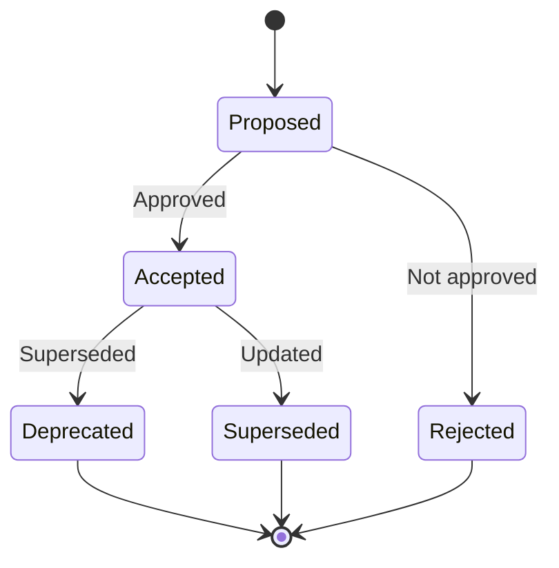

# 📝 Architecture Decision Records (ADR) Index

Architecture Decision Records (ADRs) document important architectural decisions made during the development of the Brown Bear platform. Each ADR captures the context, decision, and consequences of architectural choices.

## 📚 **ADR Template**

See [ADR Template](./template.md) for the standard format for creating new ADRs.

## 📋 **ADR Index**

| ADR # | Title | Status | Date | Impact |
|-------|-------|--------|------|--------|
| [ADR-001](./001-microservices-architecture.md) | Microservices Architecture Pattern | ✅ Accepted | 2025-08-01 | High |
| [ADR-002](./002-container-orchestration.md) | Container Orchestration with Docker | ✅ Accepted | 2025-08-02 | High |
| [ADR-003](./003-api-first-design.md) | API-First Design Approach | ✅ Accepted | 2025-08-03 | High |
| [ADR-004](./004-database-technology.md) | Database Technology Selection | ✅ Accepted | 2025-08-04 | High |
| [ADR-005](./005-authentication-strategy.md) | Authentication and Authorization Strategy | ✅ Accepted | 2025-08-05 | High |
| [ADR-006](./006-monitoring-stack.md) | Monitoring and Observability Stack | ✅ Accepted | 2025-08-06 | Medium |
| [ADR-007](./007-security-framework.md) | Security Framework and Patterns | ✅ Accepted | 2025-08-07 | High |
| [ADR-008](./008-deployment-strategy.md) | Deployment Strategy and Environments | ✅ Accepted | 2025-08-08 | High |
| [ADR-009](./009-message-queue-selection.md) | Message Queue Technology Selection | ✅ Accepted | 2025-08-09 | Medium |
| [ADR-010](./010-frontend-framework.md) | Frontend Framework Selection | ✅ Accepted | 2025-08-10 | Medium |
| [ADR-011](./011-caching-strategy.md) | Caching Strategy and Implementation | ✅ Accepted | 2025-08-11 | Medium |
| [ADR-012](./012-logging-strategy.md) | Logging Strategy and Implementation | ✅ Accepted | 2025-08-12 | Medium |
| [ADR-013](./013-backup-recovery.md) | Backup and Recovery Strategy | ✅ Accepted | 2025-08-13 | High |
| [ADR-014](./014-scalability-approach.md) | Scalability and Performance Approach | ✅ Accepted | 2025-08-14 | High |
| [ADR-015](./015-cicd-pipeline.md) | CI/CD Pipeline Architecture | ✅ Accepted | 2025-08-15 | High |

## 📊 **ADR Status Legend**

- ✅ **Accepted**: Decision has been approved and is being implemented
- 🔄 **Proposed**: Decision is under review and discussion
- ⚠️ **Deprecated**: Decision has been superseded by a newer ADR
- ❌ **Rejected**: Decision was considered but rejected
- 🔒 **Superseded**: Decision replaced by a newer version

## 🎯 **ADR Categories**

### 🏗️ **Architecture & Design**
- Microservices architecture patterns
- API design principles
- Data architecture decisions
- Integration patterns

### 🛡️ **Security**
- Authentication and authorization
- Security frameworks
- Encryption standards
- Access control models

### 🚀 **Infrastructure & Deployment**
- Container orchestration
- Deployment strategies
- Environment configuration
- Scalability approaches

### 📊 **Operations & Monitoring**
- Monitoring and observability
- Logging strategies
- Backup and recovery
- Performance optimization

### 🔧 **Technology Selection**
- Framework and library choices
- Database technology decisions
- Tool and platform selections
- Vendor evaluations

## 📝 **Creating New ADRs**

1. **Copy the template**: Use [template.md](./template.md) as starting point
2. **Assign number**: Use next available ADR number
3. **Follow format**: Maintain consistent structure and format
4. **Seek review**: Get architectural review before finalizing
5. **Update index**: Add entry to this index after approval

## 🔄 **ADR Lifecycle**

## 📞 **ADR Governance**

### **👥 Decision Makers**
- **Chief Technology Officer**: Final authority on high-impact decisions
- **Lead Architects**: Primary decision makers for architectural choices
- **Engineering Leads**: Input on implementation feasibility
- **Security Team**: Review of security-related decisions

### **📋 Review Process**
1. **Preparation**: Author prepares ADR using template
2. **Technical Review**: Engineering team reviews for technical soundness
3. **Architecture Review**: Architecture team reviews for alignment
4. **Security Review**: Security team reviews security implications
5. **Stakeholder Review**: Business stakeholders review impact
6. **Final Approval**: CTO or designated authority approves
7. **Publication**: ADR is published and communicated

### **🔄 Maintenance**
- **Quarterly Review**: Review all ADRs for relevance and accuracy
- **Impact Assessment**: Evaluate real-world impact of decisions
- **Update Process**: Modify or supersede ADRs as needed
- **Communication**: Ensure team awareness of ADR changes

## 📚 **ADR Best Practices**

### **✍️ Writing Guidelines**
- **Be concise**: Keep ADRs focused and readable
- **Be specific**: Provide concrete details and rationale
- **Be factual**: Base decisions on evidence and analysis
- **Be timely**: Document decisions when they are made
- **Be accessible**: Write for various technical audiences

### **🎯 Content Guidelines**
- **Context first**: Explain the problem and constraints
- **Options considered**: Show alternatives that were evaluated
- **Clear decision**: State the chosen approach explicitly
- **Rationale**: Explain why this option was selected
- **Consequences**: Identify positive and negative outcomes

### **🔗 Reference Guidelines**
- **Link dependencies**: Reference related ADRs and decisions
- **Cite sources**: Include external references and research
- **Version control**: Track changes and evolution
- **Cross-reference**: Ensure consistency across ADRs

---

**Document Metadata:**
- **Version**: 1.0
- **Last Updated**: August 2025
- **Maintained by**: Architecture Team
- **Next Review**: Q4 2025
