# 🏗️ Brown Bear System Architecture Overview

## 📖 **Table of Contents**

1. [Executive Summary](#executive-summary)
2. [System Context](#system-context)
3. [High-Level Architecture](#high-level-architecture)
4. [Service Architecture](#service-architecture)
5. [Data Flow Architecture](#data-flow-architecture)
6. [Security Architecture](#security-architecture)
7. [Deployment Architecture](#deployment-architecture)
8. [Integration Architecture](#integration-architecture)
9. [Scalability & Performance](#scalability--performance)
10. [Technology Stack](#technology-stack)

---

## 🎯 **Executive Summary**

Brown Bear is an enterprise-grade Application Lifecycle Management (ALM) platform that provides a unified ecosystem for software development, project management, and DevOps operations. The platform integrates industry-leading tools into a cohesive, secure, and scalable solution.

### **🎖️ Key Architectural Principles**

- **Microservices Architecture**: Loosely coupled services with clear boundaries
- **API-First Design**: RESTful APIs for all inter-service communication
- **Security by Design**: Multi-layered security with defense in depth
- **Cloud Native**: Container-based deployment with orchestration
- **Event-Driven**: Asynchronous communication through message queues
- **Observability**: Comprehensive monitoring and logging

---

## 🌍 **System Context**

### **System Context Diagram**

```mermaid
C4Context
    title Brown Bear ALM Platform - System Context

    Person(dev, "Developers", "Software developers working on projects")
    Person(pm, "Project Managers", "Managing projects and teams")
    Person(devops, "DevOps Engineers", "Managing infrastructure and deployments")
    Person(security, "Security Teams", "Managing security and compliance")
    Person(admin, "System Administrators", "Platform administration")

    System_Boundary(bb, "Brown Bear Platform") {
        System(alm, "ALM Core", "Tuleap-based project management and collaboration")
        System(scm, "Source Control", "GitLab for Git repository management")
        System(cicd, "CI/CD Pipeline", "Jenkins for automated builds and deployments")
        System(quality, "Code Quality", "SonarQube for code analysis")
        System(artifacts, "Artifact Repository", "Nexus for package management")
        System(review, "Code Review", "Gerrit for peer code review")
    }

    System_Ext(ldap, "LDAP Directory", "Corporate identity management")
    System_Ext(email, "Email System", "Corporate email infrastructure")
    System_Ext(monitoring, "External Monitoring", "Enterprise monitoring systems")
    System_Ext(backup, "Backup System", "Enterprise backup infrastructure")
    System_Ext(registry, "Container Registry", "Docker image repository")

    Rel(dev, alm, "Manages projects and artifacts")
    Rel(dev, scm, "Commits code")
    Rel(dev, review, "Submits code for review")
    
    Rel(pm, alm, "Tracks progress and manages backlogs")
    
    Rel(devops, cicd, "Configures pipelines")
    Rel(devops, artifacts, "Manages packages")
    
    Rel(security, quality, "Reviews security scans")
    Rel(admin, bb, "Administers platform")

    Rel(bb, ldap, "Authenticates users")
    Rel(bb, email, "Sends notifications")
    Rel(bb, monitoring, "Sends metrics")
    Rel(bb, backup, "Stores backups")
    Rel(bb, registry, "Stores container images")
```

### **🎭 User Personas & Use Cases**

| Persona | Primary Use Cases | Key Features |
|---------|------------------|--------------|
| **Developers** | Code development, debugging, collaboration | Git workflow, code review, CI/CD, quality metrics |
| **Project Managers** | Project planning, tracking, reporting | Agile boards, backlogs, dashboards, reports |
| **DevOps Engineers** | Infrastructure, deployments, monitoring | Pipeline management, artifact management, monitoring |
| **Security Teams** | Security scanning, compliance, auditing | Security dashboards, vulnerability management, compliance reports |
| **Administrators** | Platform management, user management | User administration, system configuration, monitoring |

---

## 🏗️ **High-Level Architecture**

### **Layered Architecture Diagram**


### **🎯 Architectural Patterns**

| Pattern | Implementation | Benefit |
|---------|---------------|---------|
| **Microservices** | Service-per-component architecture | Scalability, maintainability, technology diversity |
| **API Gateway** | Centralized API management | Security, rate limiting, monitoring |
| **Event Sourcing** | Event-driven state changes | Audit trail, consistency, replay capability |
| **CQRS** | Separate read/write models | Performance optimization, scalability |
| **Circuit Breaker** | Fault tolerance patterns | Resilience, graceful degradation |
| **Bulkhead** | Resource isolation | Fault isolation, stability |

---

## ⚙️ **Service Architecture**

### **Service Decomposition**

```mermaid
graph TB
    subgraph "🎯 Core ALM Services"
        PROJECT[Project Management Service]
        USER[User Management Service]
        TRACK[Tracking Service]
        REPORT[Reporting Service]
        COLLAB[Collaboration Service]
    end
    
    subgraph "🔗 Source Control Services"
        REPO[Repository Service]
        BRANCH[Branch Management]
        MERGE[Merge Request Service]
        HOOK[Webhook Service]
    end
    
    subgraph "🚀 CI/CD Services"
        BUILD[Build Service]
        TEST[Test Service]
        DEPLOY[Deployment Service]
        PIPELINE[Pipeline Orchestrator]
        AGENT[Build Agents]
    end
    
    subgraph "📊 Quality Services"
        SCAN[Code Scanning]
        ANALYSIS[Static Analysis]
        SECURITY[Security Scanning]
        COVERAGE[Coverage Analysis]
    end
    
    subgraph "📦 Artifact Services"
        STORE[Artifact Storage]
        REGISTRY[Container Registry]
        PACKAGE[Package Management]
        VERSION[Version Management]
    end
    
    subgraph "👁️ Review Services"
        REVIEW[Code Review Engine]
        APPROVAL[Approval Workflow]
        COMMENT[Comment System]
        INTEGRATION[SCM Integration]
    end
    
    subgraph "🔐 Security Services"
        AUTH[Authentication Service]
        AUTHZ[Authorization Service]
        TOKEN[Token Management]
        AUDIT[Audit Service]
    end
    
    subgraph "📡 Supporting Services"
        NOTIFY[Notification Service]
        SEARCH[Search Service]
        FILE[File Service]
        CONFIG[Configuration Service]
    end

    PROJECT --> USER
    PROJECT --> TRACK
    PROJECT --> REPORT
    
    REPO --> BRANCH
    REPO --> MERGE
    REPO --> HOOK
    
    BUILD --> TEST
    BUILD --> DEPLOY
    PIPELINE --> BUILD
    PIPELINE --> AGENT
    
    SCAN --> ANALYSIS
    SCAN --> SECURITY
    ANALYSIS --> COVERAGE
    
    STORE --> REGISTRY
    STORE --> PACKAGE
    PACKAGE --> VERSION
    
    REVIEW --> APPROVAL
    REVIEW --> COMMENT
    REVIEW --> INTEGRATION
    
    AUTH --> AUTHZ
    AUTH --> TOKEN
    AUTHZ --> AUDIT
    
    NOTIFY --> SEARCH
    SEARCH --> FILE
    FILE --> CONFIG
```



### **🔄 Service Interaction Patterns**


---

## 🌊 **Data Flow Architecture**

### **Data Flow Diagram**


### **📊 Data Architecture Patterns**

| Pattern | Implementation | Use Case |
|---------|---------------|----------|
| **Event Sourcing** | Immutable event store | Audit trail, state reconstruction |
| **CQRS** | Separate read/write models | Query optimization, scalability |
| **Data Lake** | Raw data storage | Analytics, machine learning |
| **Data Mesh** | Domain-oriented data ownership | Decentralized data management |
| **CDC** | Change data capture | Real-time synchronization |

---

## 🛡️ **Security Architecture**

### **Security Layers Diagram**

```mermaid
graph TB
    subgraph "🌐 Network Security"
        FIREWALL[Firewall Rules]
        WAF[Web Application Firewall]
        DDoS[DDoS Protection]
        VPN[VPN Access]
    end
    
    subgraph "🔐 Identity & Access"
        LDAP[LDAP Directory]
        SSO[Single Sign-On]
        MFA[Multi-Factor Auth]
        RBAC[Role-Based Access Control]
    end
    
    subgraph "🛡️ Application Security"
        INPUT[Input Validation]
        OUTPUT[Output Encoding]
        CSRF[CSRF Protection]
        XSS[XSS Prevention]
    end
    
    subgraph "💾 Data Security"
        ENCRYPT[Data Encryption]
        HASH[Password Hashing]
        MASK[Data Masking]
        BACKUP[Secure Backup]
    end
    
    subgraph "📊 Security Monitoring"
        SIEM[SIEM System]
        IDS[Intrusion Detection]
        AUDIT[Audit Logging]
        ALERT[Security Alerts]
    end
    
    subgraph "🔍 Vulnerability Management"
        SCAN[Security Scanning]
        ASSESS[Risk Assessment]
        PATCH[Patch Management]
        PEN[Penetration Testing]
    end

    FIREWALL --> WAF
    WAF --> DDoS
    DDoS --> VPN
    
    LDAP --> SSO
    SSO --> MFA
    MFA --> RBAC
    
    INPUT --> OUTPUT
    OUTPUT --> CSRF
    CSRF --> XSS
    
    ENCRYPT --> HASH
    HASH --> MASK
    MASK --> BACKUP
    
    SIEM --> IDS
    IDS --> AUDIT
    AUDIT --> ALERT
    
    SCAN --> ASSESS
    ASSESS --> PATCH
    PATCH --> PEN
```



### **🔒 Security Controls Matrix**

| Control Type | Implementation | Coverage |
|-------------|---------------|----------|
| **Authentication** | LDAP, SAML, OAuth 2.0 | All services |
| **Authorization** | RBAC, ABAC | Granular permissions |
| **Encryption** | TLS 1.3, AES-256 | Data in transit & rest |
| **Monitoring** | SIEM, audit logs | All activities |
| **Vulnerability Management** | Automated scanning | Code & infrastructure |
| **Incident Response** | Automated alerts | Real-time detection |

---

## 🚀 **Deployment Architecture**

### **Container Orchestration**

```mermaid
graph TB
    subgraph "🌐 External Layer"
        LB[Load Balancer]
        CDN[Content Delivery Network]
        DNS[DNS Service]
    end
    
    subgraph "🔄 Reverse Proxy Layer"
        NGINX[Nginx Reverse Proxy]
        SSL[SSL Termination]
        RATE[Rate Limiting]
    end
    
    subgraph "🎯 Application Layer"
        POD1[Tuleap Pods]
        POD2[GitLab Pods]
        POD3[Jenkins Pods]
        POD4[SonarQube Pods]
        POD5[Nexus Pods]
        POD6[Gerrit Pods]
    end
    
    subgraph "💾 Data Layer"
        PVC1[Persistent Volume Claims]
        PVC2[Database Storage]
        PVC3[File Storage]
        NFS[NFS Shares]
    end
    
    subgraph "🔐 Security Layer"
        SECRETS[Kubernetes Secrets]
        RBAC_K8S[K8s RBAC]
        PSP[Pod Security Policies]
        NET_POL[Network Policies]
    end
    
    subgraph "📊 Monitoring Layer"
        PROM[Prometheus]
        GRAF[Grafana]
        JAEGER[Jaeger Tracing]
        ELK[ELK Stack]
    end

    LB --> NGINX
    CDN --> NGINX
    DNS --> LB
    
    NGINX --> SSL
    SSL --> RATE
    
    RATE --> POD1
    RATE --> POD2
    RATE --> POD3
    RATE --> POD4
    RATE --> POD5
    RATE --> POD6
    
    POD1 --> PVC1
    POD2 --> PVC2
    POD3 --> PVC3
    POD4 --> NFS
    POD5 --> PVC1
    POD6 --> PVC2
    
    SECRETS --> RBAC_K8S
    RBAC_K8S --> PSP
    PSP --> NET_POL
    
    PROM --> GRAF
    GRAF --> JAEGER
    JAEGER --> ELK
```



### **🎯 Deployment Environments**

```mermaid
graph LR
    subgraph "🏗️ Development"
        DEV_CODE[Local Development]
        DEV_TEST[Unit Testing]
        DEV_BUILD[Local Build]
    end
    
    subgraph "🧪 Testing"
        TEST_INT[Integration Testing]
        TEST_E2E[E2E Testing]
        TEST_PERF[Performance Testing]
    end
    
    subgraph "🚀 Staging"
        STAGE_DEPLOY[Staging Deployment]
        STAGE_SMOKE[Smoke Testing]
        STAGE_UAT[User Acceptance Testing]
    end
    
    subgraph "🌟 Production"
        PROD_DEPLOY[Production Deployment]
        PROD_MONITOR[Production Monitoring]
        PROD_SCALE[Auto Scaling]
    end

    DEV_CODE --> DEV_TEST
    DEV_TEST --> DEV_BUILD
    DEV_BUILD --> TEST_INT
    
    TEST_INT --> TEST_E2E
    TEST_E2E --> TEST_PERF
    TEST_PERF --> STAGE_DEPLOY
    
    STAGE_DEPLOY --> STAGE_SMOKE
    STAGE_SMOKE --> STAGE_UAT
    STAGE_UAT --> PROD_DEPLOY
    
    PROD_DEPLOY --> PROD_MONITOR
    PROD_MONITOR --> PROD_SCALE
```



---

## 🔗 **Integration Architecture**

### **Integration Patterns**

```mermaid
graph TB
    subgraph "🎯 Synchronous Integration"
        REST[REST APIs]
        GRAPHQL[GraphQL]
        RPC[gRPC]
    end
    
    subgraph "⚡ Asynchronous Integration"
        QUEUE[Message Queues]
        STREAM[Event Streams]
        WEBHOOK[Webhooks]
    end
    
    subgraph "💾 Data Integration"
        ETL_PROC[ETL Processes]
        CDC_PROC[Change Data Capture]
        SYNC[Data Synchronization]
    end
    
    subgraph "🔐 Security Integration"
        AUTH_TOKEN[Token Exchange]
        OAUTH[OAuth 2.0]
        SAML_SSO[SAML SSO]
    end

    REST --> QUEUE
    GRAPHQL --> STREAM
    RPC --> WEBHOOK
    
    QUEUE --> ETL_PROC
    STREAM --> CDC_PROC
    WEBHOOK --> SYNC
    
    ETL_PROC --> AUTH_TOKEN
    CDC_PROC --> OAUTH
    SYNC --> SAML_SSO
```



### **🌐 API Architecture**


---

## 📈 **Scalability & Performance**

### **Scaling Strategy**


### **🎯 Performance Metrics**

| Metric | Target | Monitoring |
|--------|--------|------------|
| **Response Time** | < 200ms (95th percentile) | Application Performance Monitoring |
| **Throughput** | > 1000 req/sec | Load testing, production metrics |
| **Availability** | 99.9% uptime | Health checks, SLA monitoring |
| **Error Rate** | < 0.1% | Error tracking, alerting |
| **Resource Utilization** | < 70% CPU/Memory | Infrastructure monitoring |

---

## 🛠️ **Technology Stack**

### **Technology Stack Diagram**

```mermaid
graph TB
    subgraph "🌐 Frontend Technologies"
        VUE[Vue.js 3]
        TS[TypeScript]
        SCSS[SCSS/Sass]
        WEBPACK[Webpack 5]
        VITE[Vite]
    end
    
    subgraph "⚙️ Backend Technologies"
        PHP[PHP 8.0]
        SYMFONY[Symfony Components]
        NGINX[Nginx]
        APACHE[Apache HTTP]
    end
    
    subgraph "💾 Database Technologies"
        MYSQL[MySQL 5.7/8.0]
        REDIS[Redis 6+]
        ELASTICSEARCH[Elasticsearch]
    end
    
    subgraph "🐳 Container Technologies"
        DOCKER[Docker]
        COMPOSE[Docker Compose]
        K8S[Kubernetes]
        HELM[Helm Charts]
    end
    
    subgraph "🔐 Security Technologies"
        LDAP_TECH[OpenLDAP]
        OAUTH_TECH[OAuth 2.0]
        SAML_TECH[SAML 2.0]
        SSL_TECH[SSL/TLS]
    end
    
    subgraph "📊 Monitoring Technologies"
        PROM_TECH[Prometheus]
        GRAF_TECH[Grafana]
        ELK_TECH[ELK Stack]
        JAEGER_TECH[Jaeger]
    end
    
    subgraph "🚀 DevOps Technologies"
        JENKINS_TECH[Jenkins]
        GITLAB_CI[GitLab CI]
        GITHUB_ACTIONS[GitHub Actions]
        ANSIBLE[Ansible]
    end

    VUE --> TS
    TS --> SCSS
    SCSS --> WEBPACK
    WEBPACK --> VITE
    
    PHP --> SYMFONY
    SYMFONY --> NGINX
    NGINX --> APACHE
    
    MYSQL --> REDIS
    REDIS --> ELASTICSEARCH
    
    DOCKER --> COMPOSE
    COMPOSE --> K8S
    K8S --> HELM
    
    LDAP_TECH --> OAUTH_TECH
    OAUTH_TECH --> SAML_TECH
    SAML_TECH --> SSL_TECH
    
    PROM_TECH --> GRAF_TECH
    GRAF_TECH --> ELK_TECH
    ELK_TECH --> JAEGER_TECH
    
    JENKINS_TECH --> GITLAB_CI
    GITLAB_CI --> GITHUB_ACTIONS
    GITHUB_ACTIONS --> ANSIBLE
```



### **📋 Technology Decision Matrix**

| Category | Technology | Rationale | Alternatives Considered |
|----------|------------|-----------|------------------------|
| **Frontend Framework** | Vue.js 3 | Component-based, excellent TypeScript support, active community | React, Angular |
| **Backend Language** | PHP 8.0 | Tuleap compatibility, mature ecosystem, good performance | Node.js, Python, Java |
| **Database** | MySQL 8.0 | ACID compliance, excellent performance, wide adoption | PostgreSQL, MariaDB |
| **Cache** | Redis | High performance, data structure support, clustering | Memcached, Hazelcast |
| **Container Platform** | Docker | Industry standard, excellent ecosystem, development efficiency | Podman, LXC |
| **Orchestration** | Kubernetes | Cloud-native, extensive features, vendor neutrality | Docker Swarm, Nomad |
| **CI/CD** | Jenkins | Flexibility, plugin ecosystem, pipeline as code | GitLab CI, CircleCI |
| **Monitoring** | Prometheus | Pull-based metrics, PromQL, Kubernetes integration | InfluxDB, DataDog |

---

## 📊 **Architecture Metrics & KPIs**

### **📈 System Health Indicators**

| Category | Metric | Target | Current | Trend |
|----------|--------|--------|---------|-------|
| **Availability** | System Uptime | 99.9% | 99.95% | ↗️ |
| **Performance** | Response Time (P95) | < 200ms | 150ms | ↗️ |
| **Scalability** | Concurrent Users | 10,000+ | 8,500 | ↗️ |
| **Security** | Security Scan Score | > 95% | 97% | ↗️ |
| **Quality** | Code Coverage | > 80% | 85% | ↗️ |
| **Reliability** | Error Rate | < 0.1% | 0.05% | ↗️ |

---

**Document Metadata:**
- **Version**: 1.0
- **Last Updated**: August 2025
- **Authors**: Architecture Team
- **Reviewers**: CTO, Lead Architects
- **Next Review**: Q4 2025
