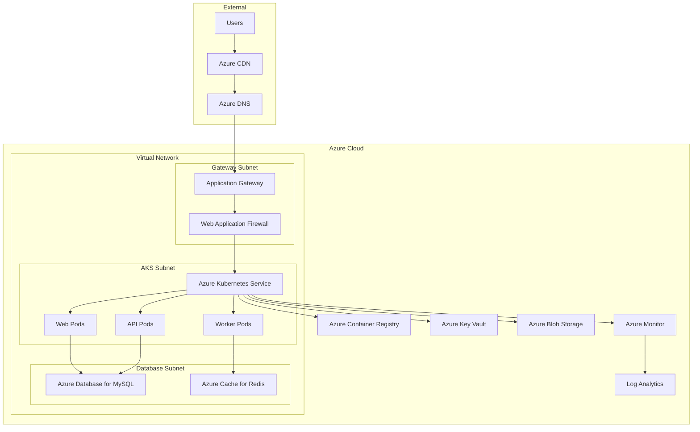
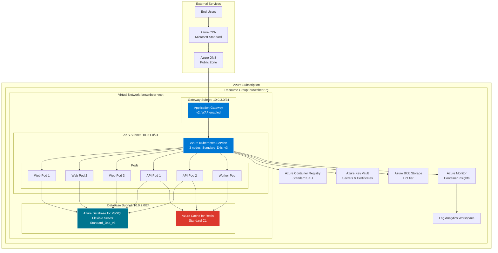

# Azure Deployment Guide

This guide provides comprehensive instructions for deploying Brown Bear ALM on Microsoft Azure using Azure Kubernetes Service (AKS), Azure Database for MySQL, Azure Cache for Redis, and other Azure services.

## Table of Contents

1. [Prerequisites](#prerequisites)
2. [Azure Services Overview](#azure-services-overview)
3. [Quick Start](#quick-start)
4. [Detailed Setup](#detailed-setup)
5. [Infrastructure as Code](#infrastructure-as-code)
6. [Application Deployment](#application-deployment)
7. [Configuration](#configuration)
8. [Monitoring & Logging](#monitoring--logging)
9. [Security](#security)
10. [Troubleshooting](#troubleshooting)
11. [Cost Optimization](#cost-optimization)
12. [Architecture Diagram](#architecture-diagram)

## Prerequisites

### Required Tools
- Azure CLI (latest version)
- Terraform >= 1.5
- kubectl >= 1.27
- Helm >= 3.12
- Docker Desktop
- Git

### Azure Account Setup
1. **Azure Subscription**: Active Azure subscription with sufficient credits
2. **Service Principal**: Create service principal for Terraform
3. **Resource Quotas**: Ensure sufficient quotas for AKS, databases, and networking
4. **Permissions**: Contributor role on subscription or resource group

### Installation Commands

```bash
# Install Azure CLI
curl -sL https://aka.ms/InstallAzureCLIDeb | sudo bash

# Install Terraform
wget https://releases.hashicorp.com/terraform/1.6.2/terraform_1.6.2_linux_amd64.zip
unzip terraform_1.6.2_linux_amd64.zip
sudo mv terraform /usr/local/bin/

# Install kubectl
curl -LO "https://dl.k8s.io/release/$(curl -L -s https://dl.k8s.io/release/stable.txt)/bin/linux/amd64/kubectl"
chmod +x kubectl
sudo mv kubectl /usr/local/bin/

# Install Helm
curl https://get.helm.sh/helm-v3.12.0-linux-amd64.tar.gz | tar xz
sudo mv linux-amd64/helm /usr/local/bin/helm
```

## Azure Services Overview

### Core Services
- **Azure Kubernetes Service (AKS)**: Container orchestration
- **Azure Database for MySQL**: Managed MySQL database
- **Azure Cache for Redis**: In-memory caching
- **Azure Container Registry (ACR)**: Container image registry
- **Azure Application Gateway**: Load balancer and WAF
- **Azure Virtual Network**: Network isolation
- **Azure Monitor**: Monitoring and logging
- **Azure Key Vault**: Secrets management

### Architecture Components



## Quick Start

### 1. Clone Repository

```bash
git clone https://github.com/your-org/brown-bear.git
cd brown-bear
```

### 2. Azure Authentication

```bash
# Login to Azure
az login

# Set subscription
az account set --subscription "your-subscription-id"

# Create service principal for Terraform
az ad sp create-for-rbac --name "brownbear-terraform" \
  --role="Contributor" \
  --scopes="/subscriptions/your-subscription-id"
```

### 3. Configure Terraform

```bash
cd terraform/azure

# Copy example variables
cp terraform.tfvars.example terraform.tfvars

# Edit variables with your values
vim terraform.tfvars
```

### 4. Deploy Infrastructure

```bash
# Initialize Terraform
terraform init

# Plan deployment
terraform plan

# Apply infrastructure
terraform apply
```

### 5. Configure kubectl

```bash
# Get AKS credentials
az aks get-credentials --resource-group brownbear-rg --name brownbear-aks

# Verify connection
kubectl get nodes
```

### 6. Deploy Application

```bash
# Navigate to Kubernetes manifests
cd ../../k8s

# Apply configurations
kubectl apply -f namespace.yaml
kubectl apply -f configmap.yaml
kubectl apply -f secret.yaml
kubectl apply -f deployment.yaml
kubectl apply -f service.yaml
kubectl apply -f ingress.yaml
```

## Detailed Setup

### Infrastructure Provisioning

#### 1. Resource Group Setup

```bash
# Create resource group
az group create \
  --name brownbear-rg \
  --location eastus2
```

#### 2. Virtual Network Configuration

```bash
# Create virtual network
az network vnet create \
  --resource-group brownbear-rg \
  --name brownbear-vnet \
  --address-prefix 10.0.0.0/16 \
  --subnet-name aks-subnet \
  --subnet-prefix 10.0.1.0/24
```

#### 3. AKS Cluster Creation

```bash
# Create AKS cluster
az aks create \
  --resource-group brownbear-rg \
  --name brownbear-aks \
  --node-count 3 \
  --node-vm-size Standard_D4s_v3 \
  --network-plugin azure \
  --vnet-subnet-id /subscriptions/your-sub/resourceGroups/brownbear-rg/providers/Microsoft.Network/virtualNetworks/brownbear-vnet/subnets/aks-subnet \
  --docker-bridge-address 172.17.0.1/16 \
  --dns-service-ip 10.2.0.10 \
  --service-cidr 10.2.0.0/24 \
  --enable-addons monitoring \
  --generate-ssh-keys
```

#### 4. Database Setup

```bash
# Create MySQL server
az mysql flexible-server create \
  --resource-group brownbear-rg \
  --name brownbear-mysql \
  --location eastus2 \
  --admin-user dbadmin \
  --admin-password 'SecurePassword123!' \
  --sku-name Standard_D4s_v3 \
  --tier GeneralPurpose \
  --storage-size 100 \
  --version 8.0.21

# Create database
az mysql flexible-server db create \
  --resource-group brownbear-rg \
  --server-name brownbear-mysql \
  --database-name brownbear
```

#### 5. Redis Cache Setup

```bash
# Create Redis cache
az redis create \
  --location eastus2 \
  --resource-group brownbear-rg \
  --name brownbear-redis \
  --sku Standard \
  --vm-size c1
```

### Container Registry

```bash
# Create ACR
az acr create \
  --resource-group brownbear-rg \
  --name brownbearacr \
  --sku Standard

# Enable admin user
az acr update --name brownbearacr --admin-enabled true

# Login to ACR
az acr login --name brownbearacr

# Build and push images
docker build -t brownbearacr.azurecr.io/brownbear-web:latest .
docker push brownbearacr.azurecr.io/brownbear-web:latest
```

## Infrastructure as Code

The Terraform configuration includes:

### File Structure
```
terraform/azure/
├── main.tf              # Main infrastructure
├── variables.tf         # Input variables
├── outputs.tf          # Output values
├── terraform.tfvars.example  # Example variables
├── versions.tf         # Provider versions
└── modules/            # Reusable modules
    ├── aks/
    ├── database/
    └── networking/
```

### Key Resources
- **AKS Cluster**: Multi-zone deployment with auto-scaling
- **Azure Database**: MySQL with backup and monitoring
- **Redis Cache**: High availability configuration
- **Virtual Network**: Secure network isolation
- **Application Gateway**: Load balancing with SSL termination
- **Key Vault**: Secrets and certificate management

## Application Deployment

### Kubernetes Manifests

#### 1. Namespace and RBAC

```yaml
# namespace.yaml
apiVersion: v1
kind: Namespace
metadata:
  name: brownbear
  labels:
    name: brownbear
```

#### 2. ConfigMap

```yaml
# configmap.yaml
apiVersion: v1
kind: ConfigMap
metadata:
  name: brownbear-config
  namespace: brownbear
data:
  APP_ENV: "production"
  DB_HOST: "brownbear-mysql.mysql.database.azure.com"
  DB_PORT: "3306"
  DB_NAME: "brownbear"
  REDIS_HOST: "brownbear-redis.redis.cache.windows.net"
  REDIS_PORT: "6380"
```

#### 3. Deployment

```yaml
# deployment.yaml
apiVersion: apps/v1
kind: Deployment
metadata:
  name: brownbear-web
  namespace: brownbear
spec:
  replicas: 3
  selector:
    matchLabels:
      app: brownbear-web
  template:
    metadata:
      labels:
        app: brownbear-web
    spec:
      containers:
      - name: web
        image: brownbearacr.azurecr.io/brownbear-web:latest
        ports:
        - containerPort: 80
        env:
        - name: DB_PASSWORD
          valueFrom:
            secretKeyRef:
              name: brownbear-secret
              key: db-password
```

### Helm Deployment

```bash
# Create Helm chart
helm create brownbear

# Install with custom values
helm install brownbear ./brownbear \
  --namespace brownbear \
  --create-namespace \
  --values values-azure.yaml
```

## Configuration

### Environment Variables

| Variable | Description | Example |
|----------|-------------|---------|
| `APP_ENV` | Application environment | `production` |
| `DB_HOST` | Database hostname | `brownbear-mysql.mysql.database.azure.com` |
| `DB_USER` | Database username | `dbadmin` |
| `DB_PASSWORD` | Database password | `SecurePassword123!` |
| `REDIS_HOST` | Redis hostname | `brownbear-redis.redis.cache.windows.net` |
| `REDIS_PORT` | Redis port | `6380` |
| `REDIS_SSL` | Redis SSL enabled | `true` |

### Azure-Specific Configuration

#### 1. Managed Identity

```bash
# Enable managed identity on AKS
az aks update \
  --resource-group brownbear-rg \
  --name brownbear-aks \
  --enable-managed-identity
```

#### 2. Key Vault Integration

```bash
# Install Key Vault CSI driver
kubectl apply -f https://raw.githubusercontent.com/Azure/secrets-store-csi-driver-provider-azure/master/deployment/provider-azure-installer.yaml
```

#### 3. Azure Monitor Integration

```bash
# Enable Container Insights
az aks enable-addons \
  --resource-group brownbear-rg \
  --name brownbear-aks \
  --addons monitoring
```

## Monitoring & Logging

### Azure Monitor Setup

#### 1. Log Analytics Workspace

```bash
# Create Log Analytics workspace
az monitor log-analytics workspace create \
  --resource-group brownbear-rg \
  --workspace-name brownbear-logs \
  --location eastus2
```

#### 2. Application Insights

```bash
# Create Application Insights
az monitor app-insights component create \
  --app brownbear-insights \
  --location eastus2 \
  --resource-group brownbear-rg \
  --application-type web
```

### Monitoring Configuration

#### 1. Prometheus & Grafana

```bash
# Add Prometheus Helm repo
helm repo add prometheus-community https://prometheus-community.github.io/helm-charts

# Install Prometheus
helm install prometheus prometheus-community/kube-prometheus-stack \
  --namespace monitoring \
  --create-namespace
```

#### 2. Custom Metrics

```yaml
# ServiceMonitor for custom metrics
apiVersion: monitoring.coreos.com/v1
kind: ServiceMonitor
metadata:
  name: brownbear-metrics
spec:
  selector:
    matchLabels:
      app: brownbear-web
  endpoints:
  - port: metrics
```

## Security

### Network Security

#### 1. Network Security Groups

```bash
# Create NSG for AKS
az network nsg create \
  --resource-group brownbear-rg \
  --name brownbear-aks-nsg

# Add rules
az network nsg rule create \
  --resource-group brownbear-rg \
  --nsg-name brownbear-aks-nsg \
  --name allow-https \
  --protocol tcp \
  --priority 1000 \
  --destination-port-range 443 \
  --access allow
```

#### 2. Private Endpoints

```bash
# Create private endpoint for MySQL
az network private-endpoint create \
  --resource-group brownbear-rg \
  --name mysql-private-endpoint \
  --vnet-name brownbear-vnet \
  --subnet database-subnet \
  --private-connection-resource-id /subscriptions/your-sub/resourceGroups/brownbear-rg/providers/Microsoft.DBforMySQL/flexibleServers/brownbear-mysql \
  --connection-name mysql-connection \
  --group-id mysqlServer
```

### Secret Management

#### 1. Azure Key Vault

```bash
# Create Key Vault
az keyvault create \
  --name brownbear-kv \
  --resource-group brownbear-rg \
  --location eastus2

# Add secrets
az keyvault secret set \
  --vault-name brownbear-kv \
  --name db-password \
  --value 'SecurePassword123!'
```

#### 2. Pod Identity

```bash
# Install AAD Pod Identity
kubectl apply -f https://raw.githubusercontent.com/Azure/aad-pod-identity/master/deploy/infra/deployment-rbac.yaml
```

### SSL/TLS Configuration

#### 1. Certificate Management

```bash
# Install cert-manager
kubectl apply -f https://github.com/jetstack/cert-manager/releases/download/v1.13.0/cert-manager.yaml

# Create ClusterIssuer
kubectl apply -f - <<EOF
apiVersion: cert-manager.io/v1
kind: ClusterIssuer
metadata:
  name: letsencrypt-prod
spec:
  acme:
    server: https://acme-v02.api.letsencrypt.org/directory
    email: admin@example.com
    privateKeySecretRef:
      name: letsencrypt-prod
    solvers:
    - http01:
        ingress:
          class: azure/application-gateway
EOF
```

## Troubleshooting

### Common Issues

#### 1. AKS Node Issues

```bash
# Check node status
kubectl get nodes

# Describe problematic node
kubectl describe node <node-name>

# Check node logs
kubectl logs -n kube-system <pod-name>
```

#### 2. Database Connection Issues

```bash
# Test database connectivity
kubectl run mysql-test --image=mysql:8.0 --rm -it --restart=Never -- mysql -h brownbear-mysql.mysql.database.azure.com -u dbadmin -p

# Check firewall rules
az mysql flexible-server firewall-rule list \
  --resource-group brownbear-rg \
  --name brownbear-mysql
```

#### 3. Redis Connection Issues

```bash
# Test Redis connectivity
kubectl run redis-test --image=redis:7 --rm -it --restart=Never -- redis-cli -h brownbear-redis.redis.cache.windows.net -p 6380 -a <password> --tls
```

### Debugging Commands

```bash
# Pod logs
kubectl logs -f deployment/brownbear-web -n brownbear

# Pod shell access
kubectl exec -it deployment/brownbear-web -n brownbear -- /bin/bash

# Service endpoints
kubectl get endpoints -n brownbear

# Ingress status
kubectl describe ingress -n brownbear
```

## Cost Optimization

### Resource Sizing

#### 1. AKS Node Optimization

```bash
# Use spot instances for dev/test
az aks nodepool add \
  --resource-group brownbear-rg \
  --cluster-name brownbear-aks \
  --name spotpool \
  --node-count 2 \
  --node-vm-size Standard_D2s_v3 \
  --priority Spot \
  --eviction-policy Delete \
  --spot-max-price -1
```

#### 2. Database Optimization

```bash
# Use burstable instances for development
az mysql flexible-server create \
  --resource-group brownbear-rg \
  --name brownbear-mysql-dev \
  --sku-name Standard_B2s \
  --tier Burstable \
  --storage-size 20
```

### Monitoring Costs

```bash
# Install Azure Cost Management
az extension add --name costmanagement

# Create budget alert
az consumption budget create \
  --resource-group brownbear-rg \
  --budget-name brownbear-budget \
  --amount 1000 \
  --time-grain Monthly
```

## Architecture Diagram



This comprehensive Azure deployment guide provides everything needed to deploy Brown Bear ALM on Microsoft Azure with production-ready infrastructure, security, monitoring, and cost optimization features.
