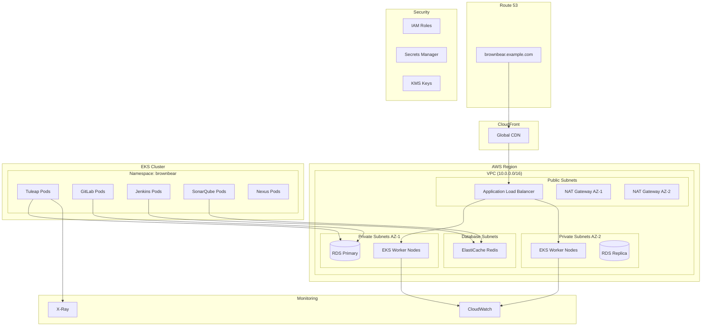

# 🚀 AWS Deployment Guide

## 📋 **Overview**

This guide provides comprehensive instructions for deploying the Brown Bear ALM platform on Amazon Web Services (AWS) using Terraform infrastructure-as-code.

## 🏗️ **AWS Architecture Diagram**



## 🛠️ **Prerequisites**

### **Required Tools**
```bash
# Install AWS CLI
curl "https://awscli.amazonaws.com/awscli-exe-linux-x86_64.zip" -o "awscliv2.zip"
unzip awscliv2.zip
sudo ./aws/install

# Install Terraform
wget https://releases.hashicorp.com/terraform/1.5.7/terraform_1.5.7_linux_amd64.zip
unzip terraform_1.5.7_linux_amd64.zip
sudo mv terraform /usr/local/bin/

# Install kubectl
curl -LO "https://dl.k8s.io/release/$(curl -L -s https://dl.k8s.io/release/stable.txt)/bin/linux/amd64/kubectl"
sudo install -o root -g root -m 0755 kubectl /usr/local/bin/kubectl

# Install eksctl
curl --silent --location "https://github.com/weaveworks/eksctl/releases/latest/download/eksctl_$(uname -s)_amd64.tar.gz" | tar xz -C /tmp
sudo mv /tmp/eksctl /usr/local/bin

# Install Helm
curl https://get.helm.sh/helm-v3.12.3-linux-amd64.tar.gz | tar xz
sudo mv linux-amd64/helm /usr/local/bin/
```

### **AWS Configuration**
```bash
# Configure AWS credentials
aws configure
# AWS Access Key ID: [Your Access Key]
# AWS Secret Access Key: [Your Secret Key]
# Default region name: us-west-2
# Default output format: json

# Verify configuration
aws sts get-caller-identity
```

## 🏗️ **Terraform Infrastructure**

### **Project Structure**
```
terraform/aws/
├── main.tf
├── variables.tf
├── outputs.tf
├── providers.tf
├── modules/
│   ├── vpc/
│   ├── eks/
│   ├── rds/
│   ├── elasticache/
│   ├── alb/
│   └── monitoring/
└── environments/
    ├── dev/
    ├── staging/
    └── production/
```

### **Main Infrastructure Code**

**providers.tf**
```hcl
terraform {
  required_version = ">= 1.5"
  required_providers {
    aws = {
      source  = "hashicorp/aws"
      version = "~> 5.0"
    }
    kubernetes = {
      source  = "hashicorp/kubernetes"
      version = "~> 2.21"
    }
    helm = {
      source  = "hashicorp/helm"
      version = "~> 2.10"
    }
  }

  backend "s3" {
    bucket         = "brownbear-terraform-state"
    key            = "production/terraform.tfstate"
    region         = "us-west-2"
    encrypt        = true
    dynamodb_table = "terraform-state-lock"
  }
}

provider "aws" {
  region = var.aws_region
  
  default_tags {
    tags = {
      Project     = "brownbear"
      Environment = var.environment
      ManagedBy   = "terraform"
      Owner       = var.owner
    }
  }
}

provider "kubernetes" {
  host                   = module.eks.cluster_endpoint
  cluster_ca_certificate = base64decode(module.eks.cluster_certificate_authority_data)
  
  exec {
    api_version = "client.authentication.k8s.io/v1beta1"
    command     = "aws"
    args = ["eks", "get-token", "--cluster-name", module.eks.cluster_name]
  }
}

provider "helm" {
  kubernetes {
    host                   = module.eks.cluster_endpoint
    cluster_ca_certificate = base64decode(module.eks.cluster_certificate_authority_data)
    
    exec {
      api_version = "client.authentication.k8s.io/v1beta1"
      command     = "aws"
      args = ["eks", "get-token", "--cluster-name", module.eks.cluster_name]
    }
  }
}
```

**variables.tf**
```hcl
variable "aws_region" {
  description = "AWS region"
  type        = string
  default     = "us-west-2"
}

variable "environment" {
  description = "Environment name"
  type        = string
  default     = "production"
}

variable "owner" {
  description = "Resource owner"
  type        = string
  default     = "brownbear-team"
}

variable "cluster_name" {
  description = "EKS cluster name"
  type        = string
  default     = "brownbear-cluster"
}

variable "cluster_version" {
  description = "Kubernetes version"
  type        = string
  default     = "1.27"
}

variable "instance_types" {
  description = "EC2 instance types for EKS nodes"
  type        = list(string)
  default     = ["t3.large", "t3.xlarge"]
}

variable "min_size" {
  description = "Minimum number of nodes"
  type        = number
  default     = 3
}

variable "max_size" {
  description = "Maximum number of nodes"
  type        = number
  default     = 10
}

variable "desired_size" {
  description = "Desired number of nodes"
  type        = number
  default     = 6
}

variable "db_instance_class" {
  description = "RDS instance class"
  type        = string
  default     = "db.r5.xlarge"
}

variable "db_allocated_storage" {
  description = "RDS allocated storage (GB)"
  type        = number
  default     = 100
}

variable "redis_node_type" {
  description = "ElastiCache Redis node type"
  type        = string
  default     = "cache.r6g.large"
}

variable "redis_num_cache_nodes" {
  description = "Number of Redis cache nodes"
  type        = number
  default     = 3
}

variable "domain_name" {
  description = "Domain name for the application"
  type        = string
  default     = "brownbear.example.com"
}
```

**main.tf**
```hcl
# Data sources
data "aws_availability_zones" "available" {
  filter {
    name   = "opt-in-status"
    values = ["opt-in-not-required"]
  }
}

data "aws_caller_identity" "current" {}

locals {
  name = "${var.cluster_name}-${var.environment}"
  azs  = slice(data.aws_availability_zones.available.names, 0, 3)
  
  tags = {
    Environment = var.environment
    Project     = "brownbear"
    ManagedBy   = "terraform"
  }
}

# VPC Module
module "vpc" {
  source = "./modules/vpc"
  
  name = local.name
  cidr = "10.0.0.0/16"
  
  azs             = local.azs
  private_subnets = ["10.0.1.0/24", "10.0.2.0/24", "10.0.3.0/24"]
  public_subnets  = ["10.0.4.0/24", "10.0.5.0/24", "10.0.6.0/24"]
  database_subnets = ["10.0.7.0/24", "10.0.8.0/24", "10.0.9.0/24"]
  
  enable_nat_gateway   = true
  single_nat_gateway   = false
  enable_dns_hostnames = true
  enable_dns_support   = true
  
  enable_flow_log                      = true
  create_flow_log_cloudwatch_iam_role  = true
  create_flow_log_cloudwatch_log_group = true
  
  public_subnet_tags = {
    "kubernetes.io/role/elb" = "1"
  }
  
  private_subnet_tags = {
    "kubernetes.io/role/internal-elb" = "1"
  }
  
  tags = local.tags
}

# EKS Module
module "eks" {
  source = "./modules/eks"
  
  cluster_name                   = local.name
  cluster_version               = var.cluster_version
  cluster_endpoint_public_access = true
  
  vpc_id                         = module.vpc.vpc_id
  subnet_ids                     = module.vpc.private_subnets
  control_plane_subnet_ids       = module.vpc.private_subnets
  
  # EKS Managed Node Groups
  eks_managed_node_groups = {
    general = {
      name           = "general"
      instance_types = var.instance_types
      
      min_size     = var.min_size
      max_size     = var.max_size
      desired_size = var.desired_size
      
      labels = {
        role = "general"
      }
      
      tags = {
        ExtraTag = "general"
      }
    }
    
    gitlab = {
      name           = "gitlab"
      instance_types = ["t3.xlarge"]
      
      min_size     = 1
      max_size     = 3
      desired_size = 2
      
      labels = {
        role = "gitlab"
      }
      
      taints = {
        dedicated = {
          key    = "gitlab"
          value  = "true"
          effect = "NO_SCHEDULE"
        }
      }
      
      tags = {
        ExtraTag = "gitlab"
      }
    }
  }
  
  tags = local.tags
}

# RDS Module
module "rds" {
  source = "./modules/rds"
  
  identifier = "${local.name}-mysql"
  
  engine               = "mysql"
  engine_version       = "8.0"
  family              = "mysql8.0"
  major_engine_version = "8.0"
  instance_class       = var.db_instance_class
  
  allocated_storage     = var.db_allocated_storage
  max_allocated_storage = var.db_allocated_storage * 2
  
  db_name  = "tuleap"
  username = "admin"
  port     = 3306
  
  multi_az               = true
  publicly_accessible    = false
  vpc_security_group_ids = [module.security_groups.rds_security_group_id]
  
  maintenance_window              = "Mon:00:00-Mon:03:00"
  backup_window                  = "03:00-06:00"
  enabled_cloudwatch_logs_exports = ["general"]
  create_cloudwatch_log_group     = true
  
  backup_retention_period = 30
  skip_final_snapshot     = false
  deletion_protection     = true
  
  performance_insights_enabled          = true
  performance_insights_retention_period = 7
  create_monitoring_role                = true
  
  db_subnet_group_name   = module.vpc.database_subnet_group
  vpc_security_group_ids = [module.security_groups.rds_security_group_id]
  
  tags = local.tags
}

# ElastiCache Redis Module
module "redis" {
  source = "./modules/elasticache"
  
  cluster_id           = "${local.name}-redis"
  description          = "Redis cluster for Brown Bear"
  
  node_type            = var.redis_node_type
  num_cache_nodes      = var.redis_num_cache_nodes
  parameter_group_name = "default.redis7"
  port                 = 6379
  
  subnet_group_name = module.vpc.elasticache_subnet_group_name
  security_group_ids = [module.security_groups.redis_security_group_id]
  
  at_rest_encryption_enabled = true
  transit_encryption_enabled = true
  
  apply_immediately = true
  
  tags = local.tags
}

# Security Groups Module
module "security_groups" {
  source = "./modules/security-groups"
  
  name   = local.name
  vpc_id = module.vpc.vpc_id
  
  tags = local.tags
}

# Application Load Balancer
module "alb" {
  source = "./modules/alb"
  
  name = "${local.name}-alb"
  
  vpc_id  = module.vpc.vpc_id
  subnets = module.vpc.public_subnets
  
  security_groups = [module.security_groups.alb_security_group_id]
  
  target_groups = [
    {
      name             = "${local.name}-tg"
      backend_protocol = "HTTP"
      backend_port     = 80
      target_type      = "ip"
      health_check = {
        enabled             = true
        healthy_threshold   = 3
        interval            = 30
        matcher             = "200"
        path                = "/health"
        port                = "traffic-port"
        protocol            = "HTTP"
        timeout             = 5
        unhealthy_threshold = 2
      }
    }
  ]
  
  https_listeners = [
    {
      port               = 443
      protocol           = "HTTPS"
      certificate_arn    = module.acm.acm_certificate_arn
      target_group_index = 0
    }
  ]
  
  http_tcp_listeners = [
    {
      port        = 80
      protocol    = "HTTP"
      action_type = "redirect"
      redirect = {
        port        = "443"
        protocol    = "HTTPS"
        status_code = "HTTP_301"
      }
    }
  ]
  
  tags = local.tags
}

# ACM Certificate
module "acm" {
  source = "./modules/acm"
  
  domain_name  = var.domain_name
  zone_id      = data.aws_route53_zone.this.zone_id
  
  subject_alternative_names = [
    "*.${var.domain_name}",
  ]
  
  wait_for_validation = true
  
  tags = local.tags
}

# Route53 Zone
data "aws_route53_zone" "this" {
  name         = var.domain_name
  private_zone = false
}

# Route53 Record
resource "aws_route53_record" "this" {
  zone_id = data.aws_route53_zone.this.zone_id
  name    = var.domain_name
  type    = "A"
  
  alias {
    name                   = module.alb.lb_dns_name
    zone_id                = module.alb.lb_zone_id
    evaluate_target_health = true
  }
}

# CloudWatch Log Groups
resource "aws_cloudwatch_log_group" "brownbear" {
  name              = "/aws/eks/${local.name}/cluster"
  retention_in_days = 30
  
  tags = local.tags
}

# IAM Roles for Service Accounts (IRSA)
module "irsa" {
  source = "./modules/irsa"
  
  cluster_oidc_issuer_url = module.eks.cluster_oidc_issuer_url
  cluster_name           = module.eks.cluster_name
  
  tags = local.tags
}
```

## 🔧 **Terraform Modules**

### **VPC Module (modules/vpc/main.tf)**
```hcl
module "vpc" {
  source = "terraform-aws-modules/vpc/aws"
  version = "~> 5.0"
  
  name = var.name
  cidr = var.cidr
  
  azs              = var.azs
  private_subnets  = var.private_subnets
  public_subnets   = var.public_subnets
  database_subnets = var.database_subnets
  
  enable_nat_gateway   = var.enable_nat_gateway
  single_nat_gateway   = var.single_nat_gateway
  enable_dns_hostnames = var.enable_dns_hostnames
  enable_dns_support   = var.enable_dns_support
  
  create_database_subnet_group       = true
  create_database_subnet_route_table = true
  
  create_elasticache_subnet_group = true
  
  enable_flow_log                      = var.enable_flow_log
  create_flow_log_cloudwatch_iam_role  = var.create_flow_log_cloudwatch_iam_role
  create_flow_log_cloudwatch_log_group = var.create_flow_log_cloudwatch_log_group
  
  public_subnet_tags  = var.public_subnet_tags
  private_subnet_tags = var.private_subnet_tags
  
  tags = var.tags
}
```

### **EKS Module (modules/eks/main.tf)**
```hcl
module "eks" {
  source = "terraform-aws-modules/eks/aws"
  version = "~> 19.0"
  
  cluster_name    = var.cluster_name
  cluster_version = var.cluster_version
  
  vpc_id                         = var.vpc_id
  subnet_ids                     = var.subnet_ids
  control_plane_subnet_ids       = var.control_plane_subnet_ids
  
  cluster_endpoint_public_access  = var.cluster_endpoint_public_access
  cluster_endpoint_private_access = true
  
  cluster_addons = {
    coredns = {
      most_recent = true
    }
    kube-proxy = {
      most_recent = true
    }
    vpc-cni = {
      most_recent = true
    }
    aws-ebs-csi-driver = {
      most_recent = true
    }
  }
  
  eks_managed_node_groups = var.eks_managed_node_groups
  
  # aws-auth configmap
  manage_aws_auth_configmap = true
  
  aws_auth_roles = [
    {
      rolearn  = "arn:aws:iam::${data.aws_caller_identity.current.account_id}:role/AWSReservedSSO_AdministratorAccess_*"
      username = "admin"
      groups   = ["system:masters"]
    },
  ]
  
  aws_auth_users = [
    {
      userarn  = "arn:aws:iam::${data.aws_caller_identity.current.account_id}:user/brownbear-admin"
      username = "brownbear-admin"
      groups   = ["system:masters"]
    },
  ]
  
  tags = var.tags
}

data "aws_caller_identity" "current" {}

# OIDC Provider
data "tls_certificate" "cluster" {
  url = module.eks.cluster_oidc_issuer_url
}

resource "aws_iam_openid_connect_provider" "cluster" {
  client_id_list  = ["sts.amazonaws.com"]
  thumbprint_list = [data.tls_certificate.cluster.certificates[0].sha1_fingerprint]
  url             = module.eks.cluster_oidc_issuer_url
  
  tags = var.tags
}
```

### **RDS Module (modules/rds/main.tf)**
```hcl
module "rds" {
  source = "terraform-aws-modules/rds/aws"
  version = "~> 6.0"
  
  identifier = var.identifier
  
  create_db_option_group    = false
  create_db_parameter_group = false
  
  engine               = var.engine
  engine_version       = var.engine_version
  family              = var.family
  major_engine_version = var.major_engine_version
  instance_class       = var.instance_class
  
  allocated_storage     = var.allocated_storage
  max_allocated_storage = var.max_allocated_storage
  
  db_name  = var.db_name
  username = var.username
  port     = var.port
  
  manage_master_user_password = true
  
  multi_az               = var.multi_az
  publicly_accessible    = var.publicly_accessible
  vpc_security_group_ids = var.vpc_security_group_ids
  
  maintenance_window              = var.maintenance_window
  backup_window                  = var.backup_window
  enabled_cloudwatch_logs_exports = var.enabled_cloudwatch_logs_exports
  create_cloudwatch_log_group     = var.create_cloudwatch_log_group
  
  backup_retention_period = var.backup_retention_period
  skip_final_snapshot     = var.skip_final_snapshot
  deletion_protection     = var.deletion_protection
  
  performance_insights_enabled          = var.performance_insights_enabled
  performance_insights_retention_period = var.performance_insights_retention_period
  create_monitoring_role                = var.create_monitoring_role
  
  create_db_subnet_group = false
  db_subnet_group_name   = var.db_subnet_group_name
  
  tags = var.tags
}

# Read Replica
resource "aws_db_instance" "replica" {
  identifier = "${var.identifier}-replica"
  
  replicate_source_db = module.rds.db_instance_identifier
  
  instance_class = var.instance_class
  
  publicly_accessible = false
  
  auto_minor_version_upgrade = true
  
  performance_insights_enabled = true
  
  tags = var.tags
}
```

## 🚀 **Deployment Steps**

### **1. Initialize Terraform**
```bash
# Clone repository
git clone https://github.com/yasir2000/brown-bear.git
cd brown-bear/terraform/aws

# Initialize Terraform
terraform init

# Create workspace for environment
terraform workspace new production
terraform workspace select production
```

### **2. Plan Infrastructure**
```bash
# Review the execution plan
terraform plan -var-file="environments/production/terraform.tfvars"

# Optional: Save plan to file
terraform plan -var-file="environments/production/terraform.tfvars" -out=production.tfplan
```

### **3. Deploy Infrastructure**
```bash
# Apply the configuration
terraform apply -var-file="environments/production/terraform.tfvars"

# Or apply from saved plan
terraform apply production.tfplan
```

### **4. Configure kubectl**
```bash
# Update kubeconfig
aws eks update-kubeconfig --region us-west-2 --name brownbear-cluster-production

# Verify connection
kubectl get nodes
kubectl get namespaces
```

### **5. Deploy Applications**
```bash
# Create namespace
kubectl create namespace brownbear

# Apply Kubernetes manifests
kubectl apply -f k8s/namespace.yaml
kubectl apply -f k8s/configmaps/
kubectl apply -f k8s/secrets/
kubectl apply -f k8s/deployments/
kubectl apply -f k8s/services/
kubectl apply -f k8s/ingress/

# Or use Helm
helm repo add brownbear ./charts
helm install brownbear brownbear/brownbear \
  --namespace brownbear \
  --values values-aws-production.yaml
```

## 📊 **Monitoring & Observability**

### **CloudWatch Integration**
```bash
# Install AWS Load Balancer Controller
kubectl apply -k "github.com/aws/eks-charts/stable/aws-load-balancer-controller//crds?ref=master"

helm repo add eks https://aws.github.io/eks-charts
helm install aws-load-balancer-controller eks/aws-load-balancer-controller \
  -n kube-system \
  --set clusterName=brownbear-cluster-production \
  --set serviceAccount.create=false \
  --set serviceAccount.name=aws-load-balancer-controller

# Install CloudWatch Container Insights
curl https://raw.githubusercontent.com/aws-samples/amazon-cloudwatch-container-insights/latest/k8s-deployment-manifest-templates/deployment-mode/daemonset/container-insights-monitoring/quickstart/cwagent-fluentd-quickstart.yaml | sed "s/{{cluster_name}}/brownbear-cluster-production/;s/{{region_name}}/us-west-2/" | kubectl apply -f -
```

### **Prometheus & Grafana**
```bash
# Install kube-prometheus-stack
helm repo add prometheus-community https://prometheus-community.github.io/helm-charts
helm install prometheus prometheus-community/kube-prometheus-stack \
  --namespace monitoring \
  --create-namespace \
  --values prometheus-values.yaml
```

## 🔐 **Security Configuration**

### **IAM Roles and Policies**
```bash
# Create service account with IRSA
eksctl create iamserviceaccount \
  --cluster=brownbear-cluster-production \
  --namespace=brownbear \
  --name=brownbear-service-account \
  --attach-policy-arn=arn:aws:iam::aws:policy/AmazonS3FullAccess \
  --approve \
  --override-existing-serviceaccounts
```

### **Secrets Management**
```bash
# Install External Secrets Operator
helm repo add external-secrets https://charts.external-secrets.io
helm install external-secrets external-secrets/external-secrets \
  --namespace external-secrets-system \
  --create-namespace

# Create secret store
kubectl apply -f - <<EOF
apiVersion: external-secrets.io/v1beta1
kind: SecretStore
metadata:
  name: aws-secrets-manager
  namespace: brownbear
spec:
  provider:
    aws:
      service: SecretsManager
      region: us-west-2
      auth:
        jwt:
          serviceAccountRef:
            name: brownbear-service-account
EOF
```

## 🔄 **Backup & Disaster Recovery**

### **Velero Backup**
```bash
# Install Velero
wget https://github.com/vmware-tanzu/velero/releases/download/v1.11.1/velero-v1.11.1-linux-amd64.tar.gz
tar xzf velero-v1.11.1-linux-amd64.tar.gz
sudo mv velero-v1.11.1-linux-amd64/velero /usr/local/bin/

# Install Velero in cluster
velero install \
    --provider aws \
    --plugins velero/velero-plugin-for-aws:v1.7.1 \
    --bucket brownbear-backup-bucket \
    --backup-location-config region=us-west-2 \
    --snapshot-location-config region=us-west-2 \
    --secret-file ./credentials-velero

# Create backup schedule
velero schedule create brownbear-daily \
    --schedule="0 1 * * *" \
    --include-namespaces brownbear
```

## 💰 **Cost Optimization**

### **Spot Instances**
```hcl
# Add spot instances to EKS node groups
spot = {
  name           = "spot"
  instance_types = ["t3.medium", "t3.large", "t3.xlarge"]
  capacity_type  = "SPOT"
  
  min_size     = 0
  max_size     = 10
  desired_size = 3
  
  labels = {
    role = "spot"
  }
  
  taints = {
    spot = {
      key    = "spot"
      value  = "true"
      effect = "NO_SCHEDULE"
    }
  }
}
```

### **Resource Optimization**
```bash
# Install Vertical Pod Autoscaler
kubectl apply -f https://github.com/kubernetes/autoscaler/releases/download/vpa-0.14.0/vpa-v0.14.0-crd-gen.yaml
kubectl apply -f https://github.com/kubernetes/autoscaler/releases/download/vpa-0.14.0/vpa-v0.14.0-admission-controller-gen.yaml
kubectl apply -f https://github.com/kubernetes/autoscaler/releases/download/vpa-0.14.0/vpa-v0.14.0-recommender-gen.yaml
kubectl apply -f https://github.com/kubernetes/autoscaler/releases/download/vpa-0.14.0/vpa-v0.14.0-updater-gen.yaml

# Install Cluster Autoscaler
helm repo add autoscaler https://kubernetes.github.io/autoscaler
helm install cluster-autoscaler autoscaler/cluster-autoscaler \
  --namespace kube-system \
  --set autoDiscovery.clusterName=brownbear-cluster-production \
  --set awsRegion=us-west-2
```

## 🚨 **Troubleshooting**

### **Common Issues**

1. **EKS Node Group Issues**
   ```bash
   # Check node group status
   aws eks describe-nodegroup --cluster-name brownbear-cluster-production --nodegroup-name general
   
   # Check node conditions
   kubectl describe nodes
   ```

2. **RDS Connection Issues**
   ```bash
   # Test RDS connectivity
   kubectl run mysql-client --rm -it --image=mysql:8.0 -- mysql -h rds-endpoint -u admin -p
   
   # Check security groups
   aws ec2 describe-security-groups --group-ids sg-xxxxxxxxx
   ```

3. **Load Balancer Issues**
   ```bash
   # Check ALB controller logs
   kubectl logs -n kube-system deployment.apps/aws-load-balancer-controller
   
   # Check target group health
   aws elbv2 describe-target-health --target-group-arn arn:aws:elasticloadbalancing:...
   ```

### **Cleanup**
```bash
# Destroy infrastructure (be careful!)
terraform destroy -var-file="environments/production/terraform.tfvars"

# Or destroy specific resources
terraform destroy -target=module.eks -var-file="environments/production/terraform.tfvars"
```

---

This AWS deployment guide provides a comprehensive, production-ready setup for the Brown Bear ALM platform with proper security, monitoring, and scalability considerations.
