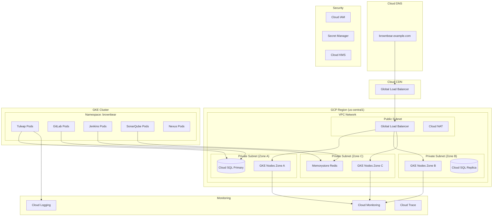

# 🌩️ Google Cloud Platform Deployment Guide

## 📋 **Overview**

This guide provides comprehensive instructions for deploying the Brown Bear ALM platform on Google Cloud Platform (GCP) using Terraform infrastructure-as-code.

## 🏗️ **GCP Architecture Diagram**



## 🛠️ **Prerequisites**

### **Required Tools**
```bash
# Install Google Cloud SDK
curl https://sdk.cloud.google.com | bash
exec -l $SHELL

# Initialize gcloud
gcloud init
gcloud auth application-default login

# Install Terraform
wget https://releases.hashicorp.com/terraform/1.5.7/terraform_1.5.7_linux_amd64.zip
unzip terraform_1.5.7_linux_amd64.zip
sudo mv terraform /usr/local/bin/

# Install kubectl
gcloud components install kubectl

# Install Helm
curl https://get.helm.sh/helm-v3.12.3-linux-amd64.tar.gz | tar xz
sudo mv linux-amd64/helm /usr/local/bin/
```

### **GCP Configuration**
```bash
# Set project
export PROJECT_ID="your-project-id"
gcloud config set project $PROJECT_ID

# Enable required APIs
gcloud services enable container.googleapis.com
gcloud services enable sqladmin.googleapis.com
gcloud services enable redis.googleapis.com
gcloud services enable compute.googleapis.com
gcloud services enable dns.googleapis.com
gcloud services enable secretmanager.googleapis.com
gcloud services enable monitoring.googleapis.com
gcloud services enable logging.googleapis.com

# Verify configuration
gcloud config list
gcloud projects describe $PROJECT_ID
```

## 🏗️ **Terraform Infrastructure**

### **Project Structure**
```
terraform/gcp/
├── main.tf
├── variables.tf
├── outputs.tf
├── providers.tf
├── modules/
│   ├── vpc/
│   ├── gke/
│   ├── cloud-sql/
│   ├── memorystore/
│   ├── load-balancer/
│   └── monitoring/
└── environments/
    ├── dev/
    ├── staging/
    └── production/
```

### **Main Infrastructure Code**

**providers.tf**
```hcl
terraform {
  required_version = ">= 1.5"
  required_providers {
    google = {
      source  = "hashicorp/google"
      version = "~> 4.84"
    }
    google-beta = {
      source  = "hashicorp/google-beta"
      version = "~> 4.84"
    }
    kubernetes = {
      source  = "hashicorp/kubernetes"
      version = "~> 2.21"
    }
    helm = {
      source  = "hashicorp/helm"
      version = "~> 2.10"
    }
  }

  backend "gcs" {
    bucket = "brownbear-terraform-state"
    prefix = "production/terraform.tfstate"
  }
}

provider "google" {
  project = var.project_id
  region  = var.region
  zone    = var.zone
}

provider "google-beta" {
  project = var.project_id
  region  = var.region
  zone    = var.zone
}

provider "kubernetes" {
  host                   = "https://${module.gke.endpoint}"
  token                  = data.google_client_config.default.access_token
  cluster_ca_certificate = base64decode(module.gke.ca_certificate)
}

provider "helm" {
  kubernetes {
    host                   = "https://${module.gke.endpoint}"
    token                  = data.google_client_config.default.access_token
    cluster_ca_certificate = base64decode(module.gke.ca_certificate)
  }
}

data "google_client_config" "default" {}
```

**variables.tf**
```hcl
variable "project_id" {
  description = "GCP project ID"
  type        = string
}

variable "region" {
  description = "GCP region"
  type        = string
  default     = "us-central1"
}

variable "zone" {
  description = "GCP zone"
  type        = string
  default     = "us-central1-a"
}

variable "environment" {
  description = "Environment name"
  type        = string
  default     = "production"
}

variable "cluster_name" {
  description = "GKE cluster name"
  type        = string
  default     = "brownbear-cluster"
}

variable "cluster_version" {
  description = "Kubernetes version"
  type        = string
  default     = "1.27"
}

variable "node_count" {
  description = "Number of nodes per zone"
  type        = number
  default     = 2
}

variable "min_node_count" {
  description = "Minimum number of nodes per zone"
  type        = number
  default     = 1
}

variable "max_node_count" {
  description = "Maximum number of nodes per zone"
  type        = number
  default     = 5
}

variable "machine_type" {
  description = "Machine type for GKE nodes"
  type        = string
  default     = "e2-standard-4"
}

variable "disk_size_gb" {
  description = "Disk size for GKE nodes"
  type        = number
  default     = 50
}

variable "disk_type" {
  description = "Disk type for GKE nodes"
  type        = string
  default     = "pd-ssd"
}

variable "db_tier" {
  description = "Cloud SQL instance tier"
  type        = string
  default     = "db-n1-standard-4"
}

variable "db_disk_size" {
  description = "Cloud SQL disk size (GB)"
  type        = number
  default     = 100
}

variable "redis_memory_size_gb" {
  description = "Redis memory size (GB)"
  type        = number
  default     = 4
}

variable "domain_name" {
  description = "Domain name for the application"
  type        = string
  default     = "brownbear.example.com"
}
```

**main.tf**
```hcl
locals {
  name = "${var.cluster_name}-${var.environment}"
  
  tags = {
    environment = var.environment
    project     = "brownbear"
    managed-by  = "terraform"
  }
}

# VPC Network
resource "google_compute_network" "main" {
  name                    = "${local.name}-vpc"
  auto_create_subnetworks = false
  routing_mode           = "REGIONAL"
}

# Subnets
resource "google_compute_subnetwork" "private" {
  name          = "${local.name}-private"
  ip_cidr_range = "10.0.0.0/24"
  region        = var.region
  network       = google_compute_network.main.id
  
  secondary_ip_range {
    range_name    = "k8s-pod-range"
    ip_cidr_range = "10.1.0.0/16"
  }
  
  secondary_ip_range {
    range_name    = "k8s-service-range"
    ip_cidr_range = "10.2.0.0/16"
  }
  
  private_ip_google_access = true
}

# Cloud Router
resource "google_compute_router" "main" {
  name    = "${local.name}-router"
  region  = var.region
  network = google_compute_network.main.id
}

# Cloud NAT
resource "google_compute_router_nat" "main" {
  name                               = "${local.name}-nat"
  router                            = google_compute_router.main.name
  region                            = var.region
  nat_ip_allocate_option            = "AUTO_ONLY"
  source_subnetwork_ip_ranges_to_nat = "ALL_SUBNETWORKS_ALL_IP_RANGES"
  
  log_config {
    enable = true
    filter = "ERRORS_ONLY"
  }
}

# Firewall Rules
resource "google_compute_firewall" "allow_internal" {
  name    = "${local.name}-allow-internal"
  network = google_compute_network.main.id
  
  allow {
    protocol = "tcp"
    ports    = ["0-65535"]
  }
  
  allow {
    protocol = "udp"
    ports    = ["0-65535"]
  }
  
  allow {
    protocol = "icmp"
  }
  
  source_ranges = ["10.0.0.0/8"]
}

resource "google_compute_firewall" "allow_health_check" {
  name    = "${local.name}-allow-health-check"
  network = google_compute_network.main.id
  
  allow {
    protocol = "tcp"
    ports    = ["80", "443", "8080"]
  }
  
  source_ranges = ["130.211.0.0/22", "35.191.0.0/16"]
  target_tags   = ["gke-node"]
}

# GKE Cluster
module "gke" {
  source = "terraform-google-modules/kubernetes-engine/google//modules/private-cluster"
  version = "~> 29.0"
  
  project_id = var.project_id
  name       = local.name
  region     = var.region
  
  network           = google_compute_network.main.name
  subnetwork        = google_compute_subnetwork.private.name
  ip_range_pods     = "k8s-pod-range"
  ip_range_services = "k8s-service-range"
  
  kubernetes_version           = var.cluster_version
  release_channel             = "STABLE"
  enable_private_endpoint     = false
  enable_private_nodes        = true
  master_ipv4_cidr_block      = "172.16.0.0/28"
  
  horizontal_pod_autoscaling  = true
  network_policy              = true
  enable_binary_authorization = false
  
  node_pools = [
    {
      name            = "general-pool"
      machine_type    = var.machine_type
      node_locations  = "${var.zone},${substr(var.zone, 0, length(var.zone)-1)}b,${substr(var.zone, 0, length(var.zone)-1)}c"
      min_count       = var.min_node_count
      max_count       = var.max_node_count
      initial_node_count = var.node_count
      disk_size_gb    = var.disk_size_gb
      disk_type       = var.disk_type
      image_type      = "COS_CONTAINERD"
      enable_autoscaling = true
      auto_repair     = true
      auto_upgrade    = true
      service_account = google_service_account.gke_nodes.email
      
      node_metadata = "GKE_METADATA"
      
      oauth_scopes = [
        "https://www.googleapis.com/auth/cloud-platform"
      ]
    },
    {
      name            = "gitlab-pool"
      machine_type    = "e2-standard-8"
      node_locations  = var.zone
      min_count       = 1
      max_count       = 3
      initial_node_count = 2
      disk_size_gb    = 100
      disk_type       = var.disk_type
      image_type      = "COS_CONTAINERD"
      enable_autoscaling = true
      auto_repair     = true
      auto_upgrade    = true
      service_account = google_service_account.gke_nodes.email
      
      node_metadata = "GKE_METADATA"
      
      oauth_scopes = [
        "https://www.googleapis.com/auth/cloud-platform"
      ]
      
      taints = [{
        key    = "gitlab"
        value  = "true"
        effect = "NO_SCHEDULE"
      }]
      
      labels = {
        role = "gitlab"
      }
    }
  ]
  
  node_pools_oauth_scopes = {
    all = [
      "https://www.googleapis.com/auth/cloud-platform",
    ]
  }
  
  node_pools_labels = {
    all = {
      environment = var.environment
      project     = "brownbear"
    }
  }
  
  node_pools_tags = {
    all = ["gke-node"]
  }
}

# Service Account for GKE Nodes
resource "google_service_account" "gke_nodes" {
  account_id   = "${local.name}-gke-nodes"
  display_name = "GKE Node Service Account"
  description  = "Service account for GKE nodes"
}

resource "google_project_iam_member" "gke_nodes" {
  for_each = toset([
    "roles/logging.logWriter",
    "roles/monitoring.metricWriter",
    "roles/monitoring.viewer",
    "roles/stackdriver.resourceMetadata.writer"
  ])
  
  project = var.project_id
  role    = each.value
  member  = "serviceAccount:${google_service_account.gke_nodes.email}"
}

# Cloud SQL MySQL Instance
resource "google_sql_database_instance" "mysql" {
  name             = "${local.name}-mysql"
  database_version = "MYSQL_8_0"
  region           = var.region
  
  deletion_protection = true
  
  settings {
    tier              = var.db_tier
    disk_size         = var.db_disk_size
    disk_type         = "PD_SSD"
    disk_autoresize   = true
    availability_type = "REGIONAL"
    
    backup_configuration {
      enabled                        = true
      start_time                     = "03:00"
      point_in_time_recovery_enabled = true
      binary_log_enabled            = true
      backup_retention_settings {
        retained_backups = 30
      }
    }
    
    maintenance_window {
      day         = 7
      hour        = 3
      update_track = "stable"
    }
    
    ip_configuration {
      ipv4_enabled                                  = false
      private_network                               = google_compute_network.main.id
      enable_private_path_for_google_cloud_services = true
    }
    
    insights_config {
      query_insights_enabled  = true
      record_application_tags = true
      record_client_address   = true
    }
  }
  
  depends_on = [google_service_networking_connection.private_vpc_connection]
}

# Cloud SQL Database
resource "google_sql_database" "tuleap" {
  name     = "tuleap"
  instance = google_sql_database_instance.mysql.name
}

# Cloud SQL User
resource "google_sql_user" "admin" {
  name     = "admin"
  instance = google_sql_database_instance.mysql.name
  password = random_password.db_password.result
}

resource "random_password" "db_password" {
  length  = 16
  special = true
}

# Private Service Connection for Cloud SQL
resource "google_compute_global_address" "private_ip_address" {
  name          = "${local.name}-private-ip"
  purpose       = "VPC_PEERING"
  address_type  = "INTERNAL"
  prefix_length = 16
  network       = google_compute_network.main.id
}

resource "google_service_networking_connection" "private_vpc_connection" {
  network                 = google_compute_network.main.id
  service                 = "servicenetworking.googleapis.com"
  reserved_peering_ranges = [google_compute_global_address.private_ip_address.name]
}

# Memorystore Redis Instance
resource "google_redis_instance" "redis" {
  name           = "${local.name}-redis"
  memory_size_gb = var.redis_memory_size_gb
  region         = var.region
  
  location_id             = var.zone
  alternative_location_id = "${substr(var.zone, 0, length(var.zone)-1)}b"
  
  authorized_network = google_compute_network.main.id
  
  redis_version     = "REDIS_7_0"
  display_name      = "Brown Bear Redis Cache"
  tier              = "STANDARD_HA"
  
  auth_enabled            = true
  transit_encryption_mode = "SERVER_AUTHENTICATION"
  
  maintenance_policy {
    weekly_maintenance_window {
      day = "SUNDAY"
      start_time {
        hours   = 3
        minutes = 0
        seconds = 0
        nanos   = 0
      }
    }
  }
}

# Secret Manager Secrets
resource "google_secret_manager_secret" "db_password" {
  secret_id = "${local.name}-db-password"
  
  replication {
    automatic = true
  }
}

resource "google_secret_manager_secret_version" "db_password" {
  secret      = google_secret_manager_secret.db_password.id
  secret_data = random_password.db_password.result
}

resource "google_secret_manager_secret" "redis_auth" {
  secret_id = "${local.name}-redis-auth"
  
  replication {
    automatic = true
  }
}

resource "google_secret_manager_secret_version" "redis_auth" {
  secret      = google_secret_manager_secret.redis_auth.id
  secret_data = google_redis_instance.redis.auth_string
}

# Service Account for Workload Identity
resource "google_service_account" "brownbear" {
  account_id   = "${local.name}-workload"
  display_name = "Brown Bear Workload Service Account"
}

resource "google_project_iam_member" "brownbear" {
  for_each = toset([
    "roles/secretmanager.secretAccessor",
    "roles/storage.objectAdmin",
    "roles/cloudsql.client"
  ])
  
  project = var.project_id
  role    = each.value
  member  = "serviceAccount:${google_service_account.brownbear.email}"
}

# Kubernetes Service Account for Workload Identity
resource "google_service_account_iam_member" "workload_identity" {
  service_account_id = google_service_account.brownbear.name
  role               = "roles/iam.workloadIdentityUser"
  member             = "serviceAccount:${var.project_id}.svc.id.goog[brownbear/brownbear-service-account]"
}

# Cloud Storage Bucket for backups
resource "google_storage_bucket" "backups" {
  name     = "${local.name}-backups"
  location = var.region
  
  versioning {
    enabled = true
  }
  
  lifecycle_rule {
    condition {
      age = 30
    }
    action {
      type = "Delete"
    }
  }
  
  encryption {
    default_kms_key_name = google_kms_crypto_key.backup_key.id
  }
}

# KMS Key for encryption
resource "google_kms_key_ring" "brownbear" {
  name     = "${local.name}-keyring"
  location = var.region
}

resource "google_kms_crypto_key" "backup_key" {
  name     = "backup-key"
  key_ring = google_kms_key_ring.brownbear.id
  
  lifecycle {
    prevent_destroy = true
  }
}

# Cloud Monitoring
resource "google_monitoring_notification_channel" "email" {
  display_name = "Email Notifications"
  type         = "email"
  
  labels = {
    email_address = "alerts@brownbear.example.com"
  }
}

# Load Balancer (Global HTTP(S) Load Balancer)
resource "google_compute_global_address" "default" {
  name = "${local.name}-ip"
}

resource "google_compute_managed_ssl_certificate" "default" {
  name = "${local.name}-ssl-cert"
  
  managed {
    domains = [var.domain_name]
  }
}

resource "google_compute_backend_service" "default" {
  name                            = "${local.name}-backend"
  connection_draining_timeout_sec = 10
  health_checks                   = [google_compute_health_check.default.id]
  
  backend {
    group = "projects/${var.project_id}/zones/${var.zone}/networkEndpointGroups/${local.name}-neg"
  }
}

resource "google_compute_health_check" "default" {
  name               = "${local.name}-health-check"
  check_interval_sec = 10
  timeout_sec        = 5
  
  http_health_check {
    port         = 80
    request_path = "/health"
  }
}

resource "google_compute_url_map" "default" {
  name            = "${local.name}-url-map"
  default_service = google_compute_backend_service.default.id
}

resource "google_compute_target_https_proxy" "default" {
  name             = "${local.name}-https-proxy"
  url_map          = google_compute_url_map.default.id
  ssl_certificates = [google_compute_managed_ssl_certificate.default.id]
}

resource "google_compute_global_forwarding_rule" "default" {
  name       = "${local.name}-forwarding-rule"
  target     = google_compute_target_https_proxy.default.id
  port_range = "443"
  ip_address = google_compute_global_address.default.address
}

# DNS Record
data "google_dns_managed_zone" "default" {
  name = replace(var.domain_name, ".", "-")
}

resource "google_dns_record_set" "default" {
  name = "${var.domain_name}."
  type = "A"
  ttl  = 300
  
  managed_zone = data.google_dns_managed_zone.default.name
  
  rrdatas = [google_compute_global_address.default.address]
}
```

## 🚀 **Deployment Steps**

### **1. Initialize Terraform**
```bash
# Clone repository
git clone https://github.com/yasir2000/brown-bear.git
cd brown-bear/terraform/gcp

# Initialize Terraform
terraform init

# Create workspace for environment
terraform workspace new production
terraform workspace select production
```

### **2. Plan Infrastructure**
```bash
# Set project ID
export TF_VAR_project_id="your-project-id"

# Review the execution plan
terraform plan -var="project_id=$TF_VAR_project_id"

# Optional: Save plan to file
terraform plan -var="project_id=$TF_VAR_project_id" -out=production.tfplan
```

### **3. Deploy Infrastructure**
```bash
# Apply the configuration
terraform apply -var="project_id=$TF_VAR_project_id"

# Or apply from saved plan
terraform apply production.tfplan
```

### **4. Configure kubectl**
```bash
# Get GKE credentials
gcloud container clusters get-credentials brownbear-cluster-production --region us-central1

# Verify connection
kubectl get nodes
kubectl get namespaces
```

### **5. Deploy Applications**
```bash
# Create namespace
kubectl create namespace brownbear

# Configure Workload Identity
kubectl annotate serviceaccount brownbear-service-account \
    --namespace brownbear \
    iam.gke.io/gcp-service-account=brownbear-cluster-production-workload@${PROJECT_ID}.iam.gserviceaccount.com

# Apply Kubernetes manifests
kubectl apply -f k8s/namespace.yaml
kubectl apply -f k8s/configmaps/
kubectl apply -f k8s/secrets/
kubectl apply -f k8s/deployments/
kubectl apply -f k8s/services/
kubectl apply -f k8s/ingress/

# Or use Helm
helm repo add brownbear ./charts
helm install brownbear brownbear/brownbear \
  --namespace brownbear \
  --values values-gcp-production.yaml
```

## 📊 **Monitoring & Observability**

### **Google Cloud Operations Integration**
```bash
# Install Google Cloud Logging and Monitoring
kubectl apply -f https://raw.githubusercontent.com/GoogleCloudPlatform/k8s-stackdriver/master/fluentd-gcp-image/kubernetes/fluentd-gcp-ds.yaml

# Install Prometheus Operator for additional metrics
helm repo add prometheus-community https://prometheus-community.github.io/helm-charts
helm install prometheus prometheus-community/kube-prometheus-stack \
  --namespace monitoring \
  --create-namespace \
  --set prometheus.prometheusSpec.storageSpec.volumeClaimTemplate.spec.resources.requests.storage=50Gi
```

### **Cloud Monitoring Dashboards**
```bash
# Create custom dashboard
gcloud monitoring dashboards create --config-from-file=monitoring/brownbear-dashboard.json
```

## 🔐 **Security Configuration**

### **Workload Identity Setup**
```bash
# Enable Workload Identity on existing cluster
gcloud container clusters update brownbear-cluster-production \
    --workload-pool=${PROJECT_ID}.svc.id.goog \
    --region=us-central1

# Create Kubernetes service account
kubectl create serviceaccount brownbear-service-account \
    --namespace brownbear

# Bind service accounts
gcloud iam service-accounts add-iam-policy-binding \
    brownbear-cluster-production-workload@${PROJECT_ID}.iam.gserviceaccount.com \
    --role roles/iam.workloadIdentityUser \
    --member "serviceAccount:${PROJECT_ID}.svc.id.goog[brownbear/brownbear-service-account]"
```

### **Binary Authorization (Optional)**
```bash
# Enable Binary Authorization
gcloud container binauthz policy import policy.yaml

# Create attestor
gcloud container binauthz attestors create brownbear-attestor \
    --attestation-authority-note=projects/${PROJECT_ID}/notes/brownbear-note \
    --attestation-authority-note-public-key=brownbear-public-key.pub
```

## 🔄 **Backup & Disaster Recovery**

### **Velero with Cloud Storage**
```bash
# Create service account for Velero
gcloud iam service-accounts create velero-server \
    --display-name "Velero Server"

# Grant permissions
gcloud projects add-iam-policy-binding $PROJECT_ID \
    --member serviceAccount:velero-server@$PROJECT_ID.iam.gserviceaccount.com \
    --role roles/compute.storageAdmin

# Create key
gcloud iam service-accounts keys create credentials-velero \
    --iam-account velero-server@$PROJECT_ID.iam.gserviceaccount.com

# Install Velero
velero install \
    --provider gcp \
    --plugins velero/velero-plugin-for-gcp:v1.7.1 \
    --bucket brownbear-cluster-production-backups \
    --secret-file ./credentials-velero

# Create backup schedule
velero schedule create brownbear-daily \
    --schedule="0 1 * * *" \
    --include-namespaces brownbear
```

## 💰 **Cost Optimization**

### **Preemptible Instances**
```hcl
# Add preemptible node pool
{
  name            = "preemptible-pool"
  machine_type    = "e2-standard-2"
  min_count       = 0
  max_count       = 10
  initial_node_count = 2
  preemptible     = true
  
  node_metadata = "GKE_METADATA"
  
  labels = {
    role = "preemptible"
  }
  
  taints = [{
    key    = "preemptible"
    value  = "true"
    effect = "NO_SCHEDULE"
  }]
}
```

### **Spot VMs**
```hcl
# Use Spot VMs for cost savings
{
  name            = "spot-pool"
  machine_type    = "e2-standard-2"
  min_count       = 0
  max_count       = 10
  initial_node_count = 2
  spot            = true
  
  node_metadata = "GKE_METADATA"
  
  labels = {
    role = "spot"
  }
}
```

## 🚨 **Troubleshooting**

### **Common Issues**

1. **GKE Cluster Issues**
   ```bash
   # Check cluster status
   gcloud container clusters describe brownbear-cluster-production --region us-central1
   
   # Check node pool status
   gcloud container node-pools describe general-pool \
     --cluster brownbear-cluster-production --region us-central1
   ```

2. **Cloud SQL Connection Issues**
   ```bash
   # Test Cloud SQL connectivity
   kubectl run mysql-client --rm -it --image=mysql:8.0 -- \
     mysql -h <PRIVATE_IP> -u admin -p
   
   # Check Cloud SQL proxy
   kubectl run cloud-sql-proxy --rm -it --image=gcr.io/cloudsql-docker/gce-proxy:1.33.2 -- \
     /cloud_sql_proxy -instances=${PROJECT_ID}:us-central1:brownbear-cluster-production-mysql=tcp:3306
   ```

3. **Load Balancer Issues**
   ```bash
   # Check backend service health
   gcloud compute backend-services get-health brownbear-cluster-production-backend \
     --global
   
   # Check firewall rules
   gcloud compute firewall-rules list --filter="name~brownbear"
   ```

### **Cleanup**
```bash
# Destroy infrastructure (be careful!)
terraform destroy -var="project_id=$TF_VAR_project_id"

# Or destroy specific resources
terraform destroy -target=module.gke -var="project_id=$TF_VAR_project_id"
```

---

This GCP deployment guide provides a comprehensive, production-ready setup for the Brown Bear ALM platform with proper security, monitoring, and scalability considerations using Google Cloud Platform services.
