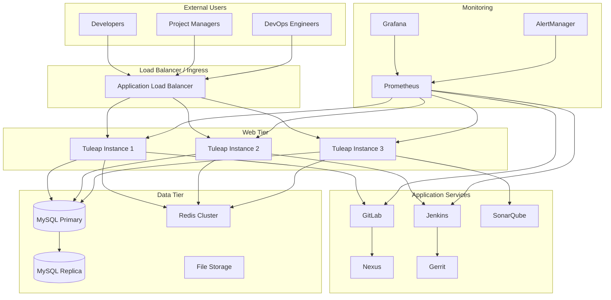

# 🚀 Brown Bear ALM - Deployment Guide

## 📋 **Overview**

This comprehensive deployment guide covers all aspects of deploying the Brown Bear Application Lifecycle Management platform across different environments and cloud providers.

## 🎯 **Deployment Options**

### **Local Development**
- Docker Compose setup
- Development environment configuration
- Hot-reload and debugging setup

### **Production Environments**
- Kubernetes deployment
- Cloud provider specific configurations
- High availability setup
- Monitoring and observability

## 📊 **Infrastructure Requirements**

### **Minimum Requirements**
| Component | CPU | Memory | Storage | Notes |
|-----------|-----|--------|---------|-------|
| Tuleap Web | 2 cores | 4GB | 20GB | Main application |
| MySQL Database | 2 cores | 4GB | 100GB | Persistent storage |
| Redis Cache | 1 core | 2GB | 10GB | In-memory cache |
| GitLab | 4 cores | 8GB | 50GB | Git repositories |
| Jenkins | 2 cores | 4GB | 50GB | CI/CD automation |
| SonarQube | 2 cores | 4GB | 20GB | Code quality |
| Nexus | 2 cores | 4GB | 100GB | Artifact storage |

### **Recommended Production**
| Component | CPU | Memory | Storage | Replicas |
|-----------|-----|--------|---------|----------|
| Tuleap Web | 4 cores | 8GB | 50GB | 3 |
| MySQL Database | 8 cores | 16GB | 500GB | 1 (HA) |
| Redis Cache | 2 cores | 4GB | 20GB | 3 |
| GitLab | 8 cores | 16GB | 200GB | 2 |
| Jenkins | 4 cores | 8GB | 100GB | 2 |
| SonarQube | 4 cores | 8GB | 50GB | 2 |
| Nexus | 4 cores | 8GB | 500GB | 2 |

## 🏗️ **Architecture Overview**



## 🐳 **Docker Compose Deployment**

### **Prerequisites**
```bash
# System requirements
- Docker Engine 20.10+
- Docker Compose 2.0+
- 16GB RAM minimum
- 100GB available disk space
```

### **Quick Start**
```bash
# Clone repository
git clone https://github.com/yasir2000/brown-bear.git
cd brown-bear

# Copy environment configuration
cp .env.example .env

# Edit configuration as needed
nano .env

# Start all services
make docker-up

# Check service status
make docker-status

# View logs
make docker-logs
```

### **Service URLs**
After deployment, services will be available at:
- **Tuleap**: https://localhost:8080
- **GitLab**: https://localhost:8081
- **Jenkins**: https://localhost:8082
- **SonarQube**: https://localhost:9000
- **Nexus**: https://localhost:8081
- **Gerrit**: https://localhost:8080
- **Grafana**: https://localhost:3000

## ☸️ **Kubernetes Deployment**

### **Prerequisites**
```bash
# Required tools
kubectl >= 1.24
helm >= 3.8
kustomize >= 4.5
```

### **Namespace Setup**
```yaml
apiVersion: v1
kind: Namespace
metadata:
  name: brownbear
  labels:
    name: brownbear
    environment: production
```

### **Deployment Steps**
```bash
# Create namespace
kubectl create namespace brownbear

# Deploy using Helm
helm repo add brownbear ./charts
helm install brownbear brownbear/brownbear \
  --namespace brownbear \
  --values values-production.yaml

# Check deployment status
kubectl get pods -n brownbear
kubectl get services -n brownbear
kubectl get ingress -n brownbear
```

## ☁️ **Cloud Provider Deployments**

### 🚀 **AWS Deployment**
See [AWS Deployment Guide](./cloud/aws-deployment.md) for detailed instructions including:
- EKS cluster setup with Terraform
- RDS database configuration
- ElastiCache Redis setup
- Application Load Balancer configuration
- Auto-scaling and monitoring

### 🌩️ **Google Cloud Platform Deployment**
See [GCP Deployment Guide](./cloud/gcp-deployment.md) for detailed instructions including:
- GKE cluster setup with Terraform
- Cloud SQL configuration
- Memorystore Redis setup
- Cloud Load Balancer configuration
- Cloud Monitoring integration

### ☁️ **Azure Deployment**
See [Azure Deployment Guide](./cloud/azure-deployment.md) for detailed instructions including:
- AKS cluster setup with Terraform
- Azure Database for MySQL
- Azure Cache for Redis
- Application Gateway configuration
- Azure Monitor integration

## 🔧 **Configuration Management**

### **Environment Variables**
```bash
# Core application
TULEAP_ENVIRONMENT=production
TULEAP_SYS_DBHOST=mysql.brownbear.local
TULEAP_SYS_DBNAME=tuleap
MYSQL_ROOT_PASSWORD=<secure-password>

# External services
GITLAB_ROOT_PASSWORD=<secure-password>
JENKINS_ADMIN_PASSWORD=<secure-password>
SONAR_PGPASS=<secure-password>

# SSL/TLS
SSL_CERTIFICATE_PATH=/etc/ssl/certs
REVERSE_PROXY_SSL_CERTIFICATE=/etc/ssl/certs/brownbear.crt

# Networking
BROWNBEAR_NETWORK=brownbear_network
WEB_HOSTNAME=brownbear.example.com
```

### **Secrets Management**
```bash
# Kubernetes secrets
kubectl create secret generic brownbear-secrets \
  --from-literal=mysql-password=<password> \
  --from-literal=gitlab-password=<password> \
  --from-literal=jenkins-password=<password> \
  --namespace brownbear
```

## 🔐 **Security Configuration**

### **SSL/TLS Setup**
```bash
# Generate self-signed certificates for development
openssl req -x509 -nodes -days 365 -newkey rsa:2048 \
  -keyout brownbear.key \
  -out brownbear.crt \
  -subj "/C=US/ST=State/L=City/O=Organization/CN=brownbear.local"

# For production, use Let's Encrypt or commercial certificates
certbot certonly --dns-cloudflare \
  --dns-cloudflare-credentials ~/.secrets/certbot/cloudflare.ini \
  -d brownbear.example.com
```

### **Network Security**
```yaml
# Network policies for Kubernetes
apiVersion: networking.k8s.io/v1
kind: NetworkPolicy
metadata:
  name: brownbear-network-policy
  namespace: brownbear
spec:
  podSelector: {}
  policyTypes:
  - Ingress
  - Egress
  ingress:
  - from:
    - namespaceSelector:
        matchLabels:
          name: ingress-nginx
    ports:
    - protocol: TCP
      port: 8080
```

## 📊 **Monitoring & Observability**

### **Prometheus Configuration**
```yaml
global:
  scrape_interval: 15s
  evaluation_interval: 15s

scrape_configs:
  - job_name: 'brownbear-web'
    static_configs:
      - targets: ['web:8080']
  
  - job_name: 'gitlab'
    static_configs:
      - targets: ['gitlab:80']
  
  - job_name: 'jenkins'
    static_configs:
      - targets: ['jenkins:8080']
```

### **Grafana Dashboards**
Pre-configured dashboards available for:
- Application performance metrics
- Infrastructure monitoring
- Service health checks
- User activity tracking
- Security event monitoring

## 🔄 **Backup & Recovery**

### **Database Backup**
```bash
# Automated MySQL backup
#!/bin/bash
BACKUP_DIR="/backups/mysql"
DATE=$(date +%Y%m%d_%H%M%S)
BACKUP_FILE="brownbear_${DATE}.sql"

mysqldump -h mysql \
  -u root \
  -p${MYSQL_ROOT_PASSWORD} \
  --single-transaction \
  --routines \
  --triggers \
  tuleap > ${BACKUP_DIR}/${BACKUP_FILE}

# Compress backup
gzip ${BACKUP_DIR}/${BACKUP_FILE}

# Upload to cloud storage
aws s3 cp ${BACKUP_DIR}/${BACKUP_FILE}.gz \
  s3://brownbear-backups/mysql/
```

### **Volume Backup**
```bash
# Backup persistent volumes
kubectl exec -n brownbear deployment/brownbear-web -- \
  tar czf - /data | \
  aws s3 cp - s3://brownbear-backups/volumes/data-$(date +%Y%m%d).tar.gz
```

## 🚨 **Troubleshooting**

### **Common Issues**

1. **Services Not Starting**
   ```bash
   # Check service logs
   docker-compose logs <service-name>
   kubectl logs -n brownbear deployment/<service-name>
   
   # Check resource utilization
   docker stats
   kubectl top pods -n brownbear
   ```

2. **Database Connection Issues**
   ```bash
   # Test database connectivity
   mysql -h mysql -u tuleap -p
   
   # Check database status
   kubectl exec -n brownbear deployment/mysql -- \
     mysql -u root -p -e "SHOW PROCESSLIST;"
   ```

3. **SSL Certificate Issues**
   ```bash
   # Verify certificate validity
   openssl x509 -in brownbear.crt -text -noout
   
   # Check certificate chain
   openssl s_client -connect brownbear.example.com:443 -showcerts
   ```

### **Performance Tuning**

1. **Database Optimization**
   ```sql
   # MySQL tuning
   SET GLOBAL innodb_buffer_pool_size = 8G;
   SET GLOBAL max_connections = 500;
   SET GLOBAL query_cache_size = 256M;
   ```

2. **Application Tuning**
   ```bash
   # PHP-FPM optimization
   pm.max_children = 50
   pm.start_servers = 10
   pm.min_spare_servers = 5
   pm.max_spare_servers = 20
   ```

## 🔮 **Future Enhancements**

- [ ] Blue-Green deployment strategy
- [ ] Canary deployments
- [ ] Multi-cloud deployment orchestration
- [ ] Disaster recovery procedures
- [ ] Performance optimization
- [ ] Cost optimization strategies

---

*This deployment guide provides a comprehensive foundation for deploying Brown Bear ALM in various environments. For specific cloud provider instructions, refer to the cloud-specific deployment guides.*
