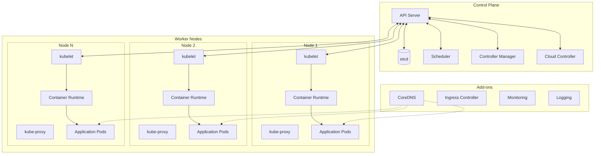
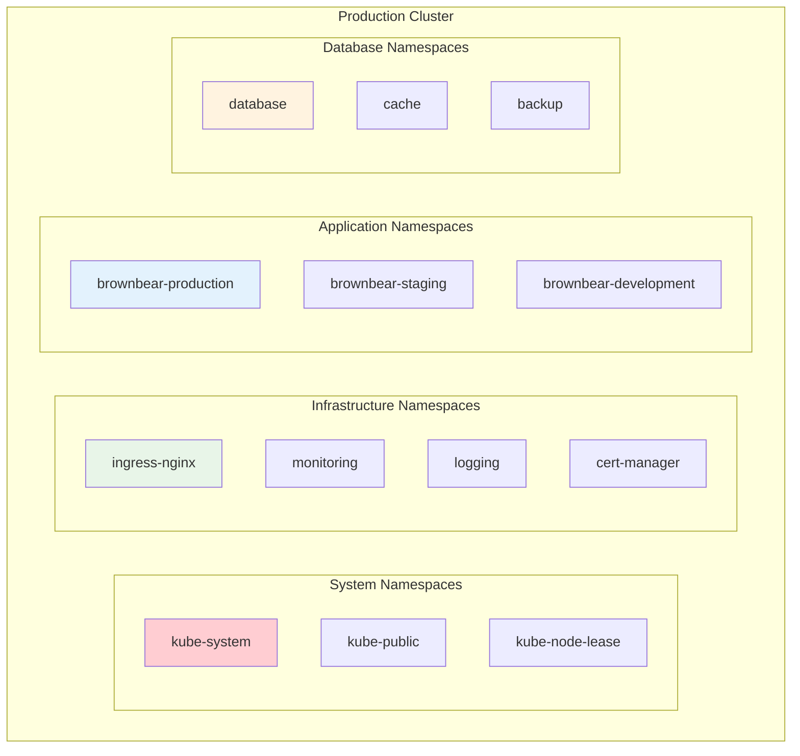
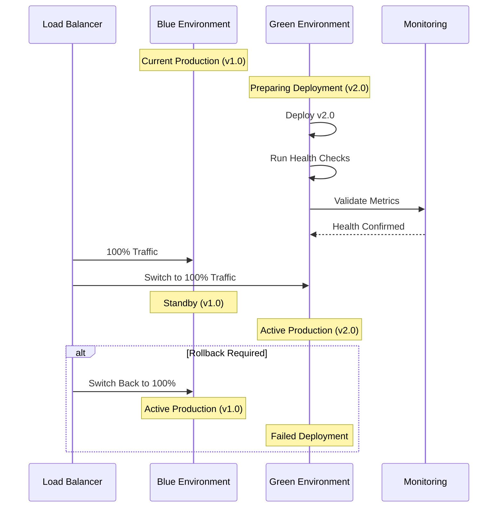
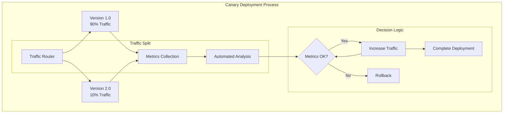
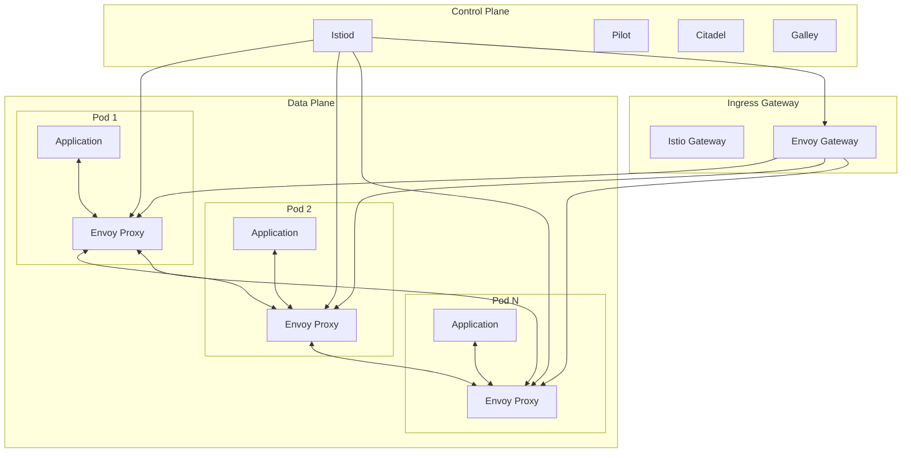
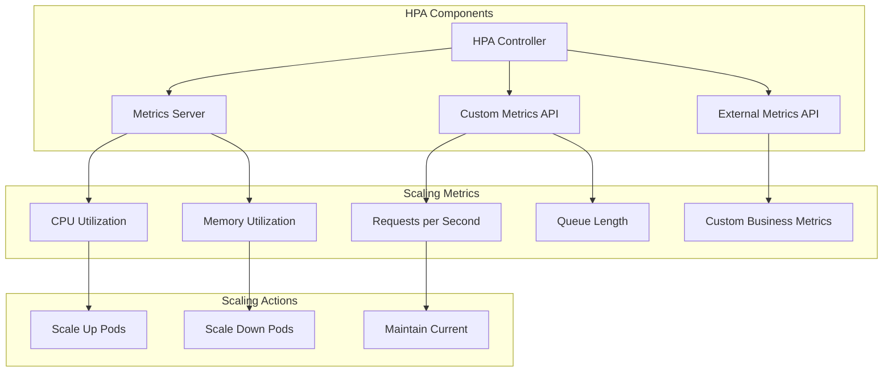
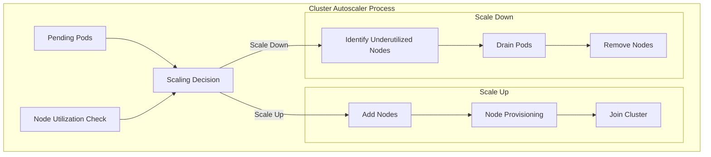
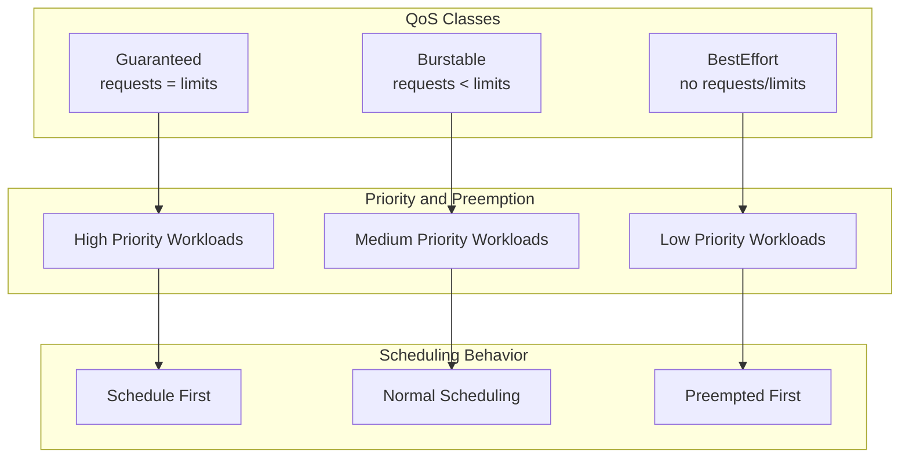
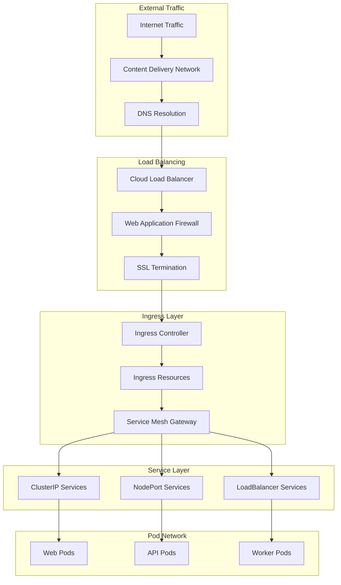

# Container Orchestration

This document provides comprehensive guidance on Brown Bear ALM's container orchestration strategy using Kubernetes, including deployment patterns, scaling strategies, and operational procedures.

## Table of Contents

1. [Kubernetes Architecture](#kubernetes-architecture)
2. [Deployment Strategies](#deployment-strategies)
3. [Service Mesh Integration](#service-mesh-integration)
4. [Auto-Scaling Configuration](#auto-scaling-configuration)
5. [Resource Management](#resource-management)
6. [Networking and Ingress](#networking-and-ingress)
7. [Security Policies](#security-policies)
8. [Monitoring and Observability](#monitoring-and-observability)
9. [Backup and Recovery](#backup-and-recovery)

## Kubernetes Architecture

### Cluster Architecture



### Namespace Organization



## Deployment Strategies

### Blue-Green Deployment



### Canary Deployment



### Rolling Update Configuration

```yaml
apiVersion: apps/v1
kind: Deployment
metadata:
  name: brownbear-web
  namespace: brownbear-production
spec:
  replicas: 6
  strategy:
    type: RollingUpdate
    rollingUpdate:
      maxUnavailable: 1
      maxSurge: 2
  selector:
    matchLabels:
      app: brownbear-web
  template:
    metadata:
      labels:
        app: brownbear-web
        version: v2.0.0
    spec:
      containers:
      - name: web
        image: brownbear/web:v2.0.0
        ports:
        - containerPort: 8080
        resources:
          requests:
            cpu: 200m
            memory: 256Mi
          limits:
            cpu: 500m
            memory: 512Mi
        livenessProbe:
          httpGet:
            path: /health
            port: 8080
          initialDelaySeconds: 30
          periodSeconds: 10
        readinessProbe:
          httpGet:
            path: /ready
            port: 8080
          initialDelaySeconds: 5
          periodSeconds: 5
```

## Service Mesh Integration

### Istio Service Mesh Architecture



### Traffic Management Policies

```yaml
# Virtual Service for Traffic Routing
apiVersion: networking.istio.io/v1beta1
kind: VirtualService
metadata:
  name: brownbear-web
  namespace: brownbear-production
spec:
  hosts:
  - brownbear.example.com
  gateways:
  - brownbear-gateway
  http:
  - match:
    - headers:
        canary:
          exact: "true"
    route:
    - destination:
        host: brownbear-web
        subset: canary
      weight: 100
  - route:
    - destination:
        host: brownbear-web
        subset: stable
      weight: 90
    - destination:
        host: brownbear-web
        subset: canary
      weight: 10

---
# Destination Rule for Load Balancing
apiVersion: networking.istio.io/v1beta1
kind: DestinationRule
metadata:
  name: brownbear-web
  namespace: brownbear-production
spec:
  host: brownbear-web
  trafficPolicy:
    loadBalancer:
      simple: LEAST_CONN
    connectionPool:
      tcp:
        maxConnections: 100
      http:
        http1MaxPendingRequests: 10
        maxRequestsPerConnection: 2
    circuitBreaker:
      consecutiveErrors: 5
      interval: 30s
      baseEjectionTime: 30s
  subsets:
  - name: stable
    labels:
      version: v1.0.0
  - name: canary
    labels:
      version: v2.0.0
```

## Auto-Scaling Configuration

### Horizontal Pod Autoscaler (HPA)



### HPA Configuration Example

```yaml
apiVersion: autoscaling/v2
kind: HorizontalPodAutoscaler
metadata:
  name: brownbear-web-hpa
  namespace: brownbear-production
spec:
  scaleTargetRef:
    apiVersion: apps/v1
    kind: Deployment
    name: brownbear-web
  minReplicas: 3
  maxReplicas: 20
  metrics:
  - type: Resource
    resource:
      name: cpu
      target:
        type: Utilization
        averageUtilization: 70
  - type: Resource
    resource:
      name: memory
      target:
        type: Utilization
        averageUtilization: 80
  - type: Pods
    pods:
      metric:
        name: requests_per_second
      target:
        type: AverageValue
        averageValue: "100"
  behavior:
    scaleUp:
      stabilizationWindowSeconds: 60
      policies:
      - type: Percent
        value: 100
        periodSeconds: 15
      - type: Pods
        value: 2
        periodSeconds: 60
    scaleDown:
      stabilizationWindowSeconds: 300
      policies:
      - type: Percent
        value: 10
        periodSeconds: 60
```

### Cluster Autoscaler



## Resource Management

### Resource Quotas and Limits

```yaml
# Namespace Resource Quota
apiVersion: v1
kind: ResourceQuota
metadata:
  name: brownbear-production-quota
  namespace: brownbear-production
spec:
  hard:
    requests.cpu: "20"
    requests.memory: 40Gi
    limits.cpu: "40"
    limits.memory: 80Gi
    persistentvolumeclaims: "10"
    pods: "50"
    services: "20"
    secrets: "50"
    configmaps: "50"

---
# Limit Range for Default Constraints
apiVersion: v1
kind: LimitRange
metadata:
  name: brownbear-production-limits
  namespace: brownbear-production
spec:
  limits:
  - default:
      cpu: 500m
      memory: 512Mi
    defaultRequest:
      cpu: 100m
      memory: 128Mi
    type: Container
  - max:
      cpu: "2"
      memory: 4Gi
    min:
      cpu: 50m
      memory: 64Mi
    type: Container
  - max:
      storage: 10Gi
    min:
      storage: 1Gi
    type: PersistentVolumeClaim
```

### Quality of Service Classes



## Networking and Ingress

### Ingress Architecture



### Network Policies

```yaml
# Default Deny All Traffic
apiVersion: networking.k8s.io/v1
kind: NetworkPolicy
metadata:
  name: default-deny-all
  namespace: brownbear-production
spec:
  podSelector: {}
  policyTypes:
  - Ingress
  - Egress

---
# Allow Web to API Communication
apiVersion: networking.k8s.io/v1
kind: NetworkPolicy
metadata:
  name: web-to-api
  namespace: brownbear-production
spec:
  podSelector:
    matchLabels:
      app: brownbear-api
  policyTypes:
  - Ingress
  ingress:
  - from:
    - podSelector:
        matchLabels:
          app: brownbear-web
    ports:
    - protocol: TCP
      port: 8080

---
# Allow API to Database
apiVersion: networking.k8s.io/v1
kind: NetworkPolicy
metadata:
  name: api-to-database
  namespace: brownbear-production
spec:
  podSelector:
    matchLabels:
      app: brownbear-api
  policyTypes:
  - Egress
  egress:
  - to:
    - namespaceSelector:
        matchLabels:
          name: database
    ports:
    - protocol: TCP
      port: 3306
  - to: []
    ports:
    - protocol: UDP
      port: 53
```

This container orchestration documentation provides comprehensive guidance for deploying, scaling, and managing Brown Bear ALM on Kubernetes with advanced features like service mesh integration, auto-scaling, and network security policies.
