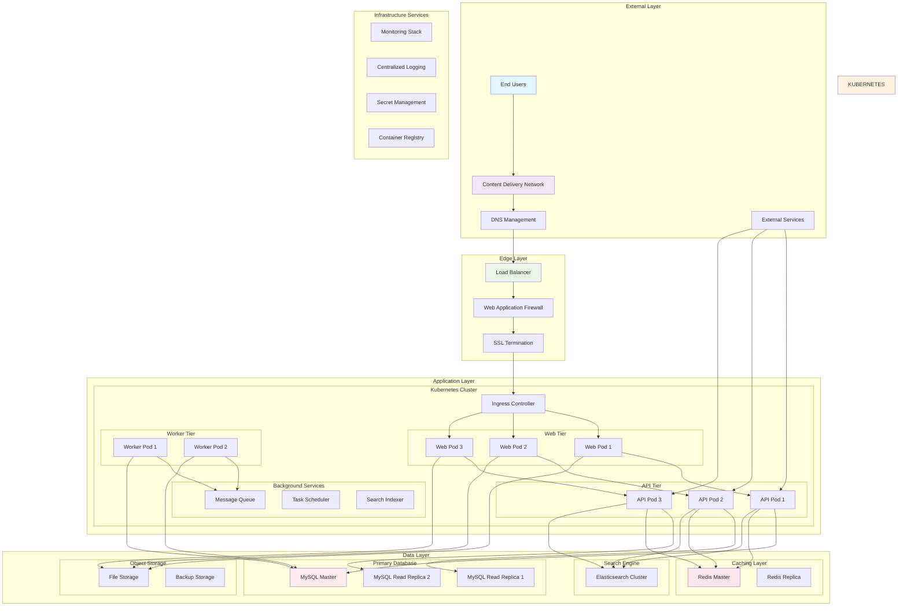
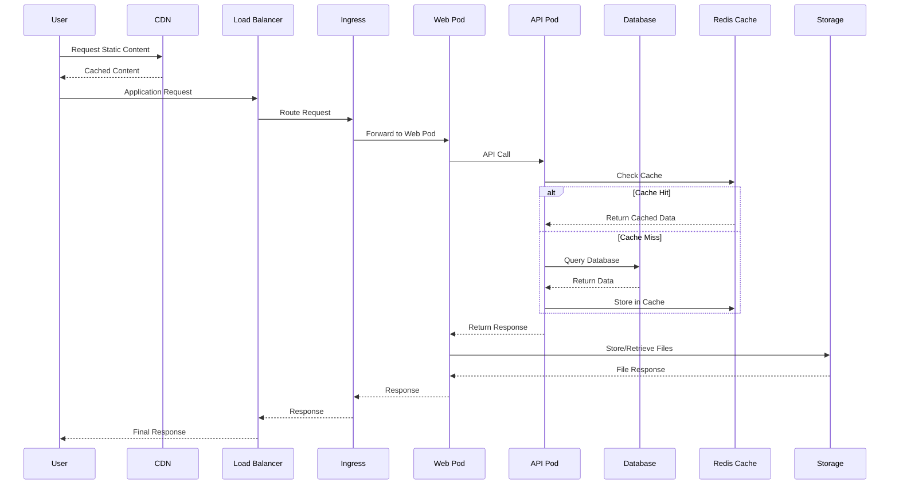
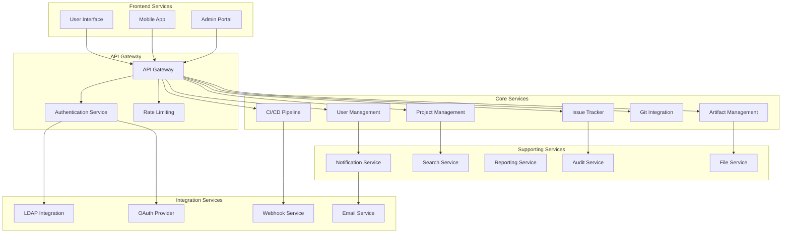
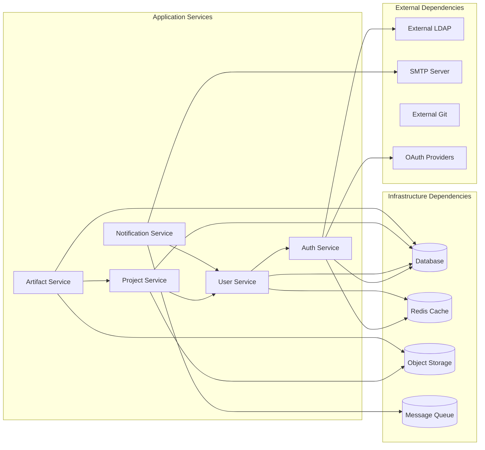
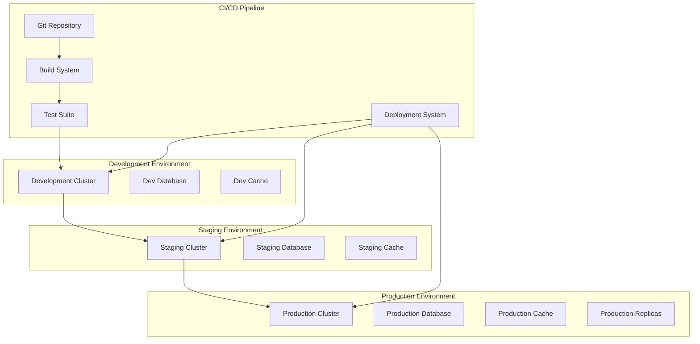
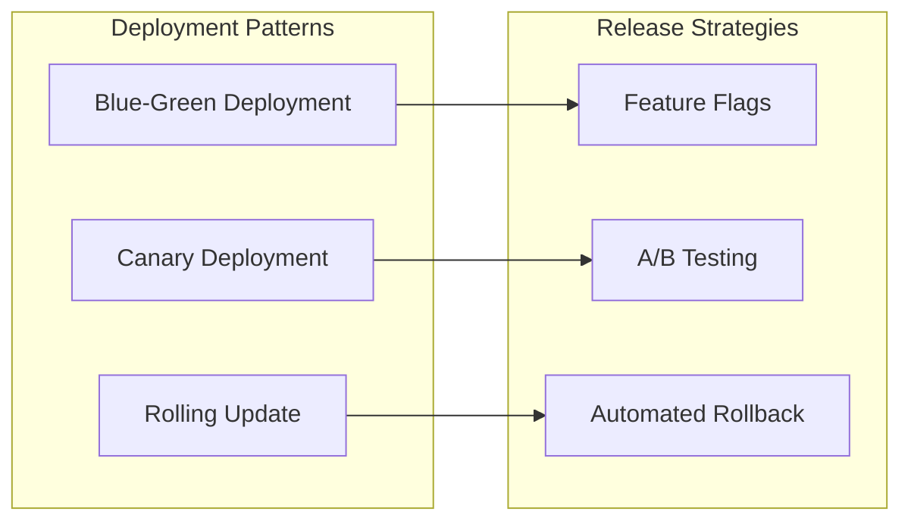
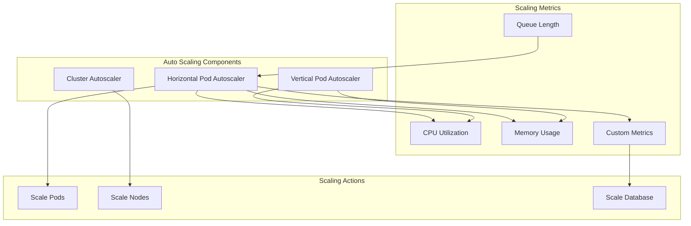
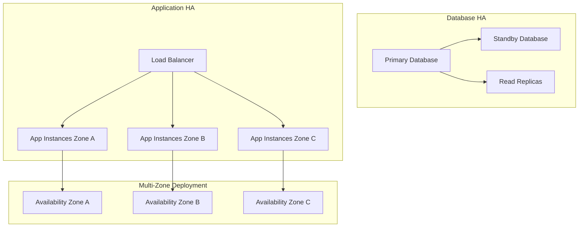
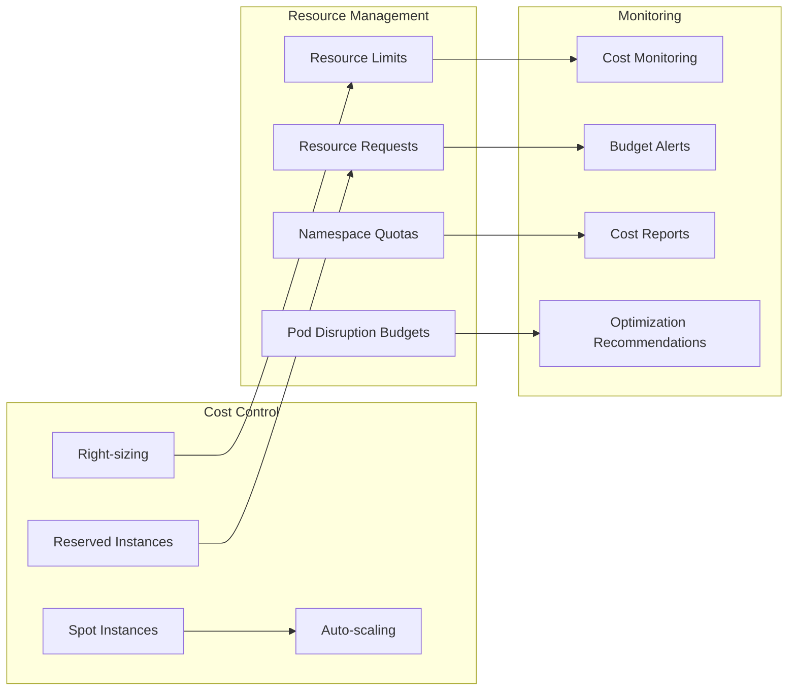

# Infrastructure Overview

This document provides a comprehensive overview of Brown Bear ALM's infrastructure architecture, design principles, and operational framework.

## Table of Contents

1. [Architecture Principles](#architecture-principles)
2. [Infrastructure Overview](#infrastructure-overview)
3. [System Architecture](#system-architecture)
4. [Technology Stack](#technology-stack)
5. [Deployment Architecture](#deployment-architecture)
6. [Scalability Design](#scalability-design)
7. [High Availability](#high-availability)
8. [Performance Considerations](#performance-considerations)
9. [Cost Optimization](#cost-optimization)

## Architecture Principles

### Design Philosophy
Brown Bear ALM infrastructure is built on the following core principles:

- **Cloud-Native**: Designed for cloud environments with containerization
- **Microservices**: Loosely coupled, independently deployable services
- **Scalability**: Horizontal and vertical scaling capabilities
- **Resilience**: Fault-tolerant design with graceful degradation
- **Security**: Defense-in-depth security model
- **Observability**: Comprehensive monitoring and logging
- **Infrastructure as Code**: Version-controlled, repeatable deployments

### Architecture Patterns
- **12-Factor App**: Application design methodology
- **Event-Driven**: Asynchronous communication patterns
- **CQRS**: Command Query Responsibility Segregation
- **Circuit Breaker**: Fault tolerance patterns
- **Bulkhead**: Isolation of critical resources

## Infrastructure Overview

### High-Level Architecture

### Component Interaction Flow

## System Architecture

### Microservices Architecture

### Service Dependencies

## Technology Stack

### Container Orchestration
- **Kubernetes**: Container orchestration platform
- **Docker**: Containerization technology
- **Helm**: Package manager for Kubernetes
- **Istio**: Service mesh (optional)

### Database Technologies
- **MySQL 8.0**: Primary relational database
- **Redis 7.0**: In-memory caching and session storage
- **Elasticsearch**: Full-text search and analytics

### Programming Languages & Frameworks
- **PHP 8.2**: Backend application framework
- **JavaScript/TypeScript**: Frontend development
- **Python**: Automation and tooling
- **Go**: Microservices and utilities

### Infrastructure Tools
- **Terraform**: Infrastructure as Code
- **Ansible**: Configuration management
- **Prometheus**: Monitoring and alerting
- **Grafana**: Visualization and dashboards
- **FluentD**: Log collection and forwarding

### Cloud Services
- **AWS**: EKS, RDS, ElastiCache, S3, CloudWatch
- **GCP**: GKE, Cloud SQL, Memorystore, Cloud Storage
- **Azure**: AKS, Azure Database, Azure Cache, Blob Storage

## Deployment Architecture

### Multi-Environment Strategy

### Deployment Strategy

## Scalability Design

### Horizontal Scaling

### Performance Optimization

- **Connection Pooling**: Database connection optimization
- **Caching Layers**: Multi-level caching strategy
- **CDN Integration**: Global content distribution
- **Query Optimization**: Database query performance
- **Resource Limits**: Container resource management

## High Availability

### Redundancy Strategy

### Fault Tolerance

- **Circuit Breaker Pattern**: Service failure protection
- **Bulkhead Pattern**: Resource isolation
- **Retry Mechanisms**: Transient failure handling
- **Graceful Degradation**: Partial functionality maintenance
- **Health Checks**: Automated failure detection

## Performance Considerations

### Resource Allocation

| Service Type | CPU Request | CPU Limit | Memory Request | Memory Limit |
|--------------|-------------|-----------|----------------|--------------|
| Web Frontend | 100m | 500m | 128Mi | 512Mi |
| API Backend | 200m | 1000m | 256Mi | 1Gi |
| Database | 500m | 2000m | 1Gi | 4Gi |
| Cache | 100m | 500m | 512Mi | 2Gi |
| Workers | 200m | 800m | 256Mi | 1Gi |

### Performance Metrics

- **Response Time**: < 200ms for API calls
- **Throughput**: 1000+ requests per second
- **Availability**: 99.9% uptime SLA
- **Database Performance**: < 50ms query response
- **Cache Hit Ratio**: > 90% for frequently accessed data

## Cost Optimization

### Resource Optimization Strategies

### Cost Management Best Practices

- **Resource Tagging**: Comprehensive cost allocation
- **Environment Scheduling**: Dev/test environment automation
- **Storage Optimization**: Lifecycle policies and compression
- **Network Optimization**: Traffic routing and caching
- **Monitoring Integration**: Real-time cost tracking

This infrastructure overview provides the foundation for understanding Brown Bear ALM's architecture and serves as a reference for operational procedures and optimization strategies.
