# Network Architecture

This document details the network architecture design for Brown Bear ALM, including network topology, security zones, traffic flows, and connectivity patterns.

## Table of Contents

1. [Network Overview](#network-overview)
2. [Network Topology](#network-topology)
3. [Security Zones](#security-zones)
4. [Subnet Design](#subnet-design)
5. [Traffic Flow Patterns](#traffic-flow-patterns)
6. [Load Balancing](#load-balancing)
7. [DNS Architecture](#dns-architecture)
8. [Network Security](#network-security)
9. [Multi-Cloud Networking](#multi-cloud-networking)
10. [Network Monitoring](#network-monitoring)

## Network Overview

Brown Bear ALM network architecture follows a multi-tier design pattern with clear separation between public, private, and database subnets. The design ensures security, scalability, and high availability across multiple availability zones.

### Design Principles
- **Defense in Depth**: Multiple layers of network security
- **Zero Trust**: No implicit trust based on network location
- **Micro-segmentation**: Fine-grained network isolation
- **High Availability**: Multi-zone redundancy
- **Scalability**: Elastic network capacity

## Network Topology

### Overall Network Architecture

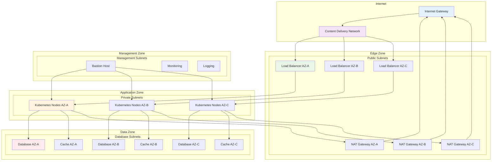

### VPC Architecture

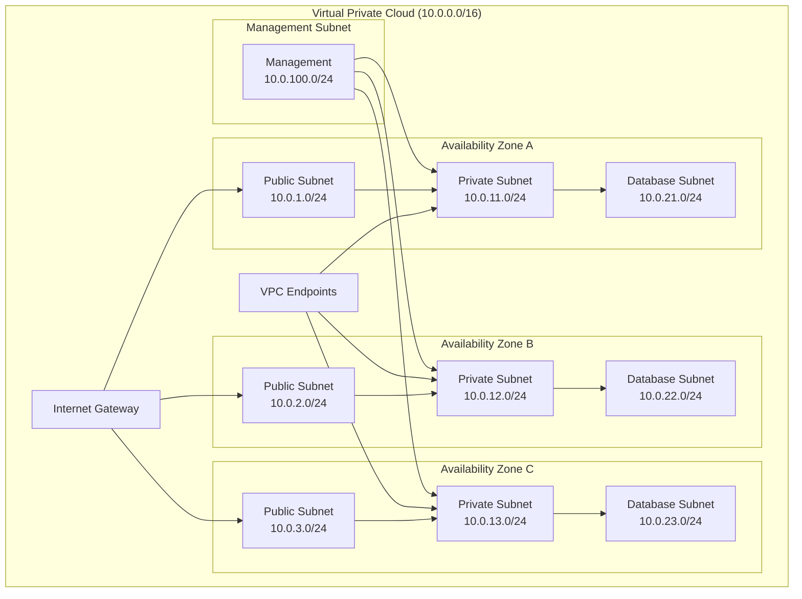

## Security Zones

### Network Security Zones

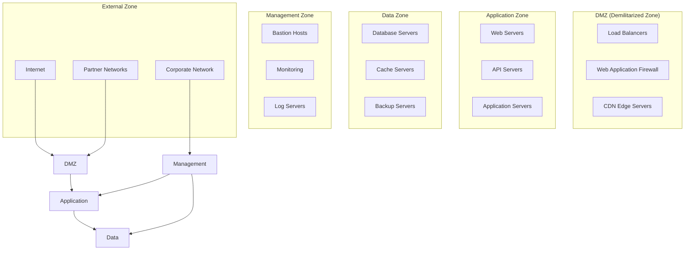

### Security Groups Configuration

| Security Group | Inbound Rules | Outbound Rules | Purpose |
|----------------|---------------|----------------|---------|
| **Load Balancer SG** | HTTP (80), HTTPS (443) from 0.0.0.0/0 | All traffic to Application SG | Public-facing load balancers |
| **Application SG** | HTTP (8080) from LB SG, SSH (22) from Bastion SG | HTTPS (443) to 0.0.0.0/0, MySQL (3306) to Database SG | Application servers |
| **Database SG** | MySQL (3306) from Application SG | None | Database servers |
| **Cache SG** | Redis (6379) from Application SG | None | Cache servers |
| **Bastion SG** | SSH (22) from Corporate IP ranges | SSH (22) to Application SG | Management access |
| **Monitoring SG** | Prometheus (9090), Grafana (3000) from Corporate | All traffic | Monitoring systems |

## Subnet Design

### Subnet Allocation Strategy

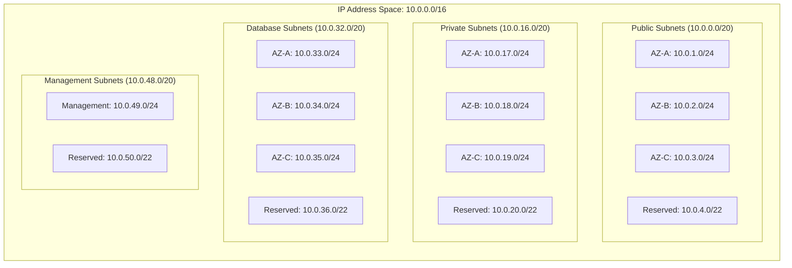

### Subnet Characteristics

| Subnet Type | CIDR Block | Route Table | NAT Gateway | Internet Access |
|-------------|------------|-------------|-------------|-----------------|
| **Public** | 10.0.1.0/24, 10.0.2.0/24, 10.0.3.0/24 | Public RT | N/A | Direct via IGW |
| **Private** | 10.0.17.0/24, 10.0.18.0/24, 10.0.19.0/24 | Private RT | Yes | Via NAT Gateway |
| **Database** | 10.0.33.0/24, 10.0.34.0/24, 10.0.35.0/24 | Database RT | No | No direct access |
| **Management** | 10.0.49.0/24 | Management RT | Yes | Via NAT Gateway |

## Traffic Flow Patterns

### Inbound Traffic Flow

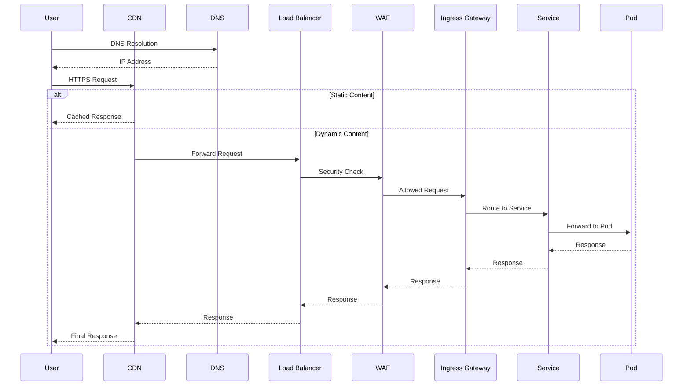

### East-West Traffic Flow

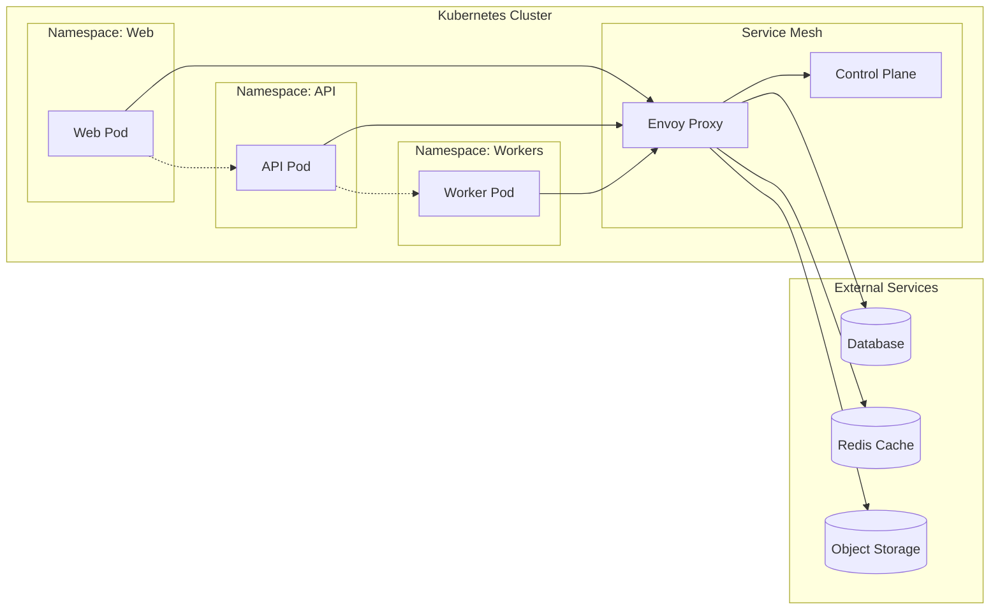

### Outbound Traffic Flow

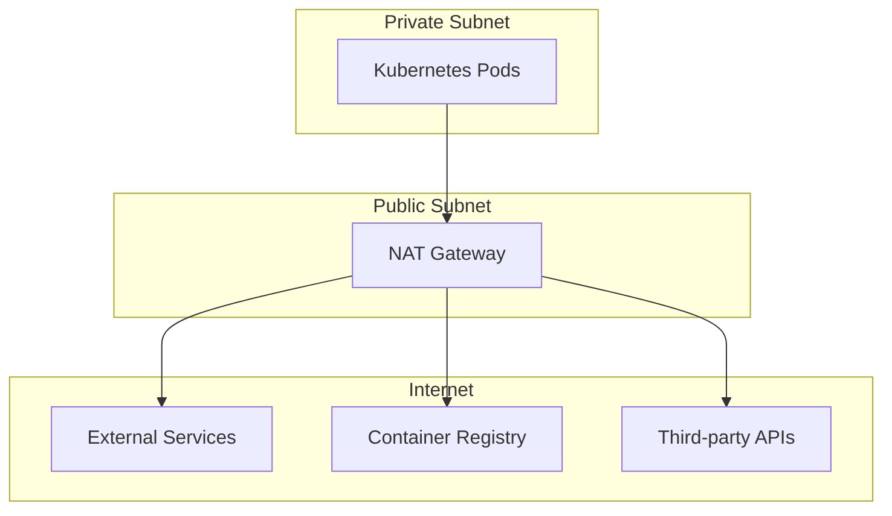

## Load Balancing

### Load Balancer Architecture

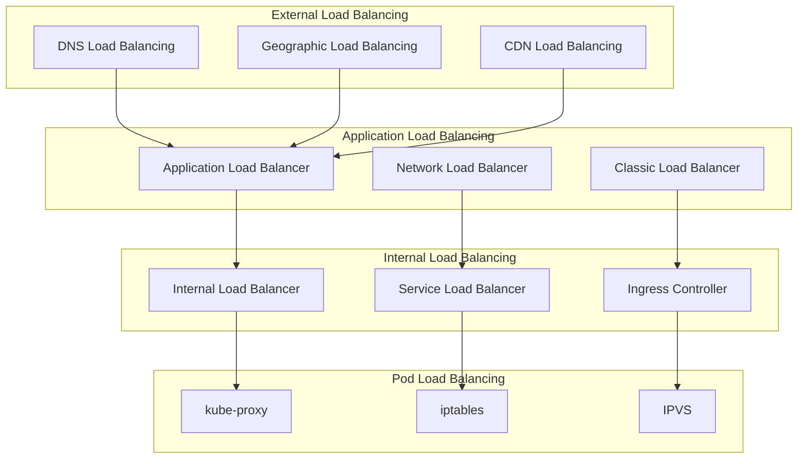

### Load Balancing Algorithms

| Load Balancer | Algorithm | Use Case | Health Checks |
|---------------|-----------|----------|---------------|
| **Application LB** | Round Robin, Least Connections | HTTP/HTTPS traffic | HTTP health checks |
| **Network LB** | Flow Hash | TCP/UDP traffic | TCP health checks |
| **Service LB** | Random, Round Robin | Internal services | Kubernetes probes |
| **Ingress Controller** | Weighted Round Robin | HTTP routing | Custom health checks |

## DNS Architecture

### DNS Hierarchy

```mermaid
graph TB
    subgraph "External DNS"
        ROOT[Root DNS]
        TLD[TLD (.com)]
        AUTH[Authoritative DNS]
    end
    
    subgraph "Cloud DNS"
        ROUTE53[Route 53]
        CLOUDFLARE[Cloudflare]
        GDNS[Google DNS]
    end
    
    subgraph "Internal DNS"
        CLUSTER_DNS[Cluster DNS]
        COREDNS[CoreDNS]
        KUBE_DNS[kube-dns]
    end
    
    subgraph "Service Discovery"
        SVC_DISC[Service Discovery]
        CONSUL[Consul]
        ETCD[etcd]
    end
    
    ROOT --> TLD
    TLD --> AUTH
    AUTH --> ROUTE53
    AUTH --> CLOUDFLARE
    AUTH --> GDNS
    
    ROUTE53 --> CLUSTER_DNS
    CLUSTER_DNS --> COREDNS
    COREDNS --> SVC_DISC
    SVC_DISC --> CONSUL
    SVC_DISC --> ETCD
```

### DNS Records Configuration

| Record Type | Name | Value | TTL | Purpose |
|-------------|------|-------|-----|---------|
| **A** | brownbear.example.com | 192.0.2.1 | 300 | Main application |
| **CNAME** | www.brownbear.example.com | brownbear.example.com | 300 | WWW redirect |
| **CNAME** | api.brownbear.example.com | brownbear.example.com | 300 | API endpoint |
| **MX** | brownbear.example.com | mail.example.com | 3600 | Email routing |
| **TXT** | brownbear.example.com | "v=spf1 include:example.com ~all" | 3600 | SPF record |

## Network Security

### Security Controls

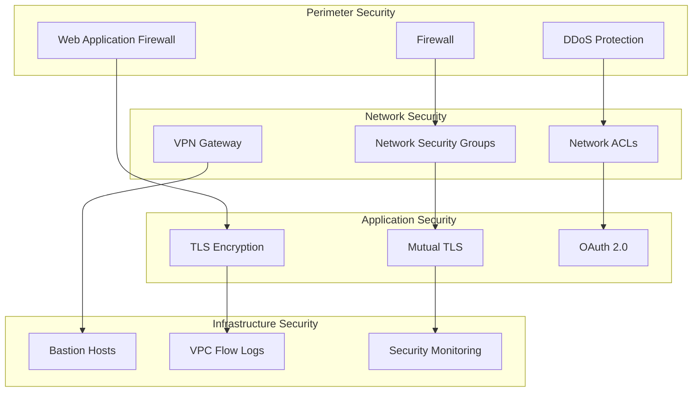

### Network Segmentation

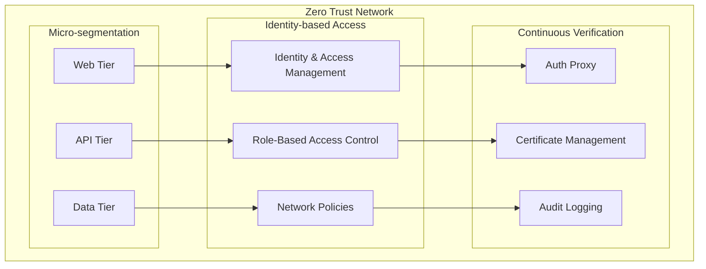

## Multi-Cloud Networking

### Cross-Cloud Connectivity

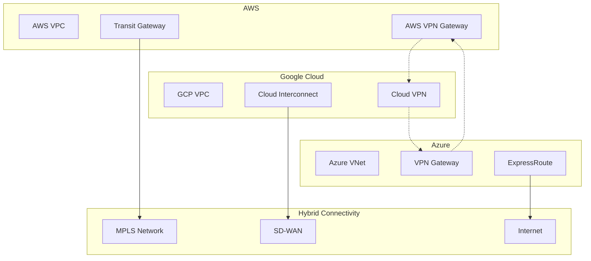

### Network Performance Optimization

- **Content Delivery Network**: Global edge caching
- **Traffic Engineering**: Optimal path selection
- **Quality of Service**: Traffic prioritization
- **Bandwidth Management**: Dynamic allocation
- **Latency Optimization**: Regional deployments

## Network Monitoring

### Monitoring Architecture

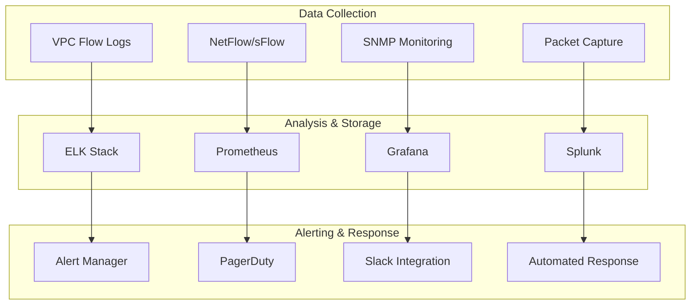

### Key Network Metrics

| Metric Category | Metrics | Threshold | Purpose |
|-----------------|---------|-----------|---------|
| **Throughput** | Bandwidth utilization, Packets per second | > 80% | Capacity planning |
| **Latency** | Round-trip time, Jitter | > 100ms | Performance monitoring |
| **Availability** | Uptime, Packet loss | < 99.9% | SLA monitoring |
| **Security** | Failed connections, Anomalous traffic | > baseline | Threat detection |

This network architecture provides a robust, secure, and scalable foundation for Brown Bear ALM deployment across multiple cloud environments.
