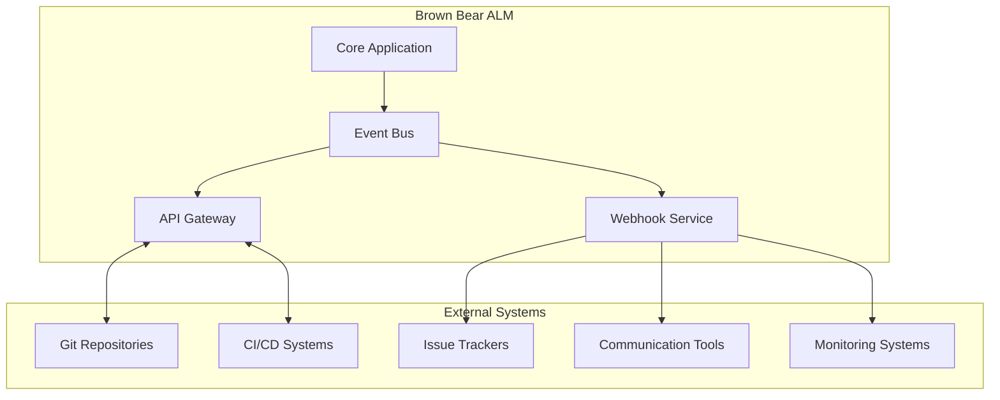

# Integration Documentation

This directory contains comprehensive documentation about Brown Bear ALM's integration capabilities, APIs, webhooks, and third-party service integrations.

## 📁 Documentation Structure

- **[Integration Overview](integration-overview.md)** - High-level integration architecture and patterns
- **[API Documentation](api-documentation.md)** - REST API specifications and usage guides
- **[Webhook Integration](webhook-integration.md)** - Webhook configuration and event handling
- **[Authentication & Authorization](auth-integration.md)** - SSO, LDAP, and OAuth integrations
- **[Third-Party Integrations](third-party-integrations.md)** - External service integrations
- **[Message Queue Integration](message-queue-integration.md)** - Asynchronous communication patterns
- **[Database Integration](database-integration.md)** - Database connectivity and data synchronization
- **[File Storage Integration](file-storage-integration.md)** - Object storage and file management
- **[Monitoring Integration](monitoring-integration.md)** - Observability and metrics integration
- **[CI/CD Integration](cicd-integration.md)** - Continuous integration and deployment workflows

## 🔗 Integration Capabilities

### Core APIs
- **REST API**: RESTful web services for all major operations
- **GraphQL API**: Flexible query interface for complex data retrieval
- **WebSocket API**: Real-time communication for live updates
- **Webhook API**: Event-driven notifications and integrations

### Authentication Methods
- **JWT Tokens**: Stateless authentication for APIs
- **OAuth 2.0**: Third-party authentication and authorization
- **LDAP/Active Directory**: Enterprise directory integration
- **SAML 2.0**: Single sign-on for enterprise environments

### Third-Party Services
- **Version Control**: Git, GitLab, GitHub, Bitbucket
- **CI/CD Systems**: Jenkins, GitLab CI, GitHub Actions, Azure DevOps
- **Issue Tracking**: Jira, GitHub Issues, Azure DevOps Work Items
- **Communication**: Slack, Microsoft Teams, Email, SMS
- **Monitoring**: Prometheus, Grafana, New Relic, Datadog

### Data Integration
- **Database Connectors**: MySQL, PostgreSQL, Oracle, SQL Server
- **Message Brokers**: RabbitMQ, Apache Kafka, Azure Service Bus
- **Object Storage**: AWS S3, Google Cloud Storage, Azure Blob Storage
- **Search Engines**: Elasticsearch, Solr, Azure Search

## 📊 Integration Architecture

### Event-Driven Architecture

### Integration Patterns
- **Request-Response**: Synchronous API calls for immediate operations
- **Event Streaming**: Real-time event processing and notifications
- **Batch Processing**: Scheduled data synchronization and imports
- **Pub/Sub Messaging**: Asynchronous event distribution
- **Circuit Breaker**: Fault tolerance for external service calls

## 🛠️ Development Tools

### SDK and Libraries
- **PHP SDK**: Native PHP client library
- **JavaScript SDK**: Browser and Node.js integration
- **Python SDK**: Python client for automation and scripting
- **REST Clients**: Postman collections and OpenAPI specifications

### Testing and Validation
- **API Testing**: Automated test suites for all endpoints
- **Integration Testing**: End-to-end integration scenarios
- **Mock Services**: Test doubles for external dependencies
- **Contract Testing**: API contract validation and compatibility

## 🔐 Security Considerations

### API Security
- **Authentication**: Multi-factor authentication support
- **Authorization**: Fine-grained permission controls
- **Rate Limiting**: Protection against abuse and DoS attacks
- **Input Validation**: Comprehensive data validation and sanitization

### Data Protection
- **Encryption**: TLS 1.3 for data in transit
- **Data Masking**: Sensitive data protection in logs and responses
- **Audit Logging**: Comprehensive integration audit trails
- **Privacy Compliance**: GDPR and data protection compliance

## 📈 Performance and Scaling

### Optimization Strategies
- **Caching**: Multi-level caching for frequently accessed data
- **Connection Pooling**: Efficient database and service connections
- **Async Processing**: Non-blocking operations for better throughput
- **Load Balancing**: Distributed load across integration endpoints

### Monitoring and Metrics
- **API Metrics**: Response times, error rates, and throughput
- **Integration Health**: External service availability and performance
- **Resource Usage**: CPU, memory, and network utilization
- **Business Metrics**: Integration success rates and data quality

## 📚 Getting Started

1. **API Overview**: Start with [Integration Overview](integration-overview.md)
2. **Authentication**: Configure authentication in [Authentication & Authorization](auth-integration.md)
3. **First Integration**: Follow examples in [API Documentation](api-documentation.md)
4. **Webhooks**: Set up event notifications in [Webhook Integration](webhook-integration.md)
5. **Monitoring**: Implement observability from [Monitoring Integration](monitoring-integration.md)

## 🔗 Related Documentation

- [Architecture Documentation](../architecture/) - System architecture and design patterns
- [Security Documentation](../security/) - Security policies and procedures
- [Infrastructure Documentation](../infrastructure/) - Infrastructure setup and configuration
- [Deployment Guides](../deployment/) - Deployment procedures and environments
