# Integration Overview

This document provides a comprehensive overview of Brown Bear ALM's integration architecture, patterns, and capabilities for connecting with external systems and services.

## Table of Contents

1. [Integration Philosophy](#integration-philosophy)
2. [Architecture Overview](#architecture-overview)
3. [Integration Patterns](#integration-patterns)
4. [API Architecture](#api-architecture)
5. [Event-Driven Integration](#event-driven-integration)
6. [Data Flow Architecture](#data-flow-architecture)
7. [Security Architecture](#security-architecture)
8. [Performance Considerations](#performance-considerations)
9. [Integration Ecosystem](#integration-ecosystem)

## Integration Philosophy

Brown Bear ALM is designed as an open, extensible platform that seamlessly integrates with existing development and operational tools. Our integration approach is built on these core principles:

### Design Principles
- **API-First**: All functionality exposed through well-designed APIs
- **Event-Driven**: Real-time notifications and asynchronous processing
- **Standards-Based**: Industry-standard protocols and formats
- **Secure by Default**: Built-in security and compliance features
- **Developer-Friendly**: Comprehensive documentation and SDKs
- **Fault-Tolerant**: Resilient to external service failures

### Integration Goals
- **Reduce Tool Proliferation**: Central hub for development lifecycle
- **Eliminate Data Silos**: Unified view across all tools
- **Automate Workflows**: Seamless process automation
- **Improve Visibility**: Real-time insights and reporting
- **Enhance Collaboration**: Better team coordination and communication

## Architecture Overview

### High-Level Integration Architecture

```mermaid
graph TB
    subgraph "External Ecosystem"
        subgraph "Development Tools"
            GIT[Git Repositories]
            IDE[IDEs & Editors]
            BUILD[Build Systems]
        end
        
        subgraph "Operations Tools"
            MONITOR[Monitoring]
            LOG[Logging]
            DEPLOY[Deployment]
        end
        
        subgraph "Business Tools"
            JIRA[Issue Tracking]
            SLACK[Communication]
            EMAIL[Email Systems]
        end
        
        subgraph "Infrastructure"
            CLOUD[Cloud Services]
            DB[Databases]
            QUEUE[Message Queues]
        end
    end
    
    subgraph "Brown Bear ALM Platform"
        subgraph "Integration Layer"
            API_GW[API Gateway]
            WEBHOOK[Webhook Engine]
            EVENT_BUS[Event Bus]
            ADAPTER[Service Adapters]
        end
        
        subgraph "Core Services"
            AUTH[Authentication]
            PROJECT[Project Management]
            ARTIFACT[Artifact Management]
            TRACKER[Issue Tracker]
            REPO[Repository Management]
        end
        
        subgraph "Data Layer"
            PRIMARY_DB[(Primary Database)]
            CACHE[(Cache Layer)]
            SEARCH[(Search Engine)]
            FILES[(File Storage)]
        end
    end
    
    %% External to Integration Layer
    GIT <--> API_GW
    IDE <--> API_GW
    BUILD --> WEBHOOK
    
    MONITOR <--> API_GW
    LOG --> EVENT_BUS
    DEPLOY <--> WEBHOOK
    
    JIRA <--> ADAPTER
    SLACK <-- EVENT_BUS
    EMAIL <-- EVENT_BUS
    
    CLOUD <--> API_GW
    DB <--> ADAPTER
    QUEUE <--> EVENT_BUS
    
    %% Integration to Core
    API_GW --> AUTH
    API_GW --> PROJECT
    API_GW --> ARTIFACT
    API_GW --> TRACKER
    API_GW --> REPO
    
    WEBHOOK --> EVENT_BUS
    EVENT_BUS --> PROJECT
    EVENT_BUS --> TRACKER
    
    ADAPTER --> PRIMARY_DB
    ADAPTER --> CACHE
    
    %% Core to Data
    AUTH --> PRIMARY_DB
    PROJECT --> PRIMARY_DB
    ARTIFACT --> FILES
    TRACKER --> SEARCH
    REPO --> PRIMARY_DB
    
    style API_GW fill:#e3f2fd
    style EVENT_BUS fill:#f3e5f5
    style WEBHOOK fill:#e8f5e8
    style ADAPTER fill:#fff3e0
```

### Integration Layer Components

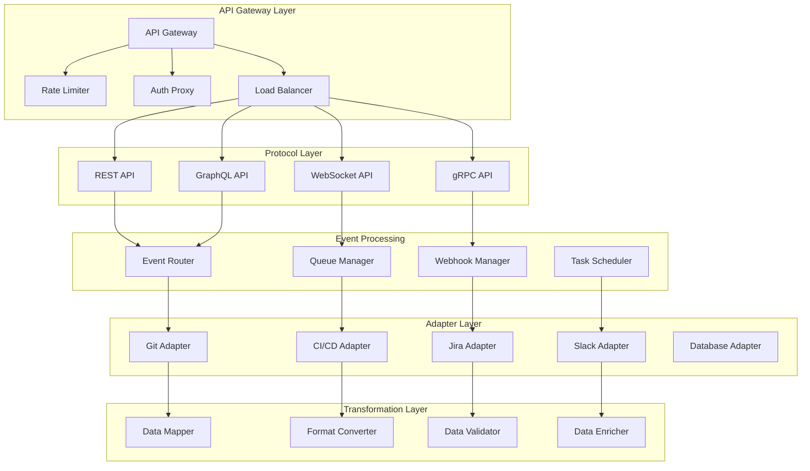

## Integration Patterns

### Synchronous Integration Patterns

#### Request-Response Pattern
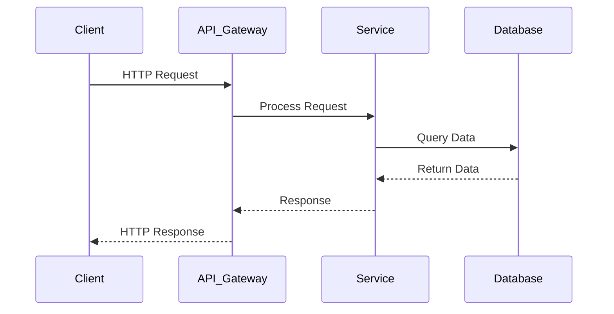

#### API Composition Pattern
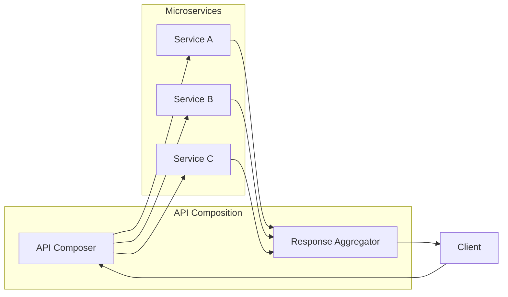

### Asynchronous Integration Patterns

#### Event Sourcing Pattern
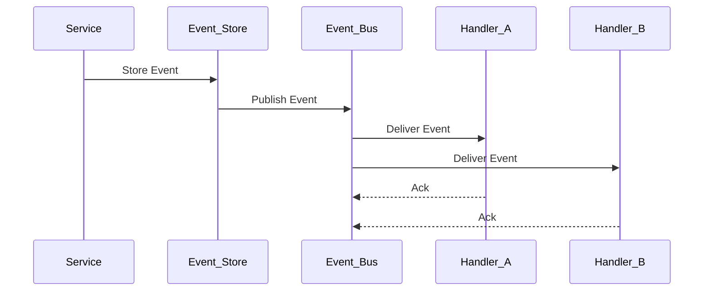

#### Saga Pattern
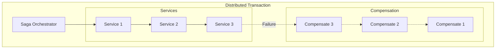

## API Architecture

### RESTful API Design

```mermaid
graph TB
    subgraph "REST API Layers"
        subgraph "Resource Layer"
            PROJECTS[/projects]
            ARTIFACTS[/artifacts]
            ISSUES[/issues]
            USERS[/users]
        end
        
        subgraph "Representation Layer"
            JSON[JSON Format]
            XML[XML Format]
            HAL[HAL+JSON]
            JSONAPI[JSON:API]
        end
        
        subgraph "Protocol Layer"
            HTTP[HTTP/HTTPS]
            METHODS[GET, POST, PUT, DELETE]
            STATUS[Status Codes]
            HEADERS[Headers]
        end
        
        subgraph "Hypermedia Layer"
            LINKS[HATEOAS Links]
            RELATIONS[Link Relations]
            ACTIONS[Available Actions]
        end
    end
    
    PROJECTS --> JSON
    ARTIFACTS --> XML
    ISSUES --> HAL
    USERS --> JSONAPI
    
    JSON --> HTTP
    XML --> METHODS
    HAL --> STATUS
    JSONAPI --> HEADERS
    
    HTTP --> LINKS
    METHODS --> RELATIONS
    STATUS --> ACTIONS
```

### GraphQL API Architecture

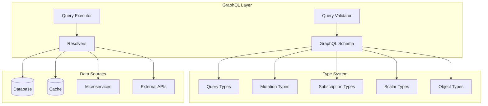

## Event-Driven Integration

### Event Architecture

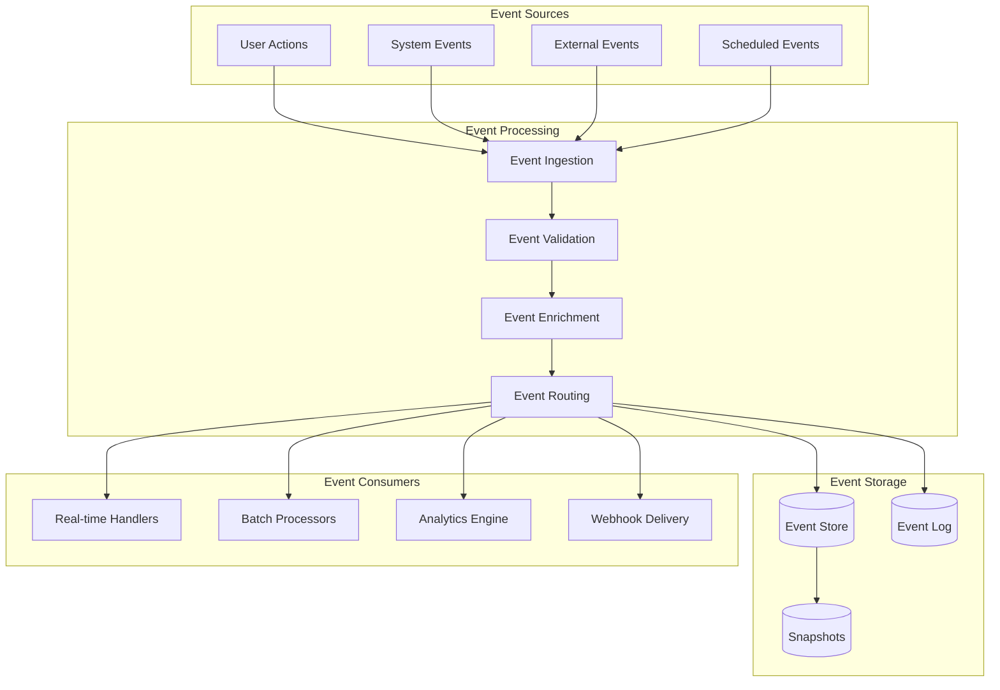

### Event Types and Schemas

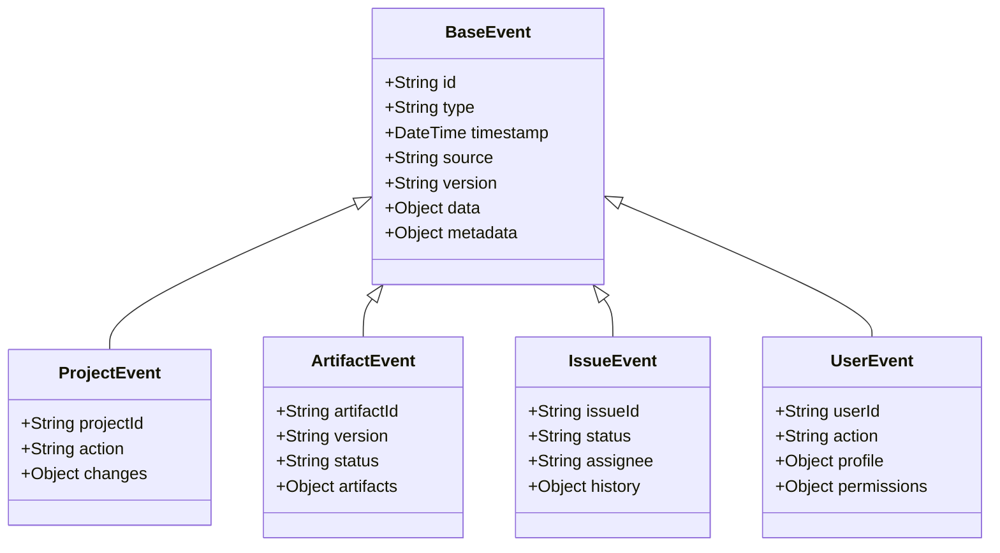

## Data Flow Architecture

### Data Integration Flow

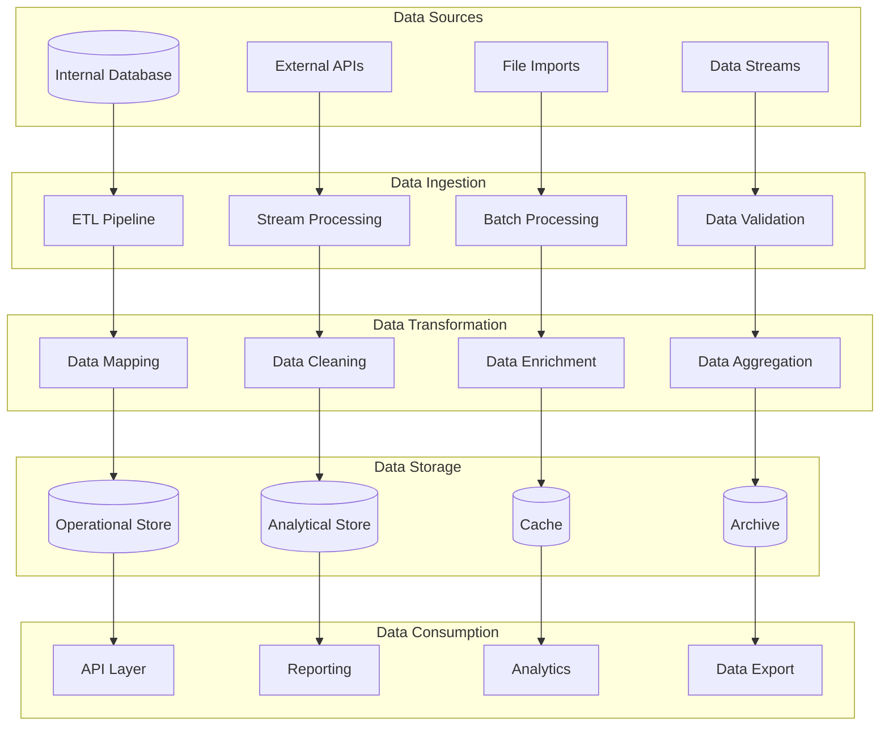

### Data Synchronization Patterns

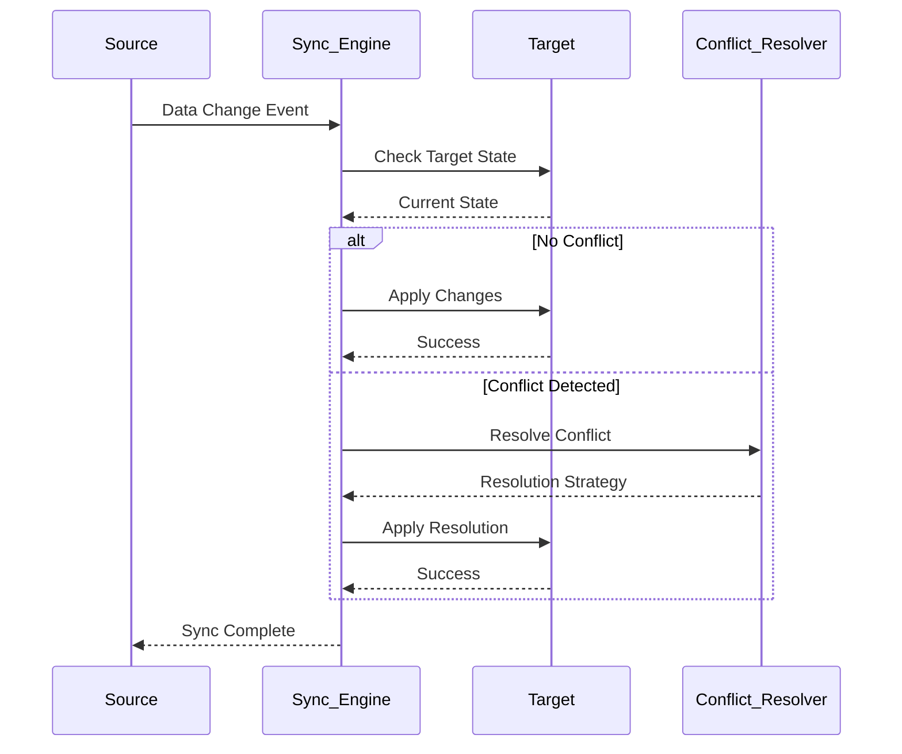

## Security Architecture

### Authentication Flow

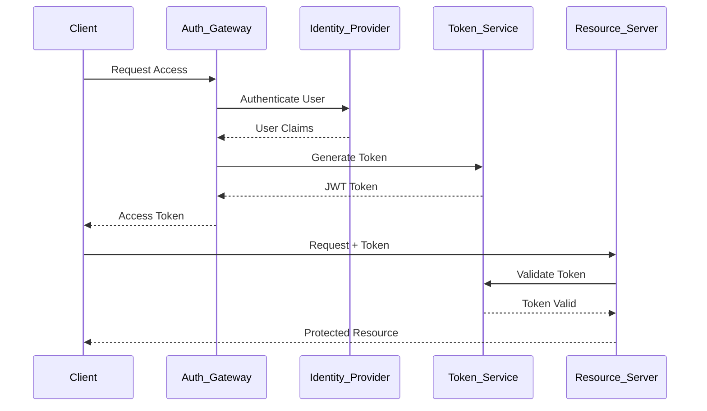

### Authorization Model

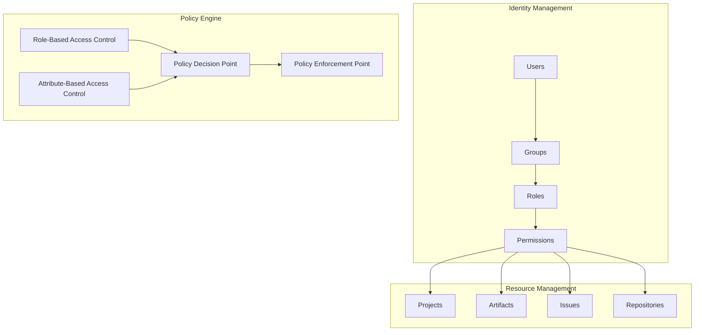

## Performance Considerations

### Caching Strategy

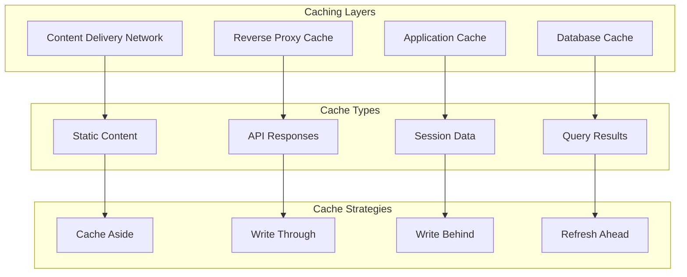

### Load Balancing and Scaling

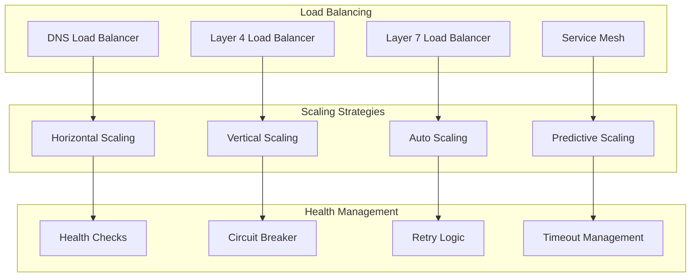

## Integration Ecosystem

### Supported Integrations

| Category | Tool/Service | Integration Type | Protocol | Status |
|----------|--------------|------------------|----------|--------|
| **Version Control** | Git | Bidirectional | Git Protocol, HTTP | ✅ |
| **Version Control** | GitHub | Bidirectional | REST API, Webhooks | ✅ |
| **Version Control** | GitLab | Bidirectional | REST API, Webhooks | ✅ |
| **Version Control** | Bitbucket | Bidirectional | REST API, Webhooks | ✅ |
| **CI/CD** | Jenkins | Bidirectional | REST API, Webhooks | ✅ |
| **CI/CD** | GitHub Actions | Bidirectional | REST API, Webhooks | ✅ |
| **CI/CD** | GitLab CI | Bidirectional | REST API, Webhooks | ✅ |
| **Issue Tracking** | Jira | Bidirectional | REST API, Webhooks | ✅ |
| **Communication** | Slack | Outbound | Webhooks, Bot API | ✅ |
| **Communication** | Microsoft Teams | Outbound | Webhooks, Bot API | ✅ |
| **Monitoring** | Prometheus | Inbound | Metrics API | ✅ |
| **Monitoring** | Grafana | Outbound | REST API | ✅ |

This integration overview provides the foundation for understanding how Brown Bear ALM connects with external systems and enables seamless workflow automation across the development lifecycle.
