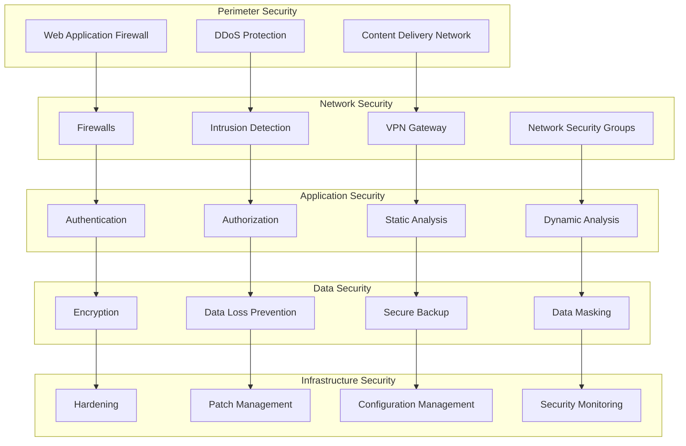

# Security Documentation

This directory contains comprehensive security documentation for Brown Bear ALM, covering security policies, procedures, architecture, and compliance requirements.

## 📁 Documentation Structure

- **[Security Overview](security-overview.md)** - High-level security architecture and principles
- **[Security Architecture](security-architecture.md)** - Detailed security design and controls
- **[Authentication & Authorization](authentication-authorization.md)** - Identity and access management
- **[Data Security](data-security.md)** - Data protection and encryption strategies
- **[Network Security](network-security.md)** - Network controls and segmentation
- **[Application Security](application-security.md)** - Secure coding and runtime protection
- **[Infrastructure Security](infrastructure-security.md)** - Infrastructure hardening and monitoring
- **[Compliance & Governance](compliance-governance.md)** - Regulatory compliance and policies
- **[Incident Response](incident-response.md)** - Security incident management procedures
- **[Security Operations](security-operations.md)** - Security monitoring and maintenance

## 🛡️ Security Framework

### Security Principles
- **Defense in Depth**: Multiple layers of security controls
- **Zero Trust**: Never trust, always verify
- **Least Privilege**: Minimum necessary access rights
- **Fail Secure**: Secure defaults and failure modes
- **Privacy by Design**: Built-in privacy protection
- **Continuous Monitoring**: Real-time security visibility

### Security Domains
- **Identity & Access Management**: Authentication, authorization, and user management
- **Data Protection**: Encryption, classification, and loss prevention
- **Network Security**: Firewalls, segmentation, and intrusion detection
- **Application Security**: Secure development and runtime protection
- **Infrastructure Security**: System hardening and configuration management
- **Operational Security**: Monitoring, logging, and incident response

## 🏗️ Security Architecture

### Multi-Layer Security Model

### Security Controls Framework
- **Preventive Controls**: Access controls, encryption, firewalls
- **Detective Controls**: Monitoring, logging, intrusion detection
- **Corrective Controls**: Incident response, patch management
- **Deterrent Controls**: Security awareness, audit trails
- **Compensating Controls**: Alternative security measures

## 🔐 Identity & Access Management

### Authentication Methods
- **Multi-Factor Authentication (MFA)**: Required for all privileged accounts
- **Single Sign-On (SSO)**: SAML 2.0 and OpenID Connect integration
- **API Authentication**: JWT tokens and OAuth 2.0
- **Certificate-Based Authentication**: X.509 certificates for services

### Authorization Model
- **Role-Based Access Control (RBAC)**: Permission assignment through roles
- **Attribute-Based Access Control (ABAC)**: Context-aware access decisions
- **Just-In-Time Access**: Temporary elevated privileges
- **Principle of Least Privilege**: Minimum required permissions

## 🔒 Data Protection

### Encryption Standards
- **Data at Rest**: AES-256 encryption for all stored data
- **Data in Transit**: TLS 1.3 for all network communications
- **Key Management**: Hardware Security Modules (HSM) for key storage
- **Database Encryption**: Transparent data encryption (TDE)

### Data Classification
- **Public**: No restriction on disclosure
- **Internal**: Limited to organization members
- **Confidential**: Restricted access, business impact if disclosed
- **Restricted**: Highest classification, regulatory requirements

## 🌐 Network Security

### Network Segmentation
- **DMZ**: Public-facing services isolation
- **Internal Networks**: Application and database separation
- **Management Networks**: Administrative access isolation
- **Zero Trust Networks**: Micro-segmentation and verification

### Traffic Control
- **Firewalls**: Stateful packet inspection and filtering
- **Intrusion Prevention**: Real-time threat detection and blocking
- **VPN Access**: Secure remote access for administrators
- **Network Monitoring**: Continuous traffic analysis and alerting

## 💻 Application Security

### Secure Development
- **Security by Design**: Threat modeling and secure architecture
- **Secure Coding**: OWASP guidelines and best practices
- **Code Review**: Mandatory security code reviews
- **Static Analysis**: Automated security testing in CI/CD

### Runtime Protection
- **Web Application Firewall**: OWASP Top 10 protection
- **API Security**: Rate limiting and input validation
- **Container Security**: Image scanning and runtime monitoring
- **Dependency Management**: Vulnerability scanning and updates

## 🏢 Compliance & Governance

### Regulatory Compliance
- **SOC 2 Type II**: Security, availability, and confidentiality controls
- **ISO 27001**: Information security management system
- **GDPR**: Data protection and privacy compliance
- **HIPAA**: Healthcare data protection (when applicable)

### Security Policies
- **Information Security Policy**: Overall security governance
- **Access Control Policy**: User access management procedures
- **Data Protection Policy**: Data handling and retention rules
- **Incident Response Policy**: Security incident procedures

## 📊 Security Monitoring

### Security Information and Event Management (SIEM)
- **Log Aggregation**: Centralized security event collection
- **Correlation Rules**: Automated threat detection
- **Alerting**: Real-time security notifications
- **Forensics**: Security incident investigation capabilities

### Key Security Metrics
- **Security Incidents**: Number and severity of incidents
- **Vulnerability Metrics**: Time to patch and remediation
- **Access Metrics**: Failed login attempts and privilege changes
- **Compliance Metrics**: Policy violations and audit findings

## 🚨 Incident Response

### Response Phases
1. **Preparation**: Incident response planning and training
2. **Detection**: Security event identification and analysis
3. **Containment**: Threat isolation and damage limitation
4. **Eradication**: Threat removal and system cleaning
5. **Recovery**: Service restoration and monitoring
6. **Lessons Learned**: Post-incident analysis and improvement

### Response Team
- **Incident Commander**: Overall response coordination
- **Security Analyst**: Technical investigation and analysis
- **System Administrator**: System access and recovery
- **Legal Counsel**: Legal and regulatory considerations
- **Communications**: Stakeholder and customer communication

## 🔧 Security Operations

### Daily Operations
- **Security Monitoring**: 24/7 security event monitoring
- **Vulnerability Management**: Regular vulnerability assessments
- **Patch Management**: Timely security update deployment
- **Backup Verification**: Regular backup integrity testing

### Security Audits
- **Internal Audits**: Regular self-assessment and review
- **External Audits**: Third-party security assessments
- **Penetration Testing**: Ethical hacking and vulnerability testing
- **Compliance Audits**: Regulatory requirement verification

## 📚 Security Training

### Security Awareness Program
- **New Employee Training**: Security orientation for all staff
- **Regular Training**: Quarterly security awareness updates
- **Phishing Simulation**: Regular phishing awareness testing
- **Role-Specific Training**: Targeted training for IT staff

### Security Certifications
- **CISSP**: Certified Information Systems Security Professional
- **CISM**: Certified Information Security Manager
- **CEH**: Certified Ethical Hacker
- **Security+**: CompTIA Security+ certification

## 🔗 Related Documentation

- [Architecture Documentation](../architecture/) - System architecture and design
- [Infrastructure Documentation](../infrastructure/) - Infrastructure security controls
- [Integration Documentation](../integration/) - API and integration security
- [Deployment Guides](../deployment/) - Secure deployment procedures
