# Security Architecture

This document provides a detailed technical overview of Brown Bear ALM's security architecture, including security controls, threat models, and defensive strategies across all system layers.

## Table of Contents

1. [Security Architecture Overview](#security-architecture-overview)
2. [Threat Modeling](#threat-modeling)
3. [Identity and Access Management](#identity-and-access-management)
4. [Data Protection Architecture](#data-protection-architecture)
5. [Network Security Architecture](#network-security-architecture)
6. [Application Security Architecture](#application-security-architecture)
7. [Infrastructure Security](#infrastructure-security)
8. [Security Monitoring Architecture](#security-monitoring-architecture)
9. [Incident Response Architecture](#incident-response-architecture)

## Security Architecture Overview

### Defense-in-Depth Model

```mermaid
graph TB
    subgraph "Security Layers"
        subgraph "Layer 7 - Data"
            DATA_CLASS[Data Classification]
            DATA_ENC[Data Encryption]
            DATA_BACKUP[Secure Backup]
            DATA_RETENTION[Data Retention]
        end
        
        subgraph "Layer 6 - Application"
            APP_AUTH[Application Authentication]
            APP_AUTHZ[Application Authorization]
            APP_VAL[Input Validation]
            APP_SAST[Static Analysis]
        end
        
        subgraph "Layer 5 - Host"
            HOST_HARD[Host Hardening]
            HOST_AV[Anti-virus/EDR]
            HOST_PATCH[Patch Management]
            HOST_LOG[Host Logging]
        end
        
        subgraph "Layer 4 - Internal Network"
            NET_SEG[Network Segmentation]
            NET_IDS[Intrusion Detection]
            NET_MICRO[Micro-segmentation]
            NET_PROXY[Security Proxy]
        end
        
        subgraph "Layer 3 - Perimeter"
            PERIM_FW[Firewall]
            PERIM_WAF[Web Application Firewall]
            PERIM_IPS[Intrusion Prevention]
            PERIM_VPN[VPN Gateway]
        end
        
        subgraph "Layer 2 - Physical Network"
            PHYS_SWITCH[Secure Switches]
            PHYS_VLAN[VLAN Isolation]
            PHYS_NAC[Network Access Control]
            PHYS_MONITOR[Physical Monitoring]
        end
        
        subgraph "Layer 1 - Physical"
            PHYS_ACCESS[Physical Access Control]
            PHYS_SURV[Surveillance]
            PHYS_ENV[Environmental Controls]
            PHYS_DESTRUCTION[Data Destruction]
        end
    end
    
    DATA_CLASS --> APP_AUTH
    DATA_ENC --> APP_AUTHZ
    DATA_BACKUP --> APP_VAL
    DATA_RETENTION --> APP_SAST
    
    APP_AUTH --> HOST_HARD
    APP_AUTHZ --> HOST_AV
    APP_VAL --> HOST_PATCH
    APP_SAST --> HOST_LOG
    
    HOST_HARD --> NET_SEG
    HOST_AV --> NET_IDS
    HOST_PATCH --> NET_MICRO
    HOST_LOG --> NET_PROXY
    
    NET_SEG --> PERIM_FW
    NET_IDS --> PERIM_WAF
    NET_MICRO --> PERIM_IPS
    NET_PROXY --> PERIM_VPN
    
    PERIM_FW --> PHYS_SWITCH
    PERIM_WAF --> PHYS_VLAN
    PERIM_IPS --> PHYS_NAC
    PERIM_VPN --> PHYS_MONITOR
    
    PHYS_SWITCH --> PHYS_ACCESS
    PHYS_VLAN --> PHYS_SURV
    PHYS_NAC --> PHYS_ENV
    PHYS_MONITOR --> PHYS_DESTRUCTION
```

### Zero Trust Architecture

```mermaid
graph TB
    subgraph "Zero Trust Principles"
        VERIFY[Verify Explicitly]
        LEAST_PRIV[Use Least Privilege]
        ASSUME_BREACH[Assume Breach]
    end
    
    subgraph "Identity Plane"
        IDENTITY[Identity Verification]
        MFA[Multi-Factor Authentication]
        PAM[Privileged Access Management]
        JUST_IN_TIME[Just-in-Time Access]
    end
    
    subgraph "Device Plane"
        DEVICE_ID[Device Identity]
        DEVICE_HEALTH[Device Health]
        DEVICE_COMPLIANCE[Device Compliance]
        CERT_AUTH[Certificate Authentication]
    end
    
    subgraph "Network Plane"
        MICRO_SEG[Micro-segmentation]
        SDP[Software Defined Perimeter]
        NETWORK_ENCRYPT[Network Encryption]
        NETWORK_MONITOR[Network Monitoring]
    end
    
    subgraph "Application Plane"
        APP_IDENTITY[Application Identity]
        API_SECURITY[API Security]
        RUNTIME_PROTECT[Runtime Protection]
        CODE_SIGNING[Code Signing]
    end
    
    subgraph "Data Plane"
        DATA_DISCOVERY[Data Discovery]
        DATA_CLASSIFY[Data Classification]
        DATA_ENCRYPT[Data Encryption]
        DLP[Data Loss Prevention]
    end
    
    VERIFY --> IDENTITY
    VERIFY --> DEVICE_ID
    VERIFY --> APP_IDENTITY
    
    LEAST_PRIV --> PAM
    LEAST_PRIV --> JUST_IN_TIME
    LEAST_PRIV --> API_SECURITY
    
    ASSUME_BREACH --> MICRO_SEG
    ASSUME_BREACH --> RUNTIME_PROTECT
    ASSUME_BREACH --> NETWORK_MONITOR
    ASSUME_BREACH --> DLP
```

## Threat Modeling

### STRIDE Threat Model

```mermaid
graph TB
    subgraph "STRIDE Threats"
        SPOOFING[Spoofing Identity]
        TAMPERING[Tampering with Data]
        REPUDIATION[Repudiation]
        INFO_DISCLOSURE[Information Disclosure]
        DOS[Denial of Service]
        ELEVATION[Elevation of Privilege]
    end
    
    subgraph "Threat Actors"
        EXTERNAL[External Attackers]
        INSIDER[Malicious Insiders]
        NATION_STATE[Nation State]
        ORGANIZED_CRIME[Organized Crime]
    end
    
    subgraph "Attack Vectors"
        WEB_ATTACKS[Web Application Attacks]
        NETWORK_ATTACKS[Network Attacks]
        SOCIAL_ENG[Social Engineering]
        SUPPLY_CHAIN[Supply Chain Attacks]
        PHYSICAL[Physical Attacks]
    end
    
    subgraph "Mitigations"
        AUTHENTICATION[Strong Authentication]
        INTEGRITY[Data Integrity Controls]
        LOGGING[Comprehensive Logging]
        ENCRYPTION[Encryption]
        REDUNDANCY[System Redundancy]
        ACCESS_CONTROL[Access Controls]
    end
    
    SPOOFING --> AUTHENTICATION
    TAMPERING --> INTEGRITY
    REPUDIATION --> LOGGING
    INFO_DISCLOSURE --> ENCRYPTION
    DOS --> REDUNDANCY
    ELEVATION --> ACCESS_CONTROL
    
    EXTERNAL --> WEB_ATTACKS
    INSIDER --> SOCIAL_ENG
    NATION_STATE --> SUPPLY_CHAIN
    ORGANIZED_CRIME --> NETWORK_ATTACKS
```

### Attack Surface Analysis

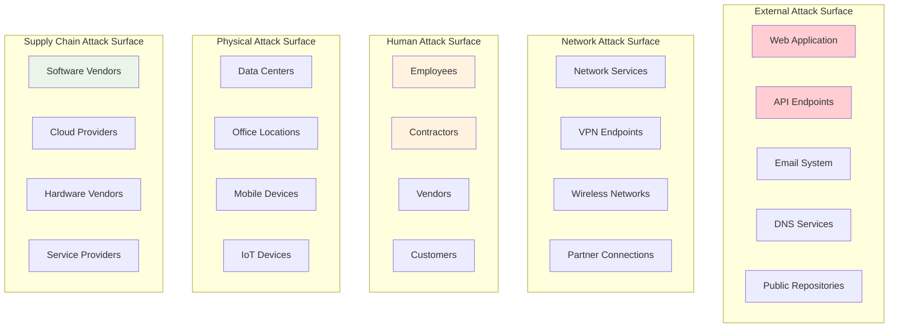

## Identity and Access Management

### IAM Architecture

```mermaid
graph TB
    subgraph "Identity Providers"
        INTERNAL_IDP[Internal Identity Provider]
        LDAP[LDAP/Active Directory]
        SAML_IDP[SAML Identity Provider]
        OAUTH_PROVIDER[OAuth Provider]
        SOCIAL_IDP[Social Identity Providers]
    end
    
    subgraph "IAM Core"
        IDENTITY_BROKER[Identity Broker]
        POLICY_ENGINE[Policy Decision Point]
        POLICY_ADMIN[Policy Administration Point]
        POLICY_INFO[Policy Information Point]
    end
    
    subgraph "Authentication Services"
        MFA_SERVICE[MFA Service]
        SSO_SERVICE[SSO Service]
        CERT_SERVICE[Certificate Service]
        KERBEROS[Kerberos Service]
    end
    
    subgraph "Authorization Services"
        RBAC_SERVICE[RBAC Service]
        ABAC_SERVICE[ABAC Service]
        OAUTH_SERVER[OAuth Authorization Server]
        JWT_SERVICE[JWT Token Service]
    end
    
    subgraph "Access Management"
        PAM[Privileged Access Management]
        JIT_ACCESS[Just-in-Time Access]
        ACCESS_REVIEW[Access Review Service]
        IDENTITY_GOVERNANCE[Identity Governance]
    end
    
    INTERNAL_IDP --> IDENTITY_BROKER
    LDAP --> IDENTITY_BROKER
    SAML_IDP --> IDENTITY_BROKER
    OAUTH_PROVIDER --> IDENTITY_BROKER
    SOCIAL_IDP --> IDENTITY_BROKER
    
    IDENTITY_BROKER --> MFA_SERVICE
    IDENTITY_BROKER --> SSO_SERVICE
    IDENTITY_BROKER --> CERT_SERVICE
    
    POLICY_ENGINE --> RBAC_SERVICE
    POLICY_ENGINE --> ABAC_SERVICE
    POLICY_ENGINE --> OAUTH_SERVER
    POLICY_ENGINE --> JWT_SERVICE
    
    POLICY_ADMIN --> PAM
    POLICY_INFO --> JIT_ACCESS
    ACCESS_REVIEW --> IDENTITY_GOVERNANCE
```

### Authentication Flow

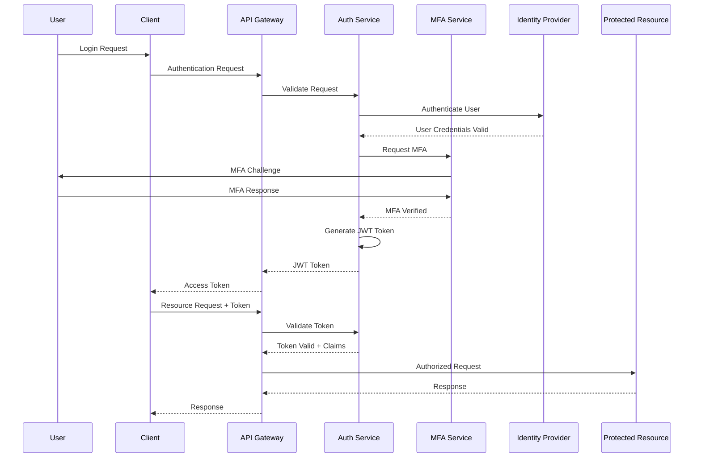

### Role-Based Access Control (RBAC)

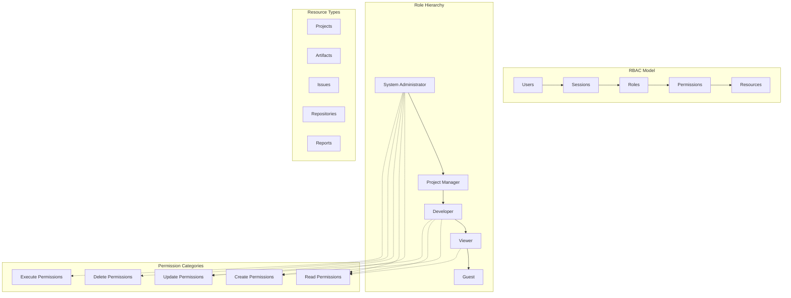

## Data Protection Architecture

### Data Classification and Protection

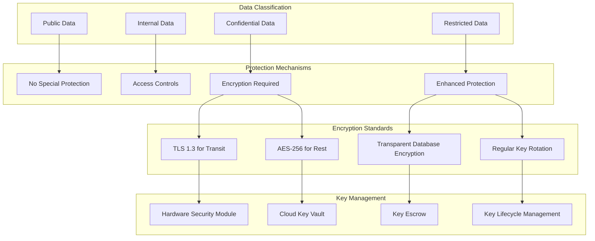

### Data Loss Prevention (DLP)

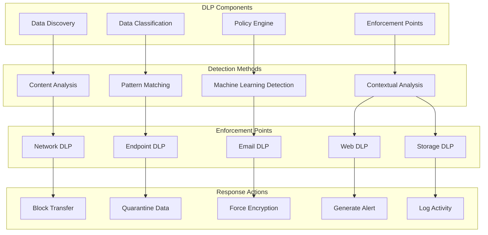

## Network Security Architecture

### Network Segmentation Strategy

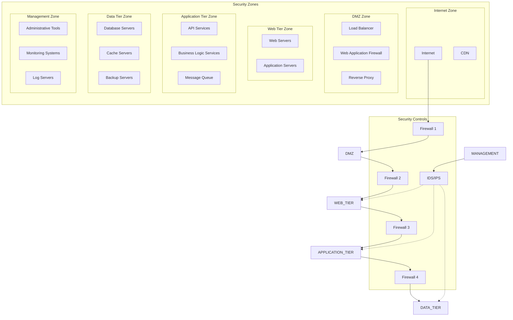

### Micro-segmentation with Service Mesh

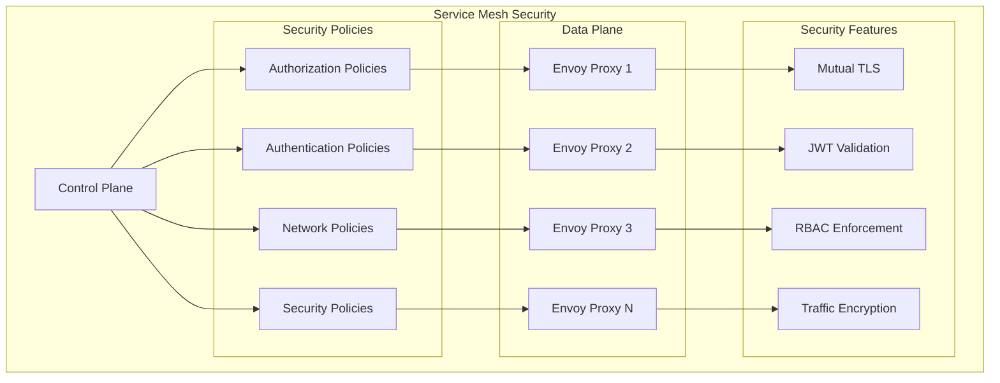

## Application Security Architecture

### Secure Development Lifecycle (SDL)

```mermaid
graph LR
    subgraph "Planning Phase"
        THREAT_MODEL[Threat Modeling]
        SECURITY_REQ[Security Requirements]
        RISK_ASSESS[Risk Assessment]
    end
    
    subgraph "Design Phase"
        SECURE_DESIGN[Secure Design]
        SECURITY_ARCH[Security Architecture]
        CRYPTO_DESIGN[Cryptographic Design]
    end
    
    subgraph "Development Phase"
        SECURE_CODING[Secure Coding]
        CODE_REVIEW[Security Code Review]
        STATIC_ANALYSIS[Static Analysis (SAST)]
    end
    
    subgraph "Testing Phase"
        DYNAMIC_ANALYSIS[Dynamic Analysis (DAST)]
        PENETRATION_TEST[Penetration Testing]
        SECURITY_TEST[Security Testing]
    end
    
    subgraph "Deployment Phase"
        SECURITY_CONFIG[Security Configuration]
        VULNERABILITY_SCAN[Vulnerability Scanning]
        SECURITY_MONITOR[Security Monitoring]
    end
    
    subgraph "Maintenance Phase"
        PATCH_MGMT[Patch Management]
        SECURITY_UPDATE[Security Updates]
        INCIDENT_RESPONSE[Incident Response]
    end
    
    PLANNING --> DESIGN
    DESIGN --> DEVELOPMENT
    DEVELOPMENT --> TESTING
    TESTING --> DEPLOYMENT
    DEPLOYMENT --> MAINTENANCE
    MAINTENANCE --> PLANNING
```

### Runtime Application Self-Protection (RASP)

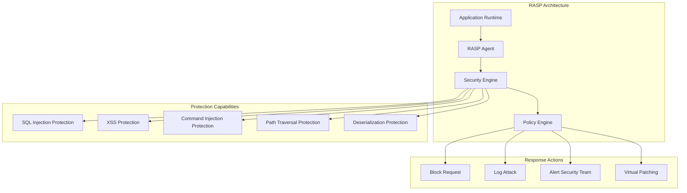

This security architecture provides comprehensive protection across all layers of Brown Bear ALM, implementing defense-in-depth strategies, zero-trust principles, and continuous security monitoring to protect against evolving threats.
