# Security Overview

This document provides a comprehensive overview of Brown Bear ALM's security architecture, controls, and governance framework designed to protect data, systems, and operations.

## Table of Contents

1. [Security Mission & Principles](#security-mission--principles)
2. [Threat Landscape](#threat-landscape)
3. [Security Architecture](#security-architecture)
4. [Security Controls Framework](#security-controls-framework)
5. [Risk Management](#risk-management)
6. [Compliance Framework](#compliance-framework)
7. [Security Governance](#security-governance)
8. [Security Operations](#security-operations)
9. [Continuous Improvement](#continuous-improvement)

## Security Mission & Principles

### Security Mission
To protect Brown Bear ALM's information assets, maintain customer trust, and ensure business continuity through comprehensive security controls, risk management, and compliance with industry standards.

### Core Security Principles

#### 1. Defense in Depth
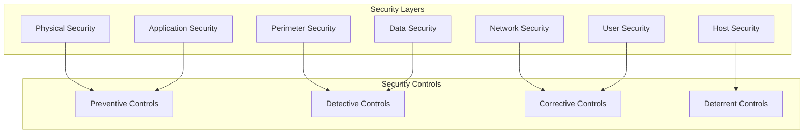

#### 2. Zero Trust Architecture
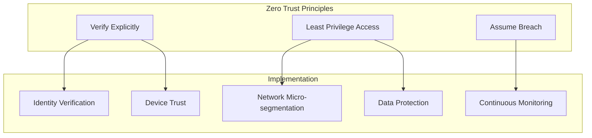

#### 3. Security by Design
- **Threat Modeling**: Systematic threat identification and mitigation
- **Secure Architecture**: Security considerations in design phase
- **Privacy by Design**: Built-in privacy protection mechanisms
- **Fail Secure**: Secure failure modes and defaults

## Threat Landscape

### Threat Categories

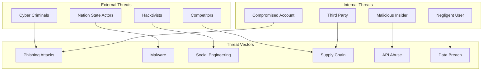

### OWASP Top 10 Security Risks

| Risk | Description | Mitigation |
|------|-------------|------------|
| **A01: Broken Access Control** | Unauthorized access to resources | RBAC, input validation, security testing |
| **A02: Cryptographic Failures** | Weak encryption or key management | Strong encryption, proper key management |
| **A03: Injection** | Code injection attacks | Input validation, parameterized queries |
| **A04: Insecure Design** | Fundamental design flaws | Threat modeling, secure architecture |
| **A05: Security Misconfiguration** | Improper security settings | Configuration management, hardening |
| **A06: Vulnerable Components** | Known vulnerable dependencies | Dependency scanning, update management |
| **A07: Authentication Failures** | Weak authentication mechanisms | MFA, session management, rate limiting |
| **A08: Software Integrity** | Compromised software supply chain | Code signing, integrity verification |
| **A09: Security Logging** | Insufficient logging and monitoring | SIEM, comprehensive logging, alerting |
| **A10: Server-Side Request Forgery** | Unauthorized server requests | Input validation, network segmentation |

## Security Architecture

### High-Level Security Architecture

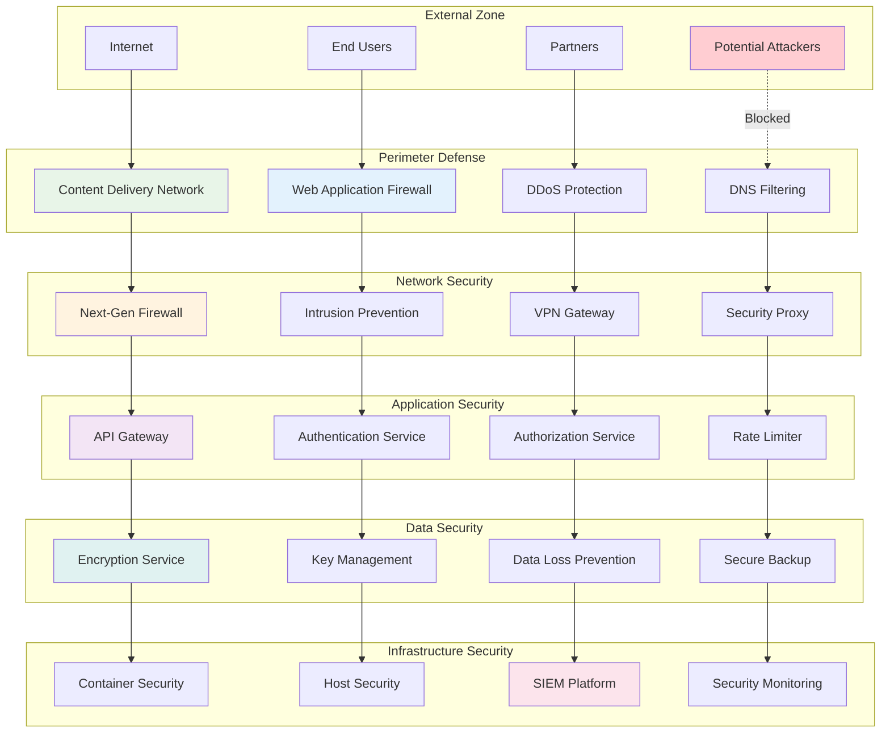

### Security Zones

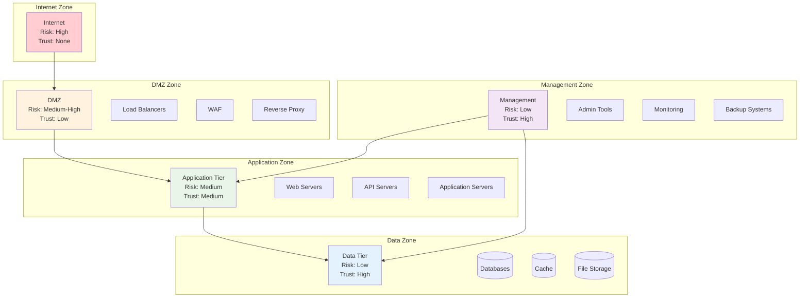

## Security Controls Framework

### NIST Cybersecurity Framework Mapping

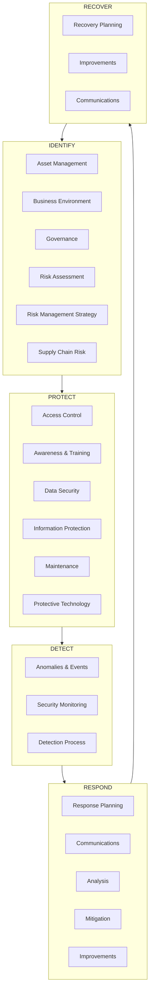

### Security Control Categories

| Control Category | Purpose | Examples |
|-----------------|---------|----------|
| **Administrative** | Policies and procedures | Security policies, training, background checks |
| **Physical** | Physical protection | Facility security, hardware protection |
| **Technical** | Technology-based controls | Firewalls, encryption, access controls |
| **Preventive** | Prevent security incidents | Access controls, encryption, firewalls |
| **Detective** | Detect security incidents | IDS, SIEM, monitoring, auditing |
| **Corrective** | Correct security incidents | Incident response, backup recovery |
| **Deterrent** | Deter malicious activity | Security awareness, audit trails |
| **Compensating** | Alternative controls | Additional monitoring when direct control unavailable |

## Risk Management

### Risk Assessment Process

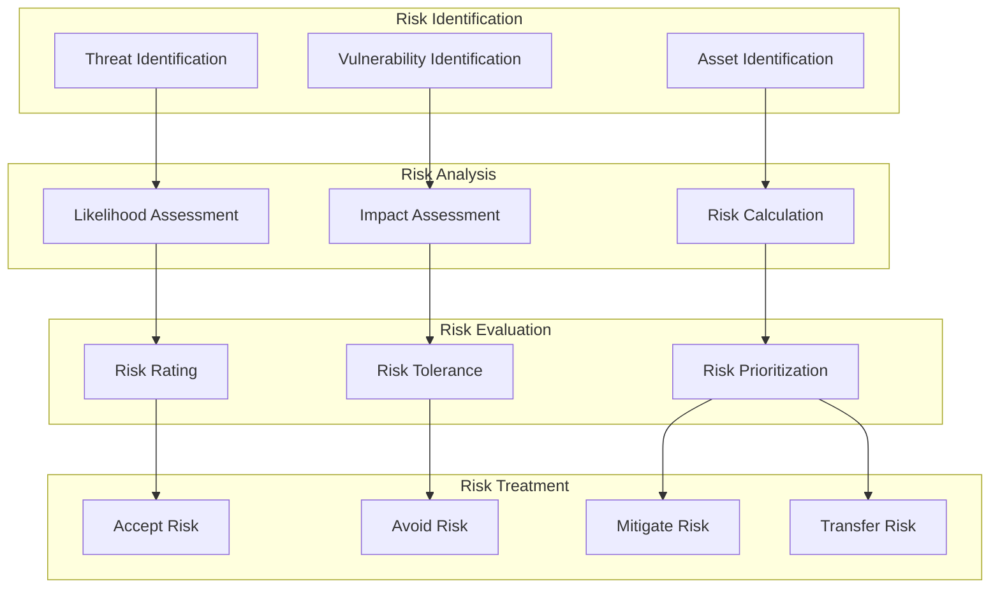

### Risk Matrix

| Probability | Negligible | Minor | Moderate | Major | Catastrophic |
|-------------|------------|-------|----------|-------|--------------|
| **Almost Certain** | Medium | High | High | Critical | Critical |
| **Likely** | Low | Medium | High | High | Critical |
| **Possible** | Low | Low | Medium | High | High |
| **Unlikely** | Very Low | Low | Low | Medium | High |
| **Rare** | Very Low | Very Low | Low | Low | Medium |

### Risk Treatment Strategies

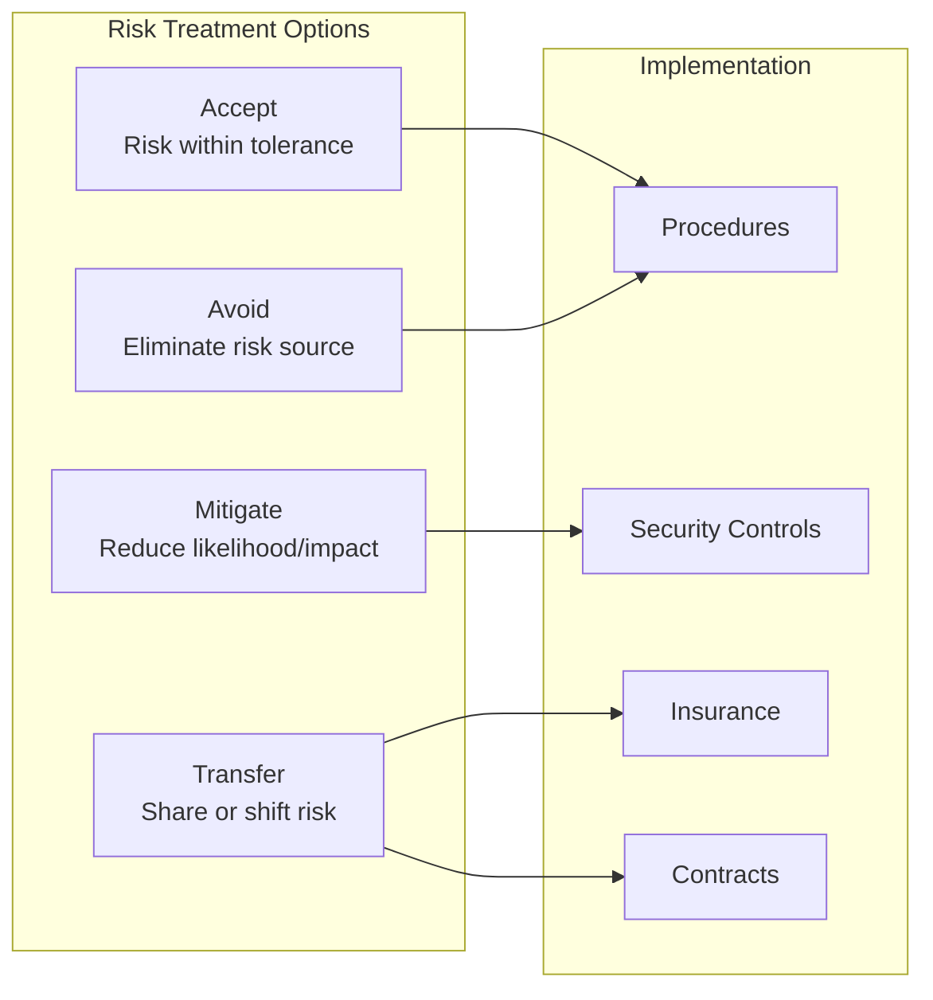

## Compliance Framework

### Regulatory Requirements

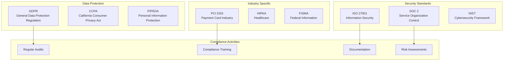

### Compliance Monitoring

| Requirement | Frequency | Owner | Evidence |
|-------------|-----------|-------|----------|
| **Security Awareness Training** | Quarterly | HR/Security | Training records, test results |
| **Vulnerability Assessments** | Monthly | Security Team | Scan reports, remediation plans |
| **Access Reviews** | Quarterly | IT/Security | Access reports, approval records |
| **Backup Testing** | Monthly | Operations | Test logs, recovery verification |
| **Incident Response Testing** | Semi-annually | Security Team | Test reports, improvement plans |
| **Policy Reviews** | Annually | Legal/Security | Review records, update logs |

## Security Governance

### Security Organization

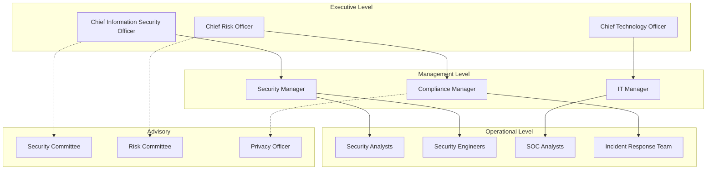

### Security Policies Hierarchy

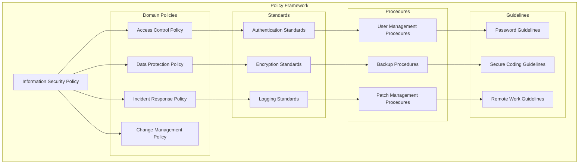

## Security Operations

### Security Operations Center (SOC)

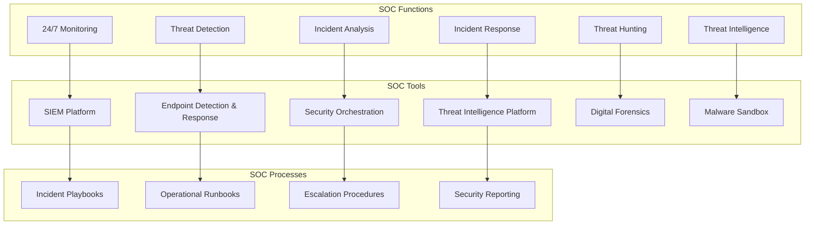

### Security Metrics and KPIs

| Metric Category | Metric | Target | Frequency |
|----------------|--------|--------|-----------|
| **Incident Response** | Mean Time to Detection (MTTD) | < 4 hours | Daily |
| **Incident Response** | Mean Time to Response (MTTR) | < 2 hours | Daily |
| **Vulnerability Management** | Critical vulnerabilities patched | < 7 days | Weekly |
| **Access Management** | Privileged account reviews | 100% quarterly | Quarterly |
| **Security Awareness** | Training completion rate | > 95% | Monthly |
| **Compliance** | Policy compliance rate | > 98% | Monthly |

## Continuous Improvement

### Security Maturity Model

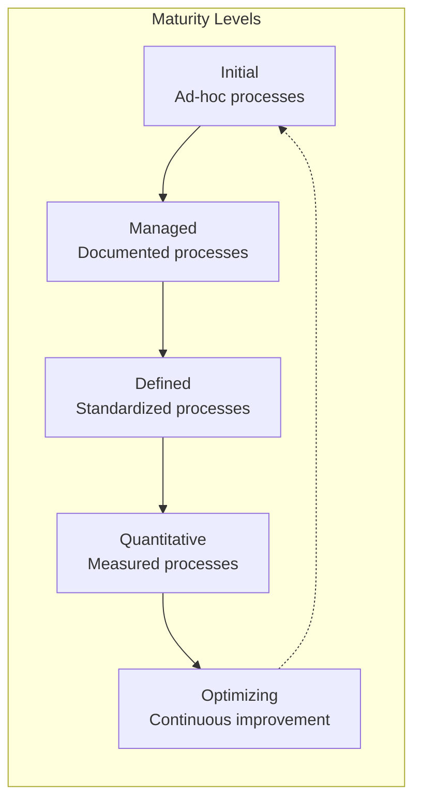

### Continuous Improvement Process

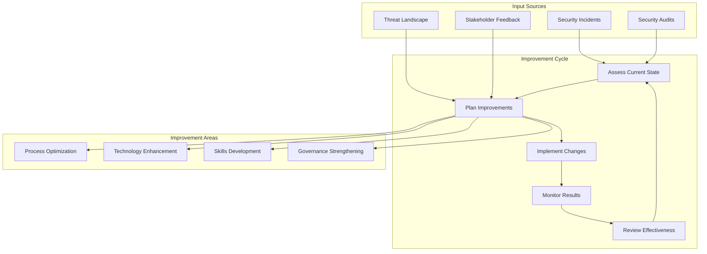

This security overview establishes the foundation for Brown Bear ALM's comprehensive security program, ensuring protection of assets, compliance with regulations, and continuous improvement of security posture.
